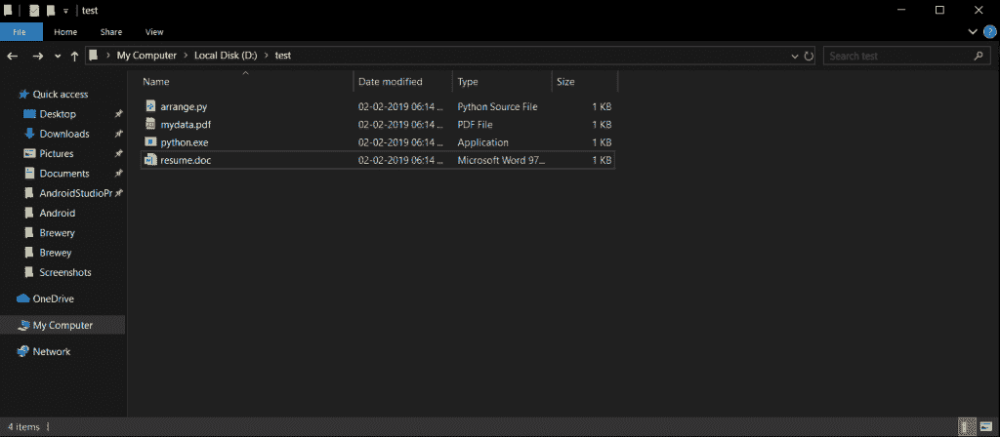
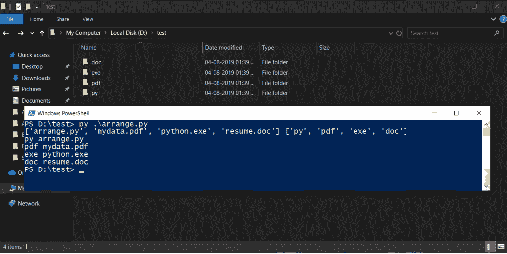

# Python |根据扩展名排列目录中的文件

> 原文:[https://www . geesforgeks . org/python-按扩展名排列目录中的文件/](https://www.geeksforgeeks.org/python-arrange-the-files-in-directories-according-to-extensions/)

在本文中，我们将学习如何根据文件的扩展名将文件排列在不同的目录中。当您有许多不同扩展名的文件时，您可以简单地使用脚本来获得帮助。

下面是 Python 实现–

```py
import os  # Using system functions

import shutil # Moving file to different folders.

# Changing the folder location.
os.chdir(os.getcwd())
cwd = os.getcwd()

# For listing files from the folder.

l = [f for f in os.listdir(cwd) if os.path.isfile(f)] 
l2 = []

# Get the extension of file from list l.

for  value in l:
    s = value.split('.')[1] 
    l2.append(s)
print(l, l2)

# We remove duplicate values from 
# list l2 and checks if directory 
# exists otherwise we create new one

for extension in set(l2):
    dirname = extension 
    if os.path.exists(cwd+'\'+extension):
        pass
    else:
        os.makedirs(dirname)

# We use zip function and list l and
# l2 passed as arguments.
# If extension in file is same and
# file not exists then we move the file.

for files, extension in zip(l, l2):
    if extension in files:
        if os.path.exists(cwd+'\'+extension+'\'+files):
            pass
        else:
            shutil.move(cwd+'\'+files, cwd+'\'+extension)
        print(extension, files)
    else :
        print('error')
```

**未排列的文件:**


**文件排列:**


**Output:**

```py
['arrange.py', 'mydata.pdf', 'python.exe', 'resume.doc'] ['py', 'pdf', 'exe', 'doc']
py arrange.py
pdf mydata.pdf
exe python.exe
doc resume.doc

```