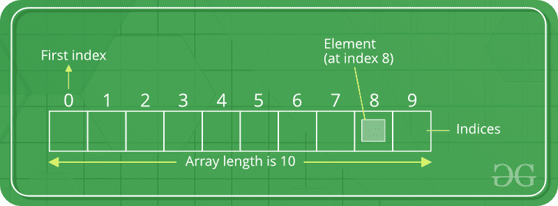
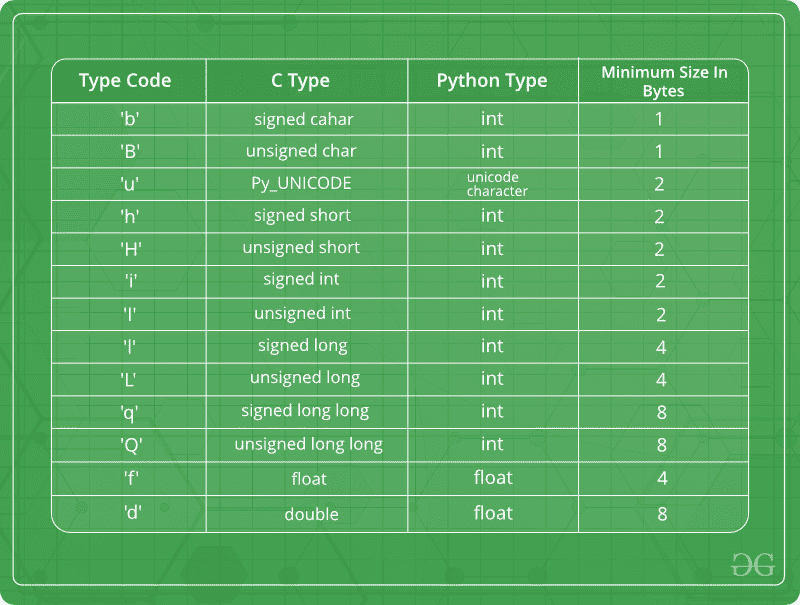
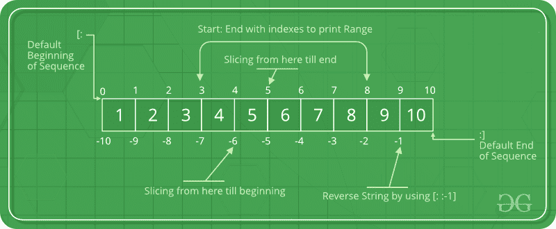

# Python 数组

> 原文:[https://www.geeksforgeeks.org/python-arrays/](https://www.geeksforgeeks.org/python-arrays/)

数组是存储在连续内存位置的项的集合。想法是将多个相同类型的项目存储在一起。这使得通过简单地将偏移加到基值，即数组的第一个元素的存储位置(通常由数组的名称表示)，来计算每个元素的位置变得更容易。
为了简单起见，我们可以想象一个数组，一排楼梯，每一步都放置一个值(比如说你的一个朋友)。在这里，你可以通过简单地知道你的朋友的步数来识别他们的位置。数组可以通过一个名为**数组**的模块在 Python 中处理。当我们只需要操作特定的数据类型值时，它们会很有用。用户可以将[列表](https://www.geeksforgeeks.org/python-list/)视为数组。但是，用户不能限制存储在列表中的元素类型。如果使用**数组**模块创建数组，数组的所有元素必须是相同的类型。



#### 创建数组

Python 中的数组可以通过导入数组模块来创建。**数组(*****data _ type*****、*****value _ list*****)**用于创建一个数组，其参数中指定了数据类型和值列表。

## 蟒蛇 3

```py
# Python program to demonstrate
# Creation of Array

# importing "array" for array creations
import array as arr

# creating an array with integer type
a = arr.array('i', [1, 2, 3])

# printing original array
print ("The new created array is : ", end =" ")
for i in range (0, 3):
    print (a[i], end =" ")
print()

# creating an array with float type
b = arr.array('d', [2.5, 3.2, 3.3])

# printing original array
print ("The new created array is : ", end =" ")
for i in range (0, 3):
    print (b[i], end =" ")

```

**输出:**

```py
The new created array is :  1 2 3 
The new created array is :  2.5 3.2 3.3 
```

下面提到的一些数据类型将有助于创建不同数据类型的数组。



#### 向数组中添加元素

可以使用内置的 [insert()](https://www.geeksforgeeks.org/python-list-insert/) 功能将元素添加到数组中。Insert 用于将一个或多个数据元素插入数组。根据需要，可以在数组的开头、结尾或任何给定的索引处添加新元素。 [append()](https://www.geeksforgeeks.org/append-extend-python/) 也用于在数组末尾添加其参数中提到的值。

## 蟒蛇 3

```py
# Python program to demonstrate
# Adding Elements to a Array

# importing "array" for array creations
import array as arr

# array with int type
a = arr.array('i', [1, 2, 3])

print ("Array before insertion : ", end =" ")
for i in range (0, 3):
    print (a[i], end =" ")
print()

# inserting array using
# insert() function
a.insert(1, 4)

print ("Array after insertion : ", end =" ")
for i in (a):
    print (i, end =" ")
print()

# array with float type
b = arr.array('d', [2.5, 3.2, 3.3])

print ("Array before insertion : ", end =" ")
for i in range (0, 3):
    print (b[i], end =" ")
print()

# adding an element using append()
b.append(4.4)

print ("Array after insertion : ", end =" ")
for i in (b):
    print (i, end =" ")
print()
```

**输出:**

```py
Array before insertion : 1 2 3 
Array after insertion :  1 4 2 3 
Array before insertion : 2.5 3.2 3.3 
Array after insertion :  2.5 3.2 3.3 4.4 
```

#### 从数组中访问元素

为了访问数组项，请参考索引号。使用索引运算符[ ]访问数组中的项。索引必须是整数。

## 蟒蛇 3

```py
# Python program to demonstrate
# accessing of element from list

# importing array module
import array as arr

# array with int type
a = arr.array('i', [1, 2, 3, 4, 5, 6])

# accessing element of array
print("Access element is: ", a[0])

# accessing element of array
print("Access element is: ", a[3])

# array with float type
b = arr.array('d', [2.5, 3.2, 3.3])

# accessing element of array
print("Access element is: ", b[1])

# accessing element of array
print("Access element is: ", b[2])
```

**输出:**

```py
Access element is:  1
Access element is:  4
Access element is:  3.2
Access element is:  3.3
```

#### 从数组中移除元素

可以使用内置的 [remove()](https://www.geeksforgeeks.org/python-list-remove/) 函数从数组中移除元素，但是如果元素不存在于集合中，则会出现错误。Remove()方法一次只移除一个元素，要移除元素范围，需要使用迭代器。 [pop()](https://www.geeksforgeeks.org/python-list-pop/) 函数也可以用来从数组中移除并返回一个元素，但默认情况下它只移除数组的最后一个元素，要从数组的特定位置移除元素，元素的索引作为参数传递给 pop()方法。
**注意–**列表中的移除方法只会移除搜索到的元素的第一个匹配项。

## 蟒蛇 3

```py
# Python program to demonstrate
# Removal of elements in a Array

# importing "array" for array operations
import array

# initializing array with array values
# initializes array with signed integers
arr = array.array('i', [1, 2, 3, 1, 5])

# printing original array
print ("The new created array is : ", end ="")
for i in range (0, 5):
    print (arr[i], end =" ")

print ("\r")

# using pop() to remove element at 2nd position
print ("The popped element is : ", end ="")
print (arr.pop(2))

# printing array after popping
print ("The array after popping is : ", end ="")
for i in range (0, 4):
    print (arr[i], end =" ")

print("\r")

# using remove() to remove 1st occurrence of 1
arr.remove(1)

# printing array after removing
print ("The array after removing is : ", end ="")
for i in range (0, 3):
    print (arr[i], end =" ")
```

**输出:**

```py
The new created array is : 1 2 3 1 5 
The popped element is : 3
The array after popping is : 1 2 1 5 
The array after removing is : 2 1 5 
```

#### 数组的切片

在 Python 数组中，有多种方式打印包含所有元素的整个数组，但是要打印数组中特定范围的元素，我们使用[切片操作](https://www.geeksforgeeks.org/python-list-comprehension-and-slicing/)。使用冒号(:)对数组执行切片操作。要打印从开始到某个范围的元素，请使用[:Index]，要打印从结束的元素，请使用[:-Index]，要打印从特定索引到结束的元素，请使用[Index:]，要打印某个范围内的元素，请使用[Start Index:End Index]，要使用切片操作打印整个列表，请使用[:]。此外，要以相反的顺序打印整个数组，请使用[::-1]。



## 蟒蛇 3

```py
# Python program to demonstrate
# slicing of elements in a Array

# importing array module
import array as arr

# creating a list
l = [1, 2, 3, 4, 5, 6, 7, 8, 9, 10]

a = arr.array('i', l)
print("Initial Array: ")
for i in (a):
    print(i, end =" ")

# Print elements of a range
# using Slice operation
Sliced_array = a[3:8]
print("\nSlicing elements in a range 3-8: ")
print(Sliced_array)

# Print elements from a
# pre-defined point to end
Sliced_array = a[5:]
print("\nElements sliced from 5th "
      "element till the end: ")
print(Sliced_array)

# Printing elements from
# beginning till end
Sliced_array = a[:]
print("\nPrinting all elements using slice operation: ")
print(Sliced_array)
```

**Output**

```py
Initial Array: 
1 2 3 4 5 6 7 8 9 10 
Slicing elements in a range 3-8: 
array('i', [4, 5, 6, 7, 8])

Elements sliced from 5th element till the end: 
array('i', [6, 7, 8, 9, 10])

Printing all elements using slice operation: 
array('i', [1, 2, 3, 4, 5, 6, 7, 8, 9, 10])
```