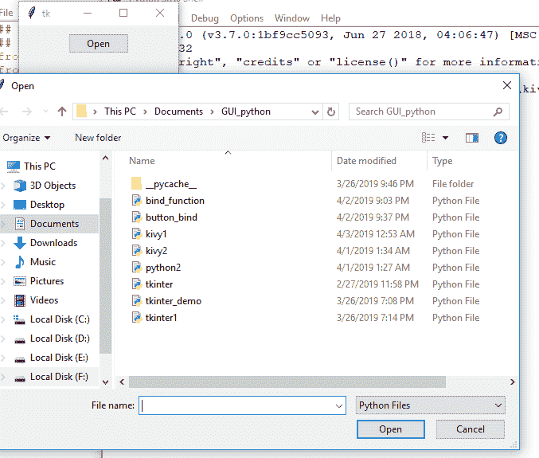
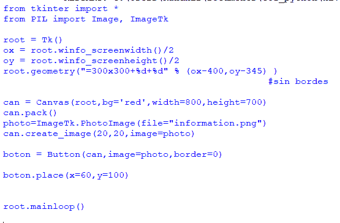
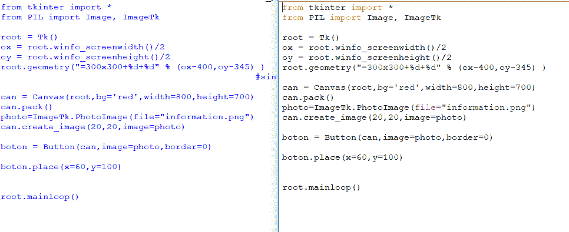

# Python | Tkinter 中的 askopenfile()函数

> 原文:[https://www . geesforgeks . org/python-askopenfile-function-in-tkinter/](https://www.geeksforgeeks.org/python-askopenfile-function-in-tkinter/)

在使用图形用户界面时，可能需要打开文件并从中读取数据，或者可能需要在特定文件中写入数据。借助 **`open()`** 函数(python 内置)可以实现这一点，但是除非在代码中提供特定文件的路径，否则可能无法选择任何所需的文件。
借助 GUI，可以不要求指定任何文件的路径，但可以直接打开文件并读取其内容。

要使用 askopenfile()函数，您可能需要遵循以下步骤:

> **- >** 从 tkinter.filedialog 中导入 tkinter
> **- >** 导入 askopenfile ##现在可以使用此功能
> -**->**file = askopenfile(mode = ' r '，filetypes=[('任何想要显示的名称'，'文件类型的扩展名')])

我们必须指定你想要打开文件的模式，就像上面的代码片段，这会以读取模式打开一个文件。

```py
# importing tkinter and tkinter.ttk
# and all their functions and classes
from tkinter import * 
from tkinter.ttk import *

# importing askopenfile function
# from class filedialog
from tkinter.filedialog import askopenfile

root = Tk()
root.geometry('200x100')

# This function will be used to open
# file in read mode and only Python files
# will be opened
def open_file():
    file = askopenfile(mode ='r', filetypes =[('Python Files', '*.py')])
    if file is not None:
        content = file.read()
        print(content)

btn = Button(root, text ='Open', command = lambda:open_file())
btn.pack(side = TOP, pady = 10)

mainloop()
```

**输出:**


**所选文件的打印内容–**


**原始文件内容与打印内容的对比–**


**注意:**在上面的代码中，只有`.py` (python 文件)类型文件会被打开。要打开指定类型的文件，必须在**文件类型**选项中提到它以及它的扩展名，如上面的代码所示。