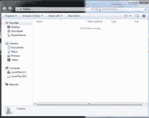
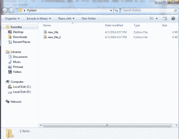

# Python | Tkinter 中的 asksaveasfile()函数

> 原文:[https://www . geesforgeks . org/python-askssaveasfile-function-in-tkinter/](https://www.geeksforgeeks.org/python-asksaveasfile-function-in-tkinter/)

Python 提供了各种模块，人们可以借助这些模块开发图形用户界面应用程序。 [Tkinter](https://www.geeksforgeeks.org/python-gui-tkinter/) 是开发 GUI 应用程序最简单快捷的方法之一。

处理文件时，可能需要打开文件，对文件进行操作，然后保存文件。`asksaveasfile()`是保存用户文件的功能(扩展名可以明确设置，也可以设置默认扩展名)。该功能在 `**class filedialog**`下。

以下是守则:

```py
# importing all files  from tkinter
from tkinter import * 
from tkinter import ttk

# import only asksaveasfile from filedialog
# which is used to save file in any extension
from tkinter.filedialog import asksaveasfile

root = Tk()
root.geometry('200x150')

# function to call when user press
# the save button, a filedialog will
# open and ask to save file
def save():
    files = [('All Files', '*.*'), 
             ('Python Files', '*.py'),
             ('Text Document', '*.txt')]
    file = asksaveasfile(filetypes = files, defaultextension = files)

btn = ttk.Button(root, text = 'Save', command = lambda : save())
btn.pack(side = TOP, pady = 20)

mainloop()
```

**输出#1:** 保存任何文件前的目录(文件夹最初为空)


**输出#2:** 用户按保存按钮时的对话框(打开保存文件的对话框)。您可以在输出 Python 文件中看到，默认情况下是选中的。
T3】

**输出#3:** 保存 2 个 Python 文件后的目录(也可以更改文件类型)
