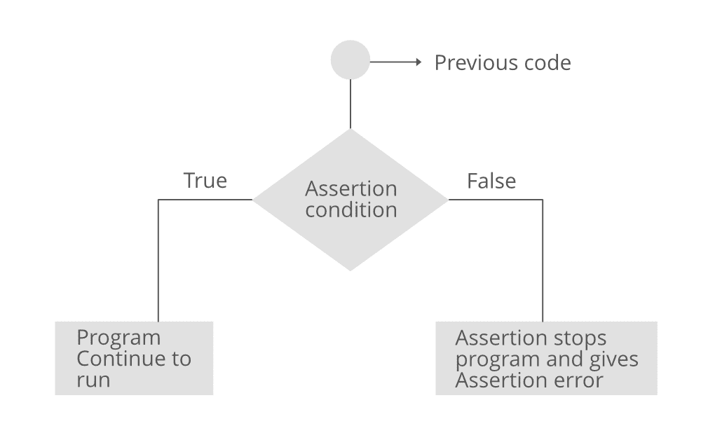

# Python 断言关键字

> 原文:[https://www.geeksforgeeks.org/python-assert-keyword/](https://www.geeksforgeeks.org/python-assert-keyword/)

**断言**在任何编程语言中都是有助于代码流畅的调试工具。断言主要是一种假设，程序员知道这种假设总是希望是真的，因此将它们放入代码中，这样它们的失败就不允许代码进一步执行。

简单来说，我们可以说断言是检查语句是真还是假的布尔表达式。如果该语句为真，则不执行任何操作并继续执行，但是如果该语句为假，则停止程序的执行并引发错误。让我们看看断言的流程图。

## 断言流程图



## Python 中的断言关键字

在 python 中，assert 关键字有助于完成这项任务。该语句只接受布尔条件的输入，当返回 true 时，它不返回任何内容，但是如果计算结果为 false，它将引发 AssertionError 以及提供的可选消息。

> **语法:**断言条件，error_message(可选)
> 
> **参数:**
> **条件:**布尔条件返回真或假。
> **错误消息:**在出现错误时要在控制台中打印的可选参数
> 
> **返回:**
> 返回 AssertionError，以防条件评估为 false，并返回错误消息。

### **示例 1: Python 断言关键字无错误消息**

## 蟒蛇 3

```
# Python 3 code to demonstrate
# working of assert

# initializing number
a = 4
b = 0

# using assert to check for 0
print("The value of a / b is : ")
assert b != 0
print(a / b)
```

**输出:**

```
AssertionError: 
```

### 示例 2: Python 断言关键字并显示错误消息

## 蟒蛇 3

```
# Python 3 code to demonstrate
# working of assert

# initializing number
a = 4
b = 0

# using assert to check for 0
print("The value of a / b is : ")
assert b != 0, "Zero Division Error"
print(a / b)
```

**输出:**

```
AssertionError: Zero Division Error
```

## **实际应用**

这在任何开发领域的测试和质量保证角色中都有更大的效用。根据应用程序的不同，使用不同类型的断言。下面是一个程序的简单演示，该程序只允许发送含有所有热食的批次，否则拒绝整个批次。

## 蟒蛇 3

```
# Python 3 code to demonstrate 
# working of assert 
# Application

# initializing list of foods temperatures
batch = [ 40, 26, 39, 30, 25, 21]

# initializing cut temperature
cut = 26

# using assert to check for temperature greater than cut
for i in batch:
    assert i >= 26, "Batch is Rejected"
    print (str(i) + " is O.K" )
```

**输出:**

```
40 is O.K
26 is O.K
39 is O.K
30 is O.K
```

**运行时异常:**

```
AssertionError: Batch is Rejected
```