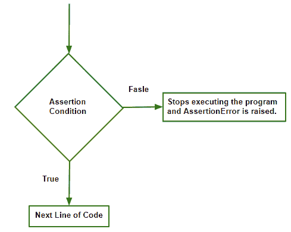

# Python |断言错误

> 原文:[https://www.geeksforgeeks.org/python-assertion-error/](https://www.geeksforgeeks.org/python-assertion-error/)

**断言错误**
断言是在编写代码时使用的编程概念，其中用户在运行模块之前使用*断言*语句声明条件为真。如果条件为*真*，控制简单地移动到下一行代码。如果是*假*，程序停止运行并返回*错误*异常。

*assert* 语句的功能是相同的，与实现它的语言无关，它是一个独立于语言的概念，只是语法随编程语言而变化。



**断言语法:**
*断言*条件，error_message(可选)

**示例 1:带有 error_message 的断言错误。**

## 蟒蛇 3

```
# AssertionError with error_message.
x = 1
y = 0
assert y != 0, "Invalid Operation" # denominator can't be 0
print(x / y)
```

**输出:**

```
Traceback (most recent call last):
  File "/home/bafc2f900d9791144fbf59f477cd4059.py", line 4, in 
    assert y!=0, "Invalid Operation" # denominator can't be 0
AssertionError: Invalid Operation
```

python 中的默认异常处理程序将打印程序员编写的 error_message，否则将只处理错误而不显示任何消息。
两种方式均有效。

**处理 AssertionError 异常:**
*AssertionError* 是从 exception 类继承而来的，当这个异常发生并引发 AssertionError 时，有两种处理方式，要么用户处理，要么默认异常处理。
在示例 1 中，我们已经看到了默认异常处理程序是如何工作的。
现在让我们深入研究手动处理。

**例 2**

## 蟒蛇 3

```
# Handling it manually
try:
    x = 1
    y = 0
    assert y != 0, "Invalid Operation"
    print(x / y)

# the errror_message provided by the user gets printed
except AssertionError as msg:
    print(msg)
```

**输出:**

```
Invalid Operation
```

**实际应用。**
**例 3:测试程序。**

## 蟒蛇 3

```
# Roots of a quadratic equation
import math
def ShridharAcharya(a, b, c):
    try:
        assert a != 0, "Not a quadratic equation as coefficient of x ^ 2 can't be 0"
        D = (b * b - 4 * a*c)
        assert D>= 0, "Roots are imaginary"
        r1 = (-b + math.sqrt(D))/(2 * a)
        r2 = (-b - math.sqrt(D))/(2 * a)
        print("Roots of the quadratic equation are :", r1, "", r2)
    except AssertionError as msg:
        print(msg)
ShridharAcharya(-1, 5, -6)
ShridharAcharya(1, 1, 6)
ShridharAcharya(2, 12, 18)
```

**输出:**

```
Roots of the quadratic equation are : 2.0  3.0
Roots are imaginary
Roots of the quadratic equation are : -3.0  -3.0
```

这是一个示例，展示了一旦断言条件为 False，该异常如何停止程序的执行。

**其他有用的应用:**

*   检查参数值。
*   检查有效的输入/类型。
*   检测另一个程序员对接口的滥用。
*   检查函数的输出。