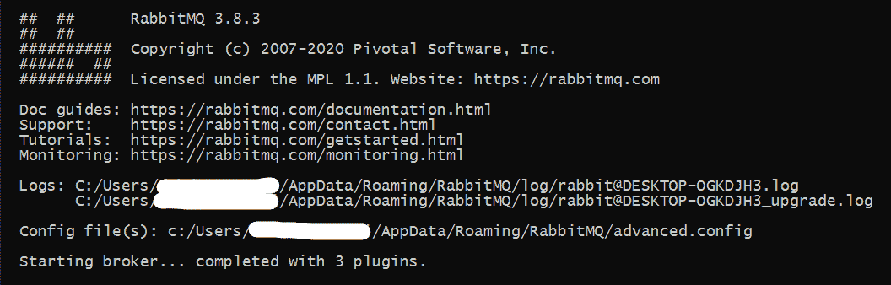
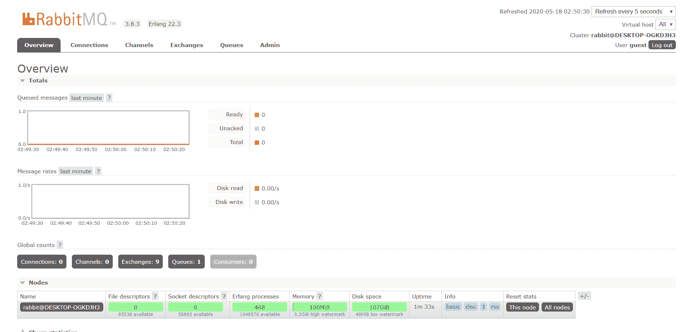
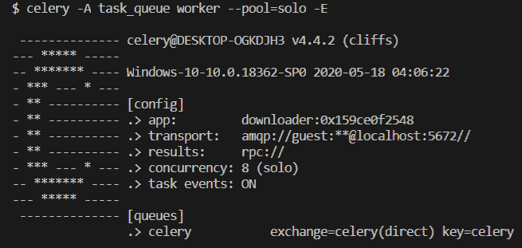

# Python–使用 RabbitMQ 的异步任务

> 原文:[https://www . geeksforgeeks . org/python-异步-任务-使用-rabbitmq/](https://www.geeksforgeeks.org/python-asynchronous-task-using-rabbitmq/)

您是否遇到过需要在后台执行一项需要花费大量时间才能完成的任务的问题？你有没有想过在一定时间间隔后执行一项任务？如果你对以上任何一个问题的回答都是“是”，那么 Python 已经涵盖了你。我们将演示如何使用**拉比任务**执行**异步**任务。

**到底**异步**是什么意思**？
异步是指通过使用前一次操作完成时发送的信号来控制要执行的操作的时间，而不是定期发送。

**什么是**拉比·T2****？
rabbtmq 是一款消息代理软件，最初实现了高级消息队列协议(AMQP)，此后通过插件架构进行了扩展，以支持面向流文本的消息协议(STOMP)、MQ 遥测传输(MQTT)和其他协议。如果你觉得这听起来很复杂，别担心，我们会帮你搞定的。因此，简单来说，它提供了一个队列，通过运行自己的服务器在后台执行任务。

弄清楚所有这些后，让我们开始安装 RabbitMQ 和其他必要的工具。因此，我们将使用名为*芹菜*的 python 包来连接 RabbitMQ。芹菜提供了一种将任务连接并发送到队列的简单方法。从技术上来说，芹菜是一个 Python 任务队列系统，处理跨线程或网络节点的工作人员任务分配。

您应该在系统上安装 python。然后你需要在你的系统上安装芹菜。为此，只需键入以下内容

```
pip install celery==4.4.2
```

接下来，在你的机器上安装 RabbitMQ。为此，前往他们的官方页面，根据您的操作系统下载安装程序。您可能需要下载 *ErLang* 和 RabbitMQ。安装完成后，在您的终端中键入以下内容

```
rabbitmq-server restart
```

你应该得到这样的输出



不要关闭此终端。现在你的经纪人应该开始运作了。要进行检查，请进入浏览器中的 [http://localhost:15672/](http://localhost:15672/) 并输入用户名和密码。默认用户名是**客人**，默认密码也是**客人**。你应该看看这样的东西



现在，让我们开始有趣的部分，也就是编码。

我们将下载一个视频到我们的系统。我们将使用 *pytube* 模块进行下载。要安装 pytube，请键入以下内容

```
pip install pytube3
```

下载 YouTube 视频可能会占用大量时间。我们现在将看到，我们的 python 文件如何立即执行，视频如何在后台继续下载。

首先，我们将创建一个名为 **task_queue.py** 的 python 文件

```
from celery import Celery
import sys

from pytube import YouTube

# Where the downloaded files will be stored
BASEDIR ="D:\\"

# Create the app and set the broker location (RabbitMQ)
app = Celery('downloader',
            backend ='rpc://',
            broker ='pyamqp://guest@localhost//')

@app.task
def download(url, filename):
    """
    Download a page and save it to the BASEDIR directory
      url: the url to download
      filename: the filename used to save the url in BASEDIR
    """
    try:
        # object creation using YouTube which
        # was imported in the beginning
        yt = YouTube(url)
    except:
        print("Connection Error") # to handle exception

    # filters out all the files with "mp4" extension
    yt.streams\
        .filter(progressive = True, file_extension ='mp4')\
        .order_by('resolution')[-1]\
        .download(output_path = BASEDIR, filename = filename) 
        # downloading the video

    print('Task Completed !')
```

我们需要另一个 python 文件来运行这段代码(您可以在同一个文件中执行，但是从另一个文件中调用函数是一个很好的做法)。用名称 **runtask.py** 创建另一个文件

```
import sys
from task_queue import download

# gets the first command line argument
link = sys.argv[1]

# gets the second command line argument
filename = sys.argv[2]

# calling the download function
download.delay(link, filename)
```

现在，开始芹菜。为此，请在工作目录中打开一个终端，并键入以下内容

```
celery -A task_queue worker --pool=solo -E
```

如果您在这方面有任何错误，那么您的 RabbitMQ 服务器没有运行，或者您不在您的工作目录中。你应该得到这样的输出



现在我们有芹菜运行。现在打开同一目录中的另一个终端，并运行以下命令

```
$ python runtask.py https://www.youtube.com/watch?v=vG2PNdI8axo Geeksforgeeks
```

完成上述命令后，等待几秒钟，让下载在后台完成。然后去你的 **D:** 车道，在那里你会看到一个名为*Geeksforgeeks.mp4*的文件。就这样。您的视频已下载。

异步任务在现实生活中非常重要。当您的代码执行任务时，您不能让您的软件或网站停留在加载页面。需要更长时间执行的任务在后台执行，而不会停止主线程。