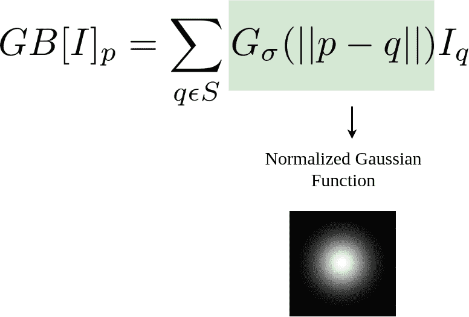
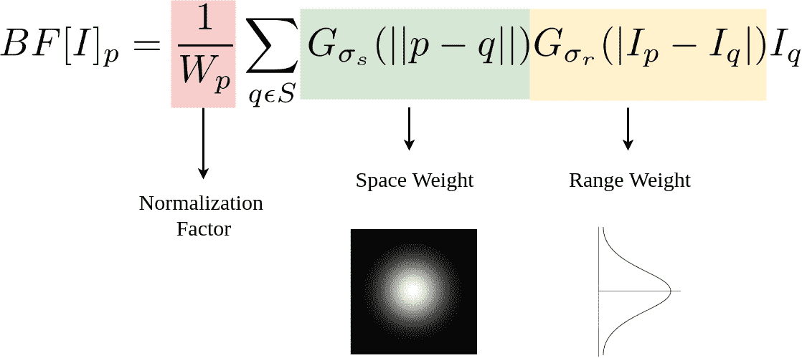
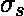

# Python |双边过滤

> 原文:[https://www.geeksforgeeks.org/python-bilateral-filtering/](https://www.geeksforgeeks.org/python-bilateral-filtering/)

双边滤波器用于平滑图像和降低噪声，同时**保留边缘**。这篇[文章](https://www.geeksforgeeks.org/salt-and-pepper-noise-removal-using-c/)解释了一种使用平均滤波器的方法，而这篇[文章](https://www.geeksforgeeks.org/noise-removal-using-median-filter-in-c/)提供了一种使用中值滤波器的方法。然而，这些卷积通常会导致重要边缘信息的丢失，因为它们会模糊掉一切，不管是噪声还是边缘。针对这一问题，引入了非线性双边滤波。

## **高斯模糊**

高斯模糊可以表述如下:



这里，![GA[I]_p  ](img/bcf049efcfaf934c9ceacc4133abd8ef.png "Rendered by QuickLaTeX.com")是像素 *p* 的结果，而 RHS 本质上是高斯函数加权的所有像素 *q* 的和。是像素 *q* 处的强度。

## **双边滤波:附加边缘项**

双边滤波器可以表述如下:



这里，归一化因子和范围权重是添加到前面等式中的新项。表示核的空间范围，即邻域的大小，表示边缘的最小振幅。它确保只有那些具有与中心像素相似的强度值的像素被考虑用于模糊，同时保持急剧的强度变化。的价值越小，优势越明显。趋于无穷大时，方程趋于高斯模糊。
OpenCV 有一个名为**双边滤波器()**的函数，参数如下:

1.  **d:** 每个像素邻域的直径。
2.  **sigmaColor:** 颜色空间中的值。值越大，彼此距离越远的颜色将开始混合。
3.  **sigmaSpace:** 坐标空间中的值。它的值越大，混合在一起的像素就越多，因为它们的颜色在 sigmaColor 范围内。

**代码:**
**输入:**嘈杂图像。


**代码:实现双边过滤**

## 计算机编程语言

```
import cv2

# Read the image.
img = cv2.imread('taj.jpg')

# Apply bilateral filter with d = 15,
# sigmaColor = sigmaSpace = 75.
bilateral = cv2.bilateralFilter(img, 15, 75, 75)

# Save the output.
cv2.imwrite('taj_bilateral.jpg', bilateral)
```

**双边滤波器输出**


**与平均和中值滤波器的比较**
下面是平均滤波器的输出(cv2.blur(img，(5，5))。


下面是中值滤波器(cv2.medianBlur(img，5))的输出。


下面是高斯滤波器(cv2)的输出。gaussianbulr(img，(5，5)，0))。


很容易注意到，所有这些去噪滤波器都会模糊边缘，而双边滤波会保留它们。