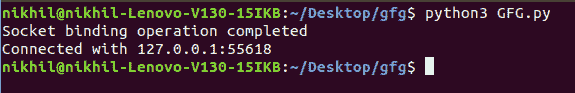
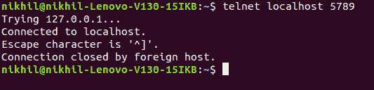

# Python–使用套接字绑定和侦听

> 原文:[https://www . geeksforgeeks . org/python-带套接字的绑定和侦听/](https://www.geeksforgeeks.org/python-binding-and-listening-with-sockets/)

**[Socket 编程](https://www.geeksforgeeks.org/socket-programming-python/)** 是连接网络上两个节点相互通信的一种方式。一个套接字(节点)监听某个 IP 的特定端口，而另一个套接字则与另一个套接字建立连接。服务器形成侦听器套接字，而客户端则连接到服务器。

**注意:**更多信息请参考 Python 中的 [Socket 编程](https://www.geeksforgeeks.org/socket-programming-python/)

## 使用套接字绑定和侦听

服务器有一个 bind()方法，将它绑定到一个特定的 IP 和端口，这样它就可以监听该 IP 和端口上的传入请求。服务器有一个`listen()`方法，将服务器置于监听模式。这允许服务器监听传入的连接。最后一个服务器有一个`accept()`和`close()`方法。accept 方法启动与客户端的连接，close 方法关闭与客户端的连接。

**例**

```
import socket
import sys

# specify Host and Port 
HOST = '' 
PORT = 5789

soc = socket.socket(socket.AF_INET, socket.SOCK_STREAM)

try:
    # With the help of bind() function 
    # binding host and port
    soc.bind((HOST, PORT))

except socket.error as massage:

    # if any error occurs then with the 
    # help of sys.exit() exit from the program
    print('Bind failed. Error Code : ' 
          + str(massage[0]) + ' Message ' 
          + massage[1])
    sys.exit()

# print if Socket binding operation completed    
print('Socket binding operation completed')

# With the help of listening () function
# starts listening
soc.listen(9)

conn, address = soc.accept()
# print the address of connection
print('Connected with ' + address[0] + ':' 
      + str(address[1]))
```

*   首先我们进口插座，这是必要的。
*   然后我们制作了一个套接字对象，并在我们的电脑上预留了一个端口。
*   之后，我们将服务器绑定到指定的端口。传递空字符串意味着服务器也可以监听来自其他计算机的传入连接。如果我们通过了 127.0.0.1，那么它将只监听本地计算机内的那些呼叫。
*   之后，我们将服务器置于监听模式。这里的 9 表示如果服务器忙，9 个连接保持等待，如果第 10 个套接字试图连接，那么连接被拒绝。

现在我们需要服务器可以与之交互的东西。我们可以像这样对服务器进行特殊化，只是为了知道我们的服务器正在工作。在终端中键入以下命令:

```
# start the server
$ python server.py
```

保持上述终端打开现在打开另一个终端并键入:

```
$ telnet localhost 12345
```

**输出:**



