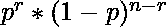
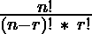
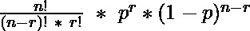
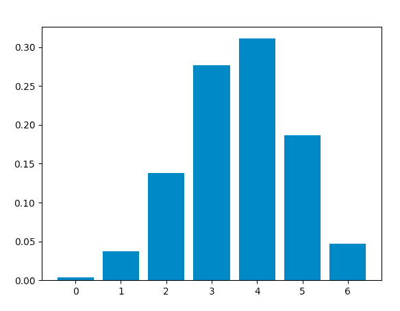
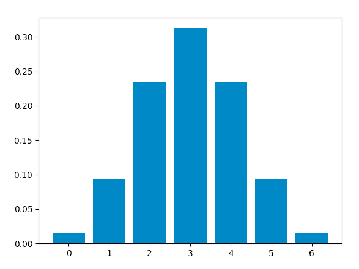

# Python–二项分布

> 原文:[https://www.geeksforgeeks.org/python-binomial-distribution/](https://www.geeksforgeeks.org/python-binomial-distribution/)

**二项式分布**是一种概率分布，总结了一个变量在给定的一组参数下取两个独立值之一的可能性。该分布是通过进行多次**伯努利**试验获得的。

假设伯努利试验满足以下每个标准:

*   只有两种可能的结果。
*   每个结果都有固定的发生概率。成功的概率为 p，失败的概率为 1–p。
*   每个试验都完全独立于所有其他试验。

二项式随机变量代表伯努利实验在 T2 连续独立试验中的成功次数。

获得 **r** 成功和 **n-r** 失败的概率为:

<center></center>

The number of ways we can achieve **r** successes is : 

<center></center>

Hence, the **probability mass function(pmf)**, which is the total probability of achieving **r** success and **n-r** failure is :

<center></center>

An example illustrating the distribution :

考虑一个随机实验，投掷一枚有偏见的硬币 **6** 次，得到一个人头的概率是 **0.6** 。如果“获得头部”被认为是“T4”成功“，那么二项式分布表将包含 r 的每个可能值的 **r** 成功的概率。

<figure class="table">

| r | Zero | one | Two | three | four | five | six |
| P(r) |  0.004096 |  0.036864 |  0.138240 |  0.276480 | 0.311040  |  0.186624 | 0.046656 |

</figure>

该分布的平均值等于 **np** ，方差为 **np(1-p)** 。

**使用 Python 获取分布:**
现在，我们将使用 Python 分析分布(使用 **SciPy** )并绘制图形(使用 **Matplotlib** )。
**所需模块:**

*   ***SciPy:***
    *SciPy* is an Open Source Python library, used in mathematics, engineering, scientific and technical computing.

    **安装:**

    ```py
    pip install scipy

    ```

*   ***Matplotlib:***
    *Matplotlib* is a comprehensive Python library for plotting static and interactive graphs and visualisations.

    **安装:**

    ```py
    pip install matplotlib

    ```

**scipy.stats** 模块包含各种统计计算和测试功能。 **scipy.stats.binom** 模块的 **stats()** 功能可用于使用 **n** 和 **p** 的值计算二项式分布。

> **语法**:scipy . stat . binom . stats(n，p)

它返回一个元组，包含按此顺序分布的平均值和方差。

**scipy.stats.binom.pmf()** 函数用于获得 r、n 和 p 某个值的概率质量函数，我们可以通过传递 r(0 到 n)的所有可能值来获得分布。

> **语法**:scipy . stat . binom . PMF(r，n，p)

**计算分配表:**

**进场:**

*   定义 **n** 和 **p** 。
*   定义从 0 到 n 的 **r** 的值列表
*   得到**均值**和**方差**。
*   对于每个 r，计算 **pmf** 并存储在列表中。

**代码:**

```py
from scipy.stats import binom
# setting the values
# of n and p
n = 6
p = 0.6
# defining the list of r values
r_values = list(range(n + 1))
# obtaining the mean and variance 
mean, var = binom.stats(n, p)
# list of pmf values
dist = [binom.pmf(r, n, p) for r in r_values ]
# printing the table
print("r\tp(r)")
for i in range(n + 1):
    print(str(r_values[i]) + "\t" + str(dist[i]))
# printing mean and variance
print("mean = "+str(mean))
print("variance = "+str(var))
```

**输出:**

```py
r    p(r)
0    0.004096000000000002
1    0.03686400000000005
2    0.13824000000000003
3    0.2764800000000001
4    0.31104
5    0.18662400000000007
6    0.04665599999999999
mean = 3.5999999999999996
variance = 1.44

```

**代码:使用 *matplotlib.pyplot.bar()* 函数绘制曲线图，绘制竖线。**

```py
from scipy.stats import binom
import matplotlib.pyplot as plt
# setting the values
# of n and p
n = 6
p = 0.6
# defining list of r values
r_values = list(range(n + 1))
# list of pmf values
dist = [binom.pmf(r, n, p) for r in r_values ]
# plotting the graph 
plt.bar(r_values, dist)
plt.show()
```

**输出:**

<center> [](https://media.geeksforgeeks.org/wp-content/uploads/20200615171408/Screenshot20200615at51319PM.png)</center>

When success and failure are equally likely, the binomial distribution is a **normal** distribution. Hence, changing the value of **p** to **0.5**, we obtain this graph, which is identical to a normal distribution plot :

<center>[](https://media.geeksforgeeks.org/wp-content/uploads/20200615171521/Screenshot20200615at51453PM.png)</center>