# Python–使用图像处理进行血细胞识别

> 原文:[https://www . geesforgeks . org/python-血细胞-识别-使用-图像处理/](https://www.geeksforgeeks.org/python-blood-cell-identification-using-image-processing/)

白细胞和红细胞的检测对于各种医疗应用非常有用，如白细胞计数、疾病诊断等。圆形检测是最合适的方法。本文是在获得的增强图像上实现适合血细胞识别的图像分割和特征提取技术。
为了说明图像增强和边缘检测的工作和使用，本文使用的是图像:
**输入:**

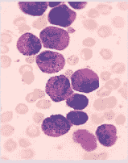

原始血液涂片显微图像

**代码:用于图像增强的 Python 代码**

## 蟒蛇 3

```
import numpy as np
import cv2
import matplotlib.pyplot as plt

# read original image
image = cv2.imread("c1.png")

# convert to gray scale image
gray = cv2.cvtColor(image, cv2.COLOR_BGR2GRAY)
cv2.imwrite('gray.png', gray)

# apply median filter for smoothning
blurM = cv2.medianBlur(gray, 5)
cv2.imwrite('blurM.png', blurM)

# apply gaussian filter for smoothning
blurG = cv2.GaussianBlur(gray, (9, 9), 0)
cv2.imwrite('blurG.png', blurG)

# histogram equalization
histoNorm = cv2.equalizeHist(gray)
cv2.imwrite('histoNorm.png', histoNorm)

# create a CLAHE object for
# Contrast Limited Adaptive Histogram Equalization (CLAHE)
clahe = cv2.createCLAHE(clipLimit = 2.0, tileGridSize=(8, 8))
claheNorm = clahe.apply(gray)
cv2.imwrite('claheNorm.png', claheNorm)

# contrast stretching
# Function to map each intensity level to output intensity level.
def pixelVal(pix, r1, s1, r2, s2):
    if (0 <= pix and pix <= r1):
        return (s1 / r1) * pix
    elif (r1 < pix and pix <= r2):
        return ((s2 - s1) / (r2 - r1)) * (pix - r1) + s1
    else:
        return ((255 - s2) / (255 - r2)) * (pix - r2) + s2

    # Define parameters.

r1 = 70
s1 = 0
r2 = 200
s2 = 255

# Vectorize the function to apply it to each value in the Numpy array.
pixelVal_vec = np.vectorize(pixelVal)

# Apply contrast stretching.
contrast_stretched = pixelVal_vec(gray, r1, s1, r2, s2)
contrast_stretched_blurM = pixelVal_vec(blurM, r1, s1, r2, s2)

cv2.imwrite('contrast_stretch.png', contrast_stretched)
cv2.imwrite('contrast_stretch_blurM.png',
            contrast_stretched_blurM)

# edge detection using canny edge detector
edge = cv2.Canny(gray, 100, 200)
cv2.imwrite('edge.png', edge)

edgeG = cv2.Canny(blurG, 100, 200)
cv2.imwrite('edgeG.png', edgeG)

edgeM = cv2.Canny(blurM, 100, 200)
cv2.imwrite('edgeM.png', edgeM)
```

**输出增强图像:**


灰度图像


中值滤波图像

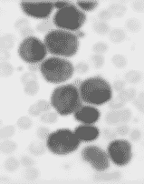

高斯滤波图像

[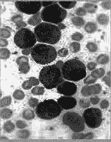](https://media.geeksforgeeks.org/wp-content/uploads/20200409113839/histoNorm.png)

直方图均衡化图像

[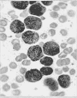](https://media.geeksforgeeks.org/wp-content/uploads/20200409113823/claheNorm.png)

标准化图像


对比度拉伸图像

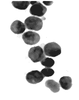

中值滤波图像的对比度拉伸

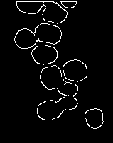

高斯滤波图像的 Canny 边缘检测

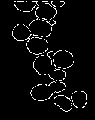

中值滤波图像的 Canny 边缘检测

**图像分割和特征提取**

## 蟒蛇 3

```
# read enhanced image
img = cv2.imread('cell.png', 0)

# morphological operations
kernel = np.ones((5, 5), np.uint8)
dilation = cv2.dilate(img, kernel, iterations = 1)
closing = cv2.morphologyEx(img, cv2.MORPH_CLOSE, kernel)

# Adaptive thresholding on mean and gaussian filter
th2 = cv2.adaptiveThreshold(img, 255, cv2.ADAPTIVE_THRESH_MEAN_C, \
            cv2.THRESH_BINARY, 11, 2)
th3 = cv2.adaptiveThreshold(img, 255, cv2.ADAPTIVE_THRESH_GAUSSIAN_C, \
            cv2.THRESH_BINARY, 11, 2)
# Otsu's thresholding
ret4, th4 = cv2.threshold(img, 0, 255, cv2.THRESH_BINARY + cv2.THRESH_OTSU)

# Initialize the list
Cell_count, x_count, y_count = [], [], []

# read original image, to display the circle and center detection 
display = cv2.imread("D:/Projects / ImageProcessing / DA1 / sample1 / cellOrig.png")

# hough transform with modified circular parameters
circles = cv2.HoughCircles(image, cv2.HOUGH_GRADIENT, 1.2, 20,
                           param1 = 50, param2 = 28, minRadius = 1, maxRadius = 20)

# circle detection and labeling using hough transformation
if circles is not None:
        # convert the (x, y) coordinates and radius of the circles to integers
        circles = np.round(circles[0, :]).astype("int")

        # loop over the (x, y) coordinates and radius of the circles
        for (x, y, r) in circles:

                cv2.circle(display, (x, y), r, (0, 255, 0), 2)
                cv2.rectangle(display, (x - 2, y - 2),
                              (x + 2, y + 2), (0, 128, 255), -1)
                Cell_count.append(r)
                x_count.append(x)
                y_count.append(y)
        # show the output image
        cv2.imshow("gray", display)
        cv2.waitKey(0)

# display the count of white blood cells
print(len(Cell_count))
# Total number of radius
print(Cell_count)
# X co-ordinate of circle
print(x_count)    
# Y co-ordinate of circle
print(y_count)    
```

**输出图像:**

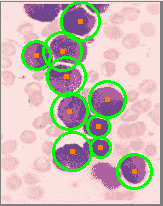

血细胞检测 q

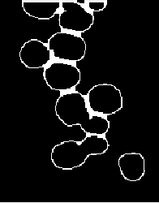

正在关闭

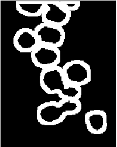

扩张

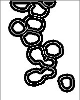

自适应阈值化

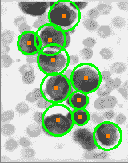

用于圆检测的改进霍格变换

**完整流程总结**

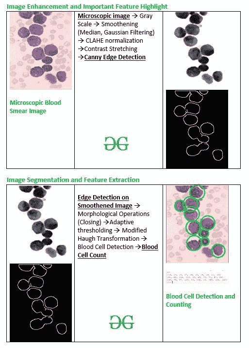