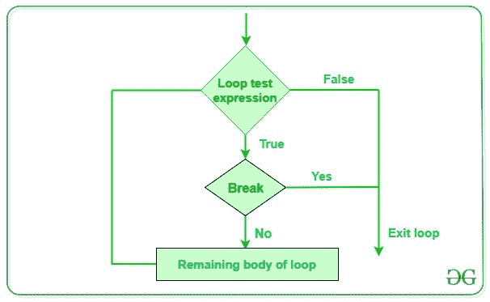

# Python break 语句

> 原文:[https://www.geeksforgeeks.org/python-break-statement/](https://www.geeksforgeeks.org/python-break-statement/)

在 Python 中使用循环以高效的方式自动化和重复任务。但是有时，可能会出现这样一种情况，您想要完全退出循环，跳过一次迭代或者忽略该情况。这些可以通过**循环控制语句**来完成。循环控制语句改变其正常顺序的执行。当执行离开一个范围时，在该范围内创建的所有自动对象都将被销毁。Python 支持以下控制语句。

*   连续语句
*   break 语句
*   传递语句

本文主要关注`break` 语句。

#### break 语句

Python 中的 Break 语句用于在某些外部条件被触发时将控件带出循环。Break 语句放在循环体中(通常在 if 条件之后)。



**语法:**

```
break

```

**示例:**

```
# Python program to
# demonstrate break statement

s = 'geeksforgeeks'
# Using for loop
for letter in s:

    print(letter)
    # break the loop as soon it sees 'e'
    # or 's'
    if letter == 'e' or letter == 's':
        break

print("Out of for loop")
print()

i = 0

# Using while loop
while True:
    print(s[i])

    # break the loop as soon it sees 'e'
    # or 's'
    if s[i] == 'e' or s[i] == 's':
        break
    i += 1

print("Out of while loop")
```

**输出:**

```
g
e
Out of for loop

g
e
Out of while loop

```

在上面的例子中，两个循环都在迭代字符串“geeksforgeeks ”,一旦遇到字符“e”或“s ”, if 条件就变为真，执行流程就被带出循环。