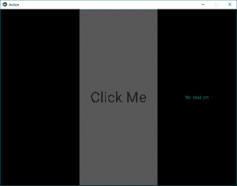
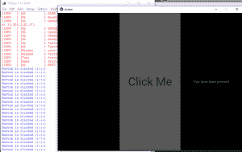

# Python | Kivy 中的按钮动作

> 原文:[https://www.geeksforgeeks.org/python-button-action-in-kivy/](https://www.geeksforgeeks.org/python-button-action-in-kivy/)

[Kivy](https://www.geeksforgeeks.org/python-kivy-kv-file/) 是 Python 中独立于平台的 GUI 工具。因为它可以在安卓、IOS、Linux 和视窗等平台上运行。它基本上是用来开发安卓应用的，但并不意味着它不能在桌面应用上使用。

> ？？？？？？？？ [Kivy 教程–通过示例学习 Kivy](https://www.geeksforgeeks.org/kivy-tutorial/)。

现在在本文中，我们将学习如何使用 *kv 文件*在 kivy 中构建按钮，就像我们在计算器和许多其他地方使用的按钮一样。
**按钮:**
按钮是一个标签，当按钮被按下(或点击/触摸后释放)时会触发相关动作。要绑定按钮按下时的动作，我们有功能 **on_press** 。
**按钮动作使用的基本方法。kv 文件:**

```
1) Import kivy
2) Import kivy app
3) Import Box layout
4) create .kv with label and button
5) Bind button to a method
6) create method
```

**现在让我们对代码进行编码。py 文件。**

## 蟒蛇 3

```
# import kivy module
import kivy

# this restrict the kivy version i.e
# below this kivy version you cannot
# use the app or software
kivy.require("1.9.1")

# base Class of your App inherits from the App class.
# app:always refers to the instance of your application
from kivy.app import App

# BoxLayout arranges children
# in a vertical or horizontal box.
from kivy.uix.boxlayout import BoxLayout

# class in which we are defining action on click
class RootWidget(BoxLayout):

    def btn_clk(self):
        self.lbl.text = "You have been pressed"

# creating action class and calling
# Rootwidget by returning it
class ActionApp(App):

    def build(self):
        return RootWidget()

# creating the myApp root for ActionApp() class 
myApp = ActionApp()

# run function runs the whole program
# i.e run() method which calls the
# target function passed to the constructor.
myApp.run()
```

**。以上代码的 kv 文件【action . kv】:**
必须用 ActionApp 类的名称保存。即 action.kv.

## 蟒蛇 3

```
# Base widget from Rootwidget class in .py file
<RootWidget>:

    # used to change the label text
    # as in rootwidget class
    lbl:my_label

    # child that is an instance of the BoxLayout
    BoxLayout:
        orientation: 'vertical'
        size: [1, .25]

    Button:
        text:'Click Me'
        font_size:"50sp"
        color: [0, 255, 255, .67]
        on_press: root.btn_clk()

    Label:
        # id is limited in scope to the rule
        # it is declared in. An id is a weakref
        # to the widget and not the widget itself.
        id: my_label
        text: 'No click Yet'
        color: [0, 84, 80, 19]
```

**输出:**





**视频讲解输出:**

<video class="wp-video-shortcode" id="video-299594-1" width="640" height="360" preload="metadata" controls=""><source type="video/mp4" src="https://media.geeksforgeeks.org/wp-content/uploads/20190502171940/action.mp4?_=1">[https://media.geeksforgeeks.org/wp-content/uploads/20190502171940/action.mp4](https://media.geeksforgeeks.org/wp-content/uploads/20190502171940/action.mp4)</video>

**注意:** BoxLayout 以一个在另一个之上的垂直方式或一个接一个的水平方式排列小部件。