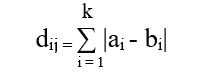

# Python |计算城市街区距离

> 原文:[https://www . geesforgeks . org/python-compute-city-block-distance/](https://www.geeksforgeeks.org/python-calculate-city-block-distance/)

城市街区距离通常是在配对对象的 2 坐标之间计算的。它是两个坐标之间绝对差的总和。2 点 *a* 和 *b* 与 *k* 维度的城市街区距离使用以下公式进行数学计算:


本文针对这个问题解释了两种解决方案——一种是 Python 代码，另一种是使用预定义的方法。

**示例:**

> **输入:**
> 数组 1 = [1，2，13，5]
> 数组 2 = [1，27，3，4]
> **输出:**
> 2 个数组之间的 CityBlock 距离为:36
> 
>  **输入:**
> a =【34、44、89、81、67、49、33、59】
> b =【98、34、23、12、233、23、44】
> **输出:** 2 个数组之间的 CityBlock 距离为:412

**代码:Python scratch 代码使用上面的公式计算距离。**

```
import numpy as np

def cityblock_distance(A, B):

    result = np.sum([abs(a - b) for (a, b) in zip(A, B)])
    return result

if __name__== "__main__":

    array1 = [1, 2, 13, 5]
    array2 = [1, 27, 3, 4]

    result = cityblock_distance(array1, array2)

    print("The CityBlock distance between 2 arrays is:", result)
```

**输出:**

```
The CityBlock distance between 2 arrays is: 36

```

对于相同大小的数组没有限制。因此，使用上面的公式很容易计算城市区块在二维坐标之间的距离，但是我们可以使用预定义的方法计算二维或二维以上的数组。

**代码:Python 代码使用预定义的方法使用上面的公式计算距离。**

```
# Import necessary package
import scipy.spatial.distance as d

def CityBlock_distance(A, B):

    result = d.cdist(A, B, 'cityblock')
    return result

if __name__== "__main__":

    mat1 = [[1, 2, 13, 5], [2, 3, 4, 5]]
    mat2 = [[1, 27, 3, 4], [8, 6, 9, 3]]

    result = CityBlock_distance(mat1, mat2)

    print(result)
```

**输出:**

```
[[ 36\.  17.]
 [ 27\.  16.]]

```