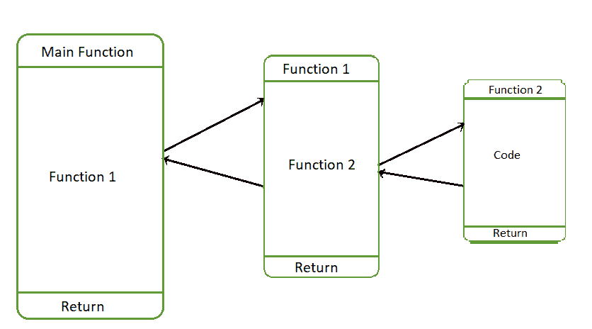

# Python–从另一个函数调用函数

> 原文:[https://www . geesforgeks . org/python-从另一个函数调用函数/](https://www.geeksforgeeks.org/python-call-function-from-another-function/)

**先决条件:**[Python 中的函数](https://www.geeksforgeeks.org/functions-in-python/)
在 Python 中，任何编写的函数都可以被另一个函数调用。请注意，这可能是将问题分解成小问题的最优雅的方式。在本文中，我们将学习如何借助多个示例从另一个函数调用一个已定义的函数。

***调用和被调用函数？***
调用另一个函数的函数称为**调用函数**，另一个函数调用的函数称为**调用函数。**

**函数执行是如何工作的？**
在函数调用执行期间使用堆栈数据结构。每当调用一个函数时，调用函数就会被推入堆栈并执行被调用的函数。当被调用的函数完成其执行并返回时，调用函数从堆栈中弹出并执行。只有当被调用的函数执行完成时，调用函数的执行才会完成。

下图中。从 Main 函数调用*函数 1* ，现在 Main 函数的状态存储在 Stack 中，当*函数 1* 返回时，Main 函数继续执行。*功能 1* 调用*功能 2* 现在*功能 1* 的状态被堆栈存储，当*功能 2* 返回时*功能 1* 将继续执行。



考虑下面的函数调用示例。函数 SumOfSquares 函数调用返回数字平方的函数 Square。

## 蟒蛇 3

```py
# Python code to demonstrate calling the
# function from another function

def Square(X):
    # computes the Square of the given number
    # and return to the caller function
    return (X * X)

def SumofSquares(Array, n):

    # Initialize variable Sum to 0\. It stores the
    # Total sum of squares of the array of elements
    Sum = 0
    for i in range(n):

        # Square of Array[i] element is stored in SquaredValue
        SquaredValue = Square(Array[i])

        # Cumulative sum is stored in Sum variable
        Sum += SquaredValue
    return Sum

# Driver Function
Array = [1, 2, 3, 4, 5, 6, 7, 8, 9, 10]
n = len(Array)

# Return value from the function
# Sum of Squares is stored in Total
Total = SumofSquares(Array, n)
print("Sum of the Square of List of Numbers:", Total)
```

**输出:**

```py
Sum of the Square of List of Numbers: 385 
```

**从同一个类中的另一个函数调用函数–**
在下面的例子中，类方法 Function1 从类中调用方法 Function2。

## 蟒蛇 3

```py
'''
Call a function from within another function
in the same class in Python
'''

class Main:

    # constructor of Main class
    def __init__(self):
        # Initialization of the Strings
        self.String1 ="Hello"
        self.String2 ="World"

    def Function1(self):
        # calling Function2 Method
        self.Function2()
        print("Function1 : ", self.String2)
        return

    def Function2(self):
        print("Function2 : ", self.String1)
        return

# Instance of Class Main
Object = Main()

# Calling Function1
Object.Function1()
```

**输出:**

```py
Function2 :  Hello
Function1 :  World
```

**调用** ***父类*** **函数从** ***子类*** **函数–**
考虑以下示例子类方法调用父类方法。子类从父类继承属性。

## 蟒蛇 3

```py
# Python code to demonstrate calling parent class
# method from the child class method

class Parent:

    # constructor of Parent class
    def __init__(self):
        # Initialization of the Strings
        self.String1 ="Hello"
        self.String2 ="World"

    def Function2(self):
        print("Function2 : ", self.String1)
        return

# Child class is inheriting from Parent class
class Child(Parent):

    def Function1(self):
        # calling Function2 Method in parent class
        self.Function2()
        print("Function1 : ", self.String2)
        return  

### Instance of Parent class
Object1 = Parent()

### Instance of Child class
Object2 = Child()

# Calling Function1 using Child class instance
Object2.Function1()
```

**输出:**

```py
Function2 :  Hello
Function1 :  World
```