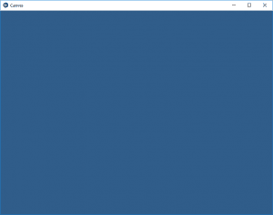
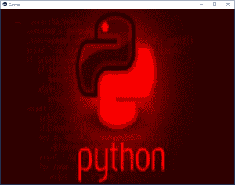

# Python | kivy 中的 Canvas

> 原文:[https://www.geeksforgeeks.org/python-canvas-in-kivy/](https://www.geeksforgeeks.org/python-canvas-in-kivy/)

Kivy 是 Python 中独立于平台的 GUI 工具。因为它可以在安卓、IOS、linux 和 Windows 等平台上运行。它基本上是用来开发安卓应用程序的，但并不意味着它不能在桌面应用程序上使用。

> ？？？？？？？？ [Kivy 教程–通过示例学习 Kivy](https://www.geeksforgeeks.org/kivy-tutorial/)。

**画布:**
画布是小部件用于绘制的根对象。画布不是你画画的地方。我在画布开始时遇到的主要问题是由于它的名字。尤其是考虑到所有关于 HTML5 画布的讨论。我最初认为画布是颜料，但画布基本上是一个说明的容器。
要使用画布，您必须导入:

```
from kivy.graphics import Rectangle, Color
```

**注意:**默认情况下，Kivy 中的每个 Widget 都已经有一个 Canvas。创建小部件时，可以创建绘图所需的所有说明。如果自我是你当前的小部件。“颜色”和“矩形”指令会自动添加到画布对象中，并在绘制窗口时使用。

```
Basic Approach 
-> import kivy
-> import kivy App
-> import widget
-> import Canvas i.e.:
      from kivy.graphics import Rectangle, Color
-> set minimum version(optional)
-> Extend the Widget class
-> Create the App Class
-> return a Widget
-> Run an instance of the class
```

**实施该方法–**

## 蟒蛇 3

```
# import kivy module
import kivy

# this restrict the kivy version i.e
# below this kivy version you cannot
# use the app or software
kivy.require("1.9.1")

# base Class of your App inherits from the App class.
# app:always refers to the instance of your application
from kivy.app import App

# A Widget is the base building block
# of GUI interfaces in Kivy.
# It provides a Canvas that
# can be used to draw on screen.
from kivy.uix.widget import Widget

# From graphics module we are importing
# Rectangle and Color as they are
# basic building of canvas.
from kivy.graphics import Rectangle, Color

# class in which we are creating the canvas
class CanvasWidget(Widget):

    def __init__(self, **kwargs):

        super(CanvasWidget, self).__init__(**kwargs)

        # Arranging Canvas
        with self.canvas:

            Color(.234, .456, .678, .8)  # set the colour

            # Setting the size and position of canvas
            self.rect = Rectangle(pos = self.center,
                                  size =(self.width / 2.,
                                        self.height / 2.))

            # Update the canvas as the screen size change
            self.bind(pos = self.update_rect,
                  size = self.update_rect)

    # update function which makes the canvas adjustable.
    def update_rect(self, *args):
        self.rect.pos = self.pos
        self.rect.size = self.size

# Create the App Class
class CanvasApp(App):
    def build(self):
        return CanvasWidget()

# run the App
CanvasApp().run()
```

**输出:**



您也可以在画布中使用任何其他小部件。在下面的例子中，我们将展示如何添加图像和改变它的颜色。
要更改颜色，只需更改将更改图像颜色的画布颜色。

## 蟒蛇 3

```
# import kivy module
import kivy

# this restrict the kivy version i.e
# below this kivy version you cannot
# use the app or software
kivy.require("1.9.1")

# base Class of your App inherits from the App class.
# app:always refers to the instance of your application
from kivy.app import App

# A Widget is the base building block
# of GUI interfaces in Kivy.
# It provides a Canvas that
# can be used to draw on screen.
from kivy.uix.widget import Widget

# From graphics module we are importing
# Rectangle and Color as they are
# basic building of canvas.
from kivy.graphics import Rectangle, Color

# class in which we are creating the canvas
class CanvasWidget(Widget):

    def __init__(self, **kwargs):

        super(CanvasWidget, self).__init__(**kwargs)

        # Arranging Canvas
        with self.canvas:

            Color(1, 0, 0, 1)  # set the colour

            # Setting the size and position of image
            # image must be in same folder
            self.rect = Rectangle(source ='download.jpg',
                                  pos = self.pos, size = self.size)

            # Update the canvas as the screen size change
            # if not use this next 5 line the
            # code will run but not cover the full screen
            self.bind(pos = self.update_rect,
                  size = self.update_rect)

    # update function which makes the canvas adjustable.
    def update_rect(self, *args):
        self.rect.pos = self.pos
        self.rect.size = self.size

# Create the App Class
class CanvasApp(App):
    def build(self):
        return CanvasWidget()

# run the App
CanvasApp().run()
```

**输出:**
**App 中使用的原图为:**


**画布中的图像:**



**注意:**
Kivy 绘图指令不会自动相对于小部件的位置或大小。因此，你在画画时需要考虑这些因素。为了使您的绘图指令相对于小部件，这些指令需要在 KvLang 中声明，或者绑定到 pos 和大小更改。