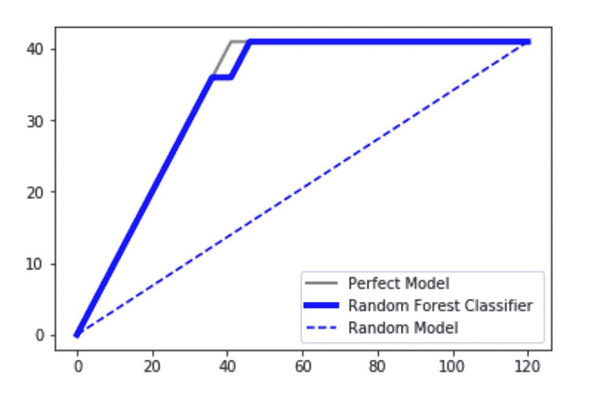
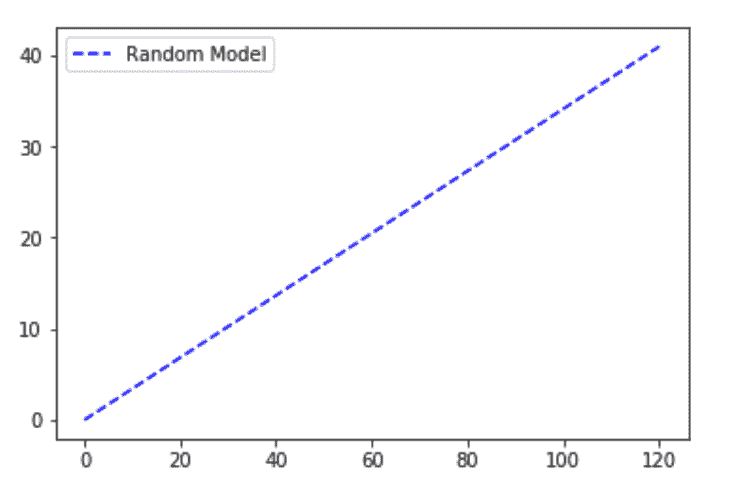
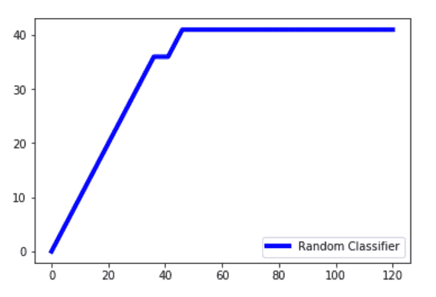
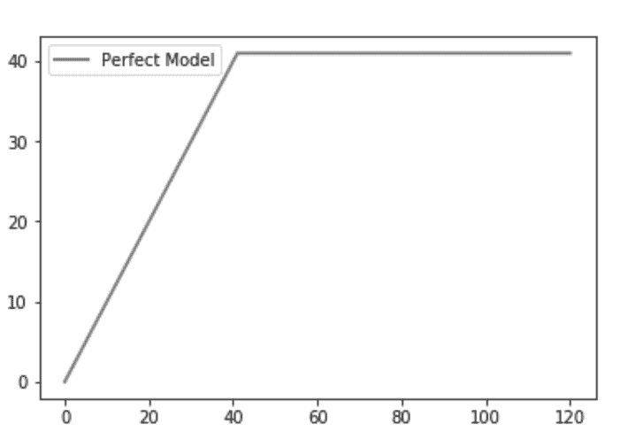

# Python | CAP–累积精度剖面分析

> 原文:[https://www . geesforgeks . org/python-cap-累积-准确性-概况-分析/](https://www.geeksforgeeks.org/python-cap-cumulative-accuracy-profile-analysis/)

在分类模型的性能评估中使用了通常称为“累积精度分布图”的 CAP。它帮助我们理解和总结分类模型的健壮性。为了实现可视化，我们在图中绘制了三条不同的曲线:

1.  随机的情节
2.  使用 SVM 分类器或随机森林分类器获得的图
3.  完美的情节(理想的路线)



我们正在使用[数据](https://www.kaggle.com/rakeshrau/social-network-ads)来理解这个概念。

**代码:加载数据集。**

## 蟒蛇 3

```py
# importing libraries
import pandas as pd
import seaborn as sns
import matplotlib.pyplot as plt
import numpy as np

# loading dataset
data = pd.read_csv('C:\\Users\\DELL\\Desktop\\Social_Network_Ads.csv')

print ("Data Head : \n\n", data.head())
```

**输出:**

```py
Data Head : 

     User ID  Gender  Age  EstimatedSalary  Purchased
0  15624510    Male   19            19000          0
1  15810944    Male   35            20000          0
2  15668575  Female   26            43000          0
3  15603246  Female   27            57000          0
4  15804002    Male   19            76000          0
```

**代码:数据输入输出。**

## 蟒蛇 3

```py
# Input and Output
x = data.iloc[:, 2:4]
y = data.iloc[:, 4]

print ("Input : \n", x.iloc[0:10, :])
```

**输出:**

```py
Input : 
    Age  EstimatedSalary
0   19            19000
1   35            20000
2   26            43000
3   27            57000
4   19            76000
5   27            58000
6   27            84000
7   32           150000
8   25            33000
9   35            65000
```

**代码:拆分数据集进行训练和测试。**

## 蟒蛇 3

```py
# splitting data
from sklearn.model_selection import train_test_split
x_train, x_test, y_train, y_test = train_test_split(
        x, y, test_size = 0.3, random_state = 0)
```

**代码:随机森林分类器**

## 蟒蛇 3

```py
# classifier
from sklearn.ensemble import RandomForestClassifier
classifier = RandomForestClassifier(n_estimators = 400)

# training
classifier.fit(x_train, y_train)

# predicting
pred = classifier.predict(x_test)
```

**代码:求分类器精度。**

## 蟒蛇 3

```py
# Model Performance
from sklearn.metrics import accuracy_score
print("Accuracy : ", accuracy_score(y_test, pred) *  100)
```

**输出:**

```py
Accuracy :  91.66666666666666
```

### **随机模型**

随机绘图是在假设我们已经绘制了从 0 到数据集中数据点总数的点总数的情况下进行的。y 轴保持为数据集中因变量结果为 1 的点的总数。随机图可以理解为线性增长关系。一个例子是一个模型，该模型基于诸如性别、年龄、收入等因素预测每个人是否从一群人中购买了产品(积极的结果)(分类参数)。如果随机联系小组成员，累计售出的产品数量将线性上升至与小组内买家总数相对应的最大值。这种分布称为**“随机”CAP** 。

**代码:随机型号**

## 蟒蛇 3

```py
# code for the random plot
import matplotlib.pyplot as plt
import numpy as np

# length of the test data
total = len(y_test)

# Counting '1' labels in test data
one_count = np.sum(y_test)

# counting '0' labels in test data
zero_count = total - one_count

plt.figure(figsize = (10, 6))

# x-axis ranges from 0 to total people contacted
# y-axis ranges from 0 to the total positive outcomes.

plt.plot([0, total], [0, one_count], c = 'b',
         linestyle = '--', label = 'Random Model')
plt.legend()
```

**输出:**



### **随机森林分类器线**

**代码:**随机森林分类算法应用于**随机分类器线图**的数据集。

## 蟒蛇 3

```py
lm = [y for _, y in sorted(zip(pred, y_test), reverse = True)]
x = np.arange(0, total + 1)
y = np.append([0], np.cumsum(lm))
plt.plot(x, y, c = 'b', label = 'Random classifier', linewidth = 2)
```

**输出:**



**说明:** pred 是随机分类器做出的预测。我们**压缩**预测和测试值，并以相反的顺序对其进行排序，以便较高的值优先，然后是较低的值。我们只提取数组中的 **y_test** 值，并将其存储在 **lm** 中。 **np.cumsum()** 创建一个值数组，同时将数组中所有以前的值累加到当前值。x 值的范围从 0 到总和+ 1。我们将一个添加到总原因中**保证()**不包括一个到数组中，我们希望 x 轴的范围从 0 到总数。

### **完美模型**

然后我们画出完美的情节(或理想线)。一个完美的预测准确地决定了哪些群体成员会购买该产品，从而以最少的通话次数达到销售产品的最大数量。这在 CAP 曲线上产生了一条陡峭的线，一旦达到最大值，这条线就会保持平坦(接触所有其他组成员不会导致销售更多产品)，这就是**“完美”的 CAP** 。

## 蟒蛇 3

```py
plt.plot([0, one_count, total], [0, one_count, one_count],
         c = 'grey', linewidth = 2, label = 'Perfect Model')
```

**输出:**



说明:一个完美的模型会在与积极结果相同的尝试次数中发现积极结果。我们的数据集中总共有 41 个积极的结果，因此正好是 41，达到了最大值。

### **最终分析:**

无论如何，我们的分类器算法不应该产生位于随机线下面的线。在那种情况下，它被认为是一个非常糟糕的模型。由于绘制的分类器线接近理想线，我们可以说我们的模型非常适合。以完美情节下的区域为例，称之为 aP。取预测模型下的区域，称之为 **aR** 。然后取比值为 **aR/aP** 。这个比率被称为**准确率**。值越接近 1，模型越好。这是分析它的一种方法。

分析它的另一种方法是从预测模型轴的大约 50%投影一条线，并将其投影到 y 轴上。假设我们获得的投影值为 X%。

```py
-> 60%        : it is a really bad model
-> 60%<X<70%  : it is still a bad model but better than the first case obviously
-> 70%<X<80%  : it is a good model
-> 80%<X<90%  : it is a very good model
-> 90%<X<100% : it is extraordinarily good and might be one of the overfitting cases.
```

所以根据这个分析，我们可以确定我们的模型有多准确。

**参考:-wikipedia.org**T2】