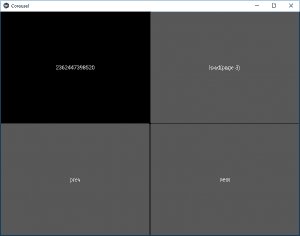

# Python | Carousel Widget In Kivy 使用。kv 文件

> 原文:[https://www . geesforgeks . org/python-carousel-widget-in-kivy-using-kv-file/](https://www.geeksforgeeks.org/python-carousel-widget-in-kivy-using-kv-file/)

Kivy 是 Python 中独立于平台的 GUI 工具。因为它可以在安卓、IOS、Linux 和视窗等平台上运行。它基本上是用来开发安卓应用程序的，但并不意味着它不能在桌面应用程序上使用。

> 👉🏽 [Kivy 教程–通过示例学习 Kivy](https://www.geeksforgeeks.org/kivy-tutorial/)。

## 转盘部件:

轮播小部件提供了经典的移动友好的轮播视图，您可以在幻灯片之间滑动。您可以向转盘添加任何内容，并让它水平或垂直移动。转盘可以按顺序或循环显示页面。

要使用此小部件，您必须导入:

```
from kivy.uix.carousel import Carousel
```

```
Basic Approach:
1) import kivy
2) import kivy App
3) import Gridlayout
4) import Carousel
5) set minimum version(optional)
6) Create as much as widget class as needed
7) create the App class
8) return the widget/layout etc class
9) Create Carousel.kv file:
        1) Create button( or what is needed)
        2) Arrange the on_release / on_press function
10) Run an instance of the class
```

在下面的例子中，我们正在应用程序中创建按钮。在本例中，我们使用了`load_previous()`和`load_next()`功能。

> **load_next(模式='next')**
> 制作下一张幻灯片的动画。
> 
> **加载 _ 上一张()**
> 动画到上一张幻灯片。

**实施方法:**

main.py 文件:

```
# Program to explain how to add carousel in kivy 

# import kivy module    
import kivy  

# base Class of your App inherits from the App class.    
# app:always refers to the instance of your application   
from kivy.app import App 

# this restrict the kivy version i.e  
# below this kivy version you cannot  
# use the app or software  
kivy.require('1.9.0') 

# The Carousel widget provides the
# classic mobile-friendly carousel
# view where you can swipe between slides
from kivy.uix.carousel import Carousel

# The GridLayout arranges children in a matrix. 
# It takes the available space and 
# divides it into columns and rows, 
# then adds widgets to the resulting “cells”.
from kivy.uix.gridlayout import GridLayout

# Create the Layout Class
class Corousel(GridLayout):
    pass

# Create the App class
class CorouselApp(App):
    def build(self):
        # Set carousel widget as root
        root = Carousel()

        # for multiple pages
        for x in range(10):
            root.add_widget(Corousel())
        return root

# run the App
if __name__ == '__main__':
    CorouselApp().run()
```

**[Corousel.kv](https://www.geeksforgeeks.org/python-kivy-kv-file/) 文件:**

```
# Corousel.kv file of the code

# Corousel Creation
<Corousel>:

    rows: 2

    # It shows the id which is different for different pages
    Label:
        text: str(id(root))

    # This button will take you directly to the 3rd page    
    Button
        text: 'load(page 3)'
        on_release:
            carousel = root.parent.parent
            carousel.load_slide(carousel.slides[2])

    # load_previous() is used to go back to previous page
    Button
        text: 'prev'
        on_release:
            root.parent.parent.load_previous()

    # load_next() is used to go to nevt page
    Button
        text: 'next'
        on_release:
            root.parent.parent.load_next()
```

**输出:**


<video class="wp-video-shortcode" id="video-317389-1" width="665" height="374" preload="metadata" controls=""><source type="video/webm" src="https://media.geeksforgeeks.org/wp-content/uploads/20190627114223/caroursel.webm?_=1">[https://media.geeksforgeeks.org/wp-content/uploads/20190627114223/caroursel.webm](https://media.geeksforgeeks.org/wp-content/uploads/20190627114223/caroursel.webm)</video>