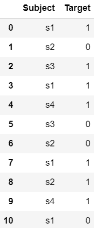

# Python–使用太阳鸟的分类编码

> 原文:[https://www . geesforgeks . org/python-classic-encoding-use-sunbird/](https://www.geeksforgeeks.org/python-categorical-encoding-using-sunbird/)

**太阳鸟**库是特征工程的最佳选择。在这个库中，您将获得各种技术来处理缺失值、异常值、分类编码、规范化和标准化、特征选择技术等。可以使用以下命令安装:

```
pip install sunbird
```

## **分类编码**

分类数据是一种常见的包含标签值而非数字的非数字数据。一些例子包括:

颜色:白色、黑色、绿色。城市:孟买、浦那、德里。性别:男，女。

为了各种编码技术，我们将使用下面的数据集:

## 蟒蛇 3

```
# importing libraries
import pandas as pd

# creating dataset
data = {'Subject': ['s1', 's2', 's3', 's1', 's4',
                        's3', 's2', 's1', 's2', 's4', 's1'],
        'Target': [1, 0, 1, 1, 1, 0, 0, 1, 1, 1, 0]}

# convert to dataframe
df = pd.DataFrame(data)

# display the dataset
df
```

**输出:**



#### 分类编码中可用的各种编码算法有:

**1)频率编码:**

频率编码使用数据中类别的频率。在这种方法中，我们用频率对类别进行编码。

如果我们举一个印度频率为 40 的国家为例，那么我们用 40 来编码它。

这种方法的缺点是假设两个类别具有相同数量的频率，那么两个类别的编码值是相同的。

**语法:**

```
from sunbird.categorical_encoding import frequency_encoding
frequency_encoding(dataframe, 'categorical-column')
```

**示例:**

## 蟒蛇 3

```
# importing libraries
from sunbird.categorical_encoding import frequency_encoding
import pandas as pd

# creating dataset
data = {'Subject': ['s1', 's2', 's3', 's1', 's4',
                    's3', 's2', 's1', 's2', 's4', 's1'],
        'Target': [1, 0, 1, 1, 1, 0, 0, 1, 1, 1, 0]}

df = pd.DataFrame(data)

# applying frequency encoding
frequency_encoding(df, 'Subject')

# display the dataset
df
```

**输出:**


**2)目标引导编码:**

在这种编码中，特征被替换为给定特定分类值的目标后验概率和所有训练数据上目标的先验概率的混合。该方法根据标签的目标对标签进行排序。

**语法:**

```
from sunbird.categorical_encoding import target_guided_encoding
target_guided_encoding(dataframe, 'categorical-column', 'target-column')
```

**示例:**

## 蟒蛇 3

```
# importing libraries
from sunbird.categorical_encoding import target_guided_encoding
import pandas as pd

# creating dataset
data = {'Subject': ['s1', 's2', 's3', 's1', 's4',
                    's3', 's2', 's1', 's2', 's4', 's1'],
        'Target': [1, 0, 1, 1, 1, 0, 0, 1, 1, 1, 0]}

df = pd.DataFrame(data)

# applying target guided encoding
target_guided_encoding(df, 'Subject', 'Target')

# display the dataset
df
```