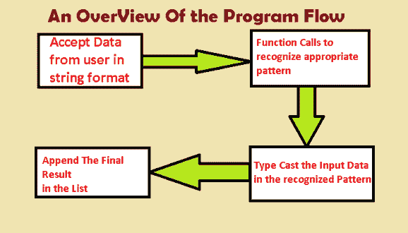
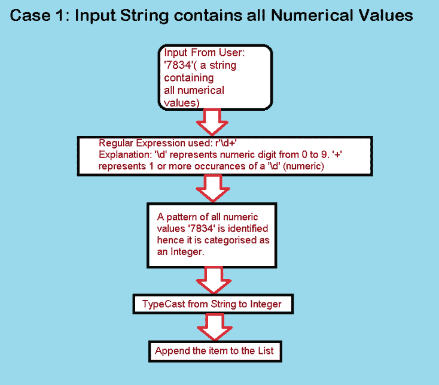
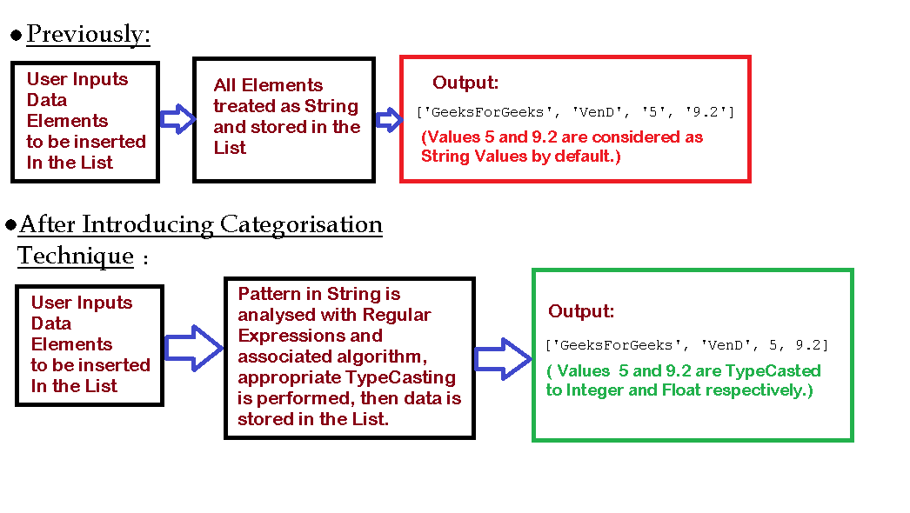

# Python |对列表中的输入数据进行分类

> 原文:[https://www . geesforgeks . org/python-分类-输入-列表中的数据/](https://www.geeksforgeeks.org/python-categorizing-input-data-in-lists/)

Python 中的列表是线性容器，用于存储各种数据类型的数据。存储各种数据的能力使列表成为 Python 中非常独特和重要的数据结构。
列表一旦创建，就可以根据需要进一步修改。因此，它们是“可变的”

创建列表后，通过定义代码段中的值，将生成类似如下的输出:
**代码:**

```py
List =['GeeksForGeeks', 'VenD', 5, 9.2]
print('\n List: ', List)
```

**输出:**

```py

 List:  ['GeeksForGeeks', 'VenD', 5, 9.2]

```

在上图中，定义的列表是整数值和字符串值的组合。解释器隐式地将“GeeksForGeeks”和“VenD”解释为字符串值，而 5 和 9.2 分别解释为整数值和浮点值。我们可以对整数值和浮点值执行通常的算术运算，如下所示。
**代号:**

```py
# Usual Arithmetic Operations on 5 and 9.2:
List =['GeeksForGeeks', 'VenD', 5, 9.2]
print('\n List[2]+2, Answer: ', end ='')
print(List[List.index(5)]+2)

print('\n\n List[3]+8.2, Answer: ', end ='')
print(List[List.index(9.2)]+8.2)
```

**输出:**

```py
 List[2]+2, Answer: 7
 List[3]+8.2, Answer: 17.4

```

此外，字符串连接等特定于字符串的操作可以在相应的字符串上执行:
**代码:**

```py
# String Concatenation Operation
# List:  ['GeeksForGeeks', 'VenD', 5, 9.2]
# Concatenating List[0] and List[1]
List =  ['GeeksForGeeks', 'VenD', 5, 9.2]
print(List[0]+' '+List[1])
```

然而，因为我们知道列表包含各种数据类型的项目，这些数据类型可能是:字符串、整数、浮点、元组、字典，甚至可能是列表本身(列表的列表)，所以如果您根据用户输入生成一个列表，这是无效的。例如，考虑下面的例子:
**代码:**

```py
# All Resultant Elements of List2 will be of string type

list2 =[]  # This is the list which will contain elements as an input from the user

element_count = int(input('\n Enter Number of Elements you wish to enter: '))

for i in range(element_count):
    element = input(f'\n Enter Element {i + 1} : ')
    list2.append(element)

print("\n List 2 : ", list2)
```

**输出:**

```py

 Enter Number of Elements you wish to enter: 4

 Enter Element 1 : GeeksForGeeks

 Enter Element 2 : VenD

 Enter Element 3 : 5

 Enter Element 4 : 9.2

 List 2 :  ['GeeksForGeeks', 'VenD', '5', '9.2']

```

您可能会注意到，由于用户输入而生成的列表 2 现在只包含字符串数据类型的值。此外，数字元素现在已经失去了进行算术运算的能力，因为它们是字符串数据类型。这种行为直接与列表的多用途行为相矛盾。

作为程序员，我们有必要处理用户数据并以适当的格式存储它，以便对目标数据集的操作变得高效。
在这种方法中，我们将把从用户那里获得的数据分成三个部分，即整数、字符串和浮点数。为此，我们使用一个小代码来执行各自的类型转换操作。

克服建议限制的技术:


**代号:**

```py
import re

def checkInt(string):
    string_to_integer = re.compile(r'\d+')
    if len(string_to_integer.findall(string)) != 0:
        if len(string_to_integer.findall(string)[0])== len(string):
            return 1
        else:
            return 0
    else:
        return 0

def checkFloat(string):
    string_to_float = re.compile(r'\d*.\d*')
    if len(string_to_float.findall(string)) != 0:
        if len(string_to_float.findall(string)[0])== len(string):
            return 1
        else:
            return 0
    else:
        return 0

List2 =[]
element_count = int(input('\n Enter number of elements : '))

for i in range(element_count):
    input_element = input(f'\n Enter Element {i + 1}: ')

    if checkInt(input_element):
        input_element = int(input_element)
        List2.append(input_element)

    elif checkFloat(input_element):
        input_element = float(input_element)
        List2.append(input_element)

    else:
        List2.append(input_element)

print(List2)
```

**输出:**

```py
 Enter number of elements : 4

 Enter Element 1: GeeksForGeeks

 Enter Element 2: VenD

 Enter Element 3: 5

 Enter Element 4: 9.2
['GeeksForGeeks', 'VenD', 5, 9.2]

```

上述技术本质上是一种算法，它使用正则表达式库和算法来分析插入元素的数据类型。在成功分析了数据模式之后，我们继续执行类型转换。

例如，考虑以下情况:

1.  **Case1:** All values in the string are numeric. The user input is 7834, the Regular Expression function analyzes the given data and identifies that all values are digits between 0 to 9 hence the string ‘7834’ is typecasted to the equivalent integer value and then appended to the list as an integer.

    用于整数标识的表达式:r'\d+'

    

2.  **案例 2:** 字符串表达式包含表示浮点数的元素。浮点值是在句号('.'之前或之后的数字模式上识别的).例:567。，. 056，6.7 等。
    用于浮点值识别的表达式:r'\d*。\d* '
3.  **案例 3:** 字符串输入也包含字符、特殊字符和数值。在这种情况下，数据元素被概括为字符串值。不需要特殊的正则表达式，因为当给定表达式被分类为整数值或浮点值时，它将返回 false。
    例句:“贝克街 155 号！”，' 12B72C_？'、‘我是 007 号特工’、‘geekesforgeks _’等。

**结论:**然而，这种方法只是在将值存储到列表中之前对其进行类型转换和原始数据处理的一个小原型。它无疑提供了一个富有成效的结果，克服了列表输入的限制。此外，随着正则表达式的高级应用和算法的一些改进，元组、字典等数据形式越来越多。可以相应地进行分析和存储。



**动态类型转换的优势:**

*   由于数据以适当的格式存储，因此可以对其执行各种“特定类型”的操作。例如:字符串情况下的连接，数值情况下的加法、减法、乘法以及对相应数据类型的各种其他操作。
*   存储数据时会发生类型转换阶段。因此，程序员不必担心在数据集上执行操作时出现的类型错误。

**动态类型转换的限制:**

*   一些不需要类型转换的数据元素会经历这个过程，导致不必要的计算。
*   每次插入新元素时，多次条件检查和函数调用都会导致内存浪费。
*   根据开发人员的需要，处理多种类型数据的灵活性可能需要对现有代码进行一些新的添加。