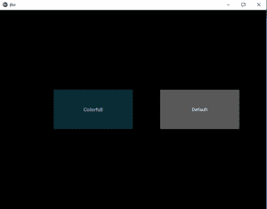

# Python–使用 kivy 更改按钮颜色。kv 文件

> 原文:[https://www . geesforgeks . org/python-change-button-color-in-kivy-using-kv-file/](https://www.geeksforgeeks.org/python-change-button-color-in-kivy-using-kv-file/)

Kivy 是 Python 中独立于平台的 GUI 工具。因为它可以在安卓、IOS、Linux 和视窗等平台上运行。它基本上是用来开发安卓应用程序的，但并不意味着它不能在桌面应用程序上使用。

在本文中，我们将学习如何在 **[中更改 kivy 中按钮的背景颜色。千伏文件](https://www.geeksforgeeks.org/python-kivy-kv-file/)** 。

> **背景 _ 颜色:**有一个属性名**背景色**，用来改变 kivy python 中按钮的颜色。background-color kivy 属性设置元素的背景颜色。背景色属性被指定为单一颜色值。
> 
> **语法:**背景 _ 颜色:1，0，0，1

**注意:**默认情况下按钮颜色为黑色，只取 0-1 之间的值

```
Basic Approach:

1) import kivy
2) import kivyApp
3) import Widget
4) import Button
5) Set minimum version(optional)
6) Create widget class
7) create App class
8) create .kv file (name same as the app class):
        1) Create Widget
        2) Create Button
        3) set the background color of the button as you want   
        4) Specify requirements
9) return Layout/widget/Class(according to requirement)
10) Run an instance of the class
```

> [Kivy 教程——用例子学习 Kivy。](https://www.geeksforgeeks.org/kivy-tutorial/)

**执行上述方法的代码，使用 kv 文件为按钮着色。**

**.py file**

```
## Sample Python application demonstrating the 
## How to change button color in Kivy using .kv file 

###################################################
# import modules 
import kivy 

# base Class of your App inherits from the App class. 
# app:always refers to the instance of your application 
from kivy.app import App 

# This layout allows you to set relative coordinates for children. 
from kivy.uix.relativelayout import RelativeLayout 

# To change the kivy default settings 
# we use this module config 
from kivy.config import Config 

# creating the root widget used in .kv file 
class RelativeLayout(RelativeLayout): 
    pass

# creating the App class in which name 
#.kv file is to be named Btn.kv 
class BtnApp(App): 
    # defining build() 
    def build(self): 
        # returning the instance of root class 
        return RelativeLayout() 

# run the app 
if __name__ == "__main__": 
    BtnApp().run() 
```

**Btn.kv 文件实现 main.py 文件**

```
#.kv file implementation of color btn 

<RelativeLayout>: 

    Button: 

        text:"Colorful"
        # Change the default color to your choice
        background_color: 0.1, 0.5, 0.6, 1
        pos_hint: {"x":0.2, "y":.4}
        size_hint: 0.3, 0.2

    Button: 
        text:"Default"

        # The default color of a button
        background_color: 1, 1, 1, 1
        pos_hint: {"x":.6, "y":.4}
        size_hint: 0.3, 0.2

```

**输出:**
