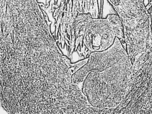
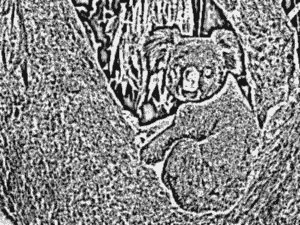

# 蟒蛇–魔杖中的木炭()方法

> 原文:[https://www . geeksforgeeks . org/python-木炭-法杖/](https://www.geeksforgeeks.org/python-charcoal-method-in-wand/)

**木炭()**生成原始图像的素描类图像。生成的图像与边缘提取非常相似，颜色相反。艺术模拟之一，木炭()可以模拟纸上的图画。

> **语法:**
> 
> ```
> wand.image.charcoal(radius, sigma)
> 
> ```
> 
> **参数:**
> 
> | 参数 | 输入类型 | 描述 |
> | --- | --- | --- |
> | 半径 | 数字。真实的 | 高斯运算符的大小。 |
> | 希腊字母表中第十八个字母 | 数字。真实的 | 高斯分布的标准偏差。 |

**来源影像:**


**例 1:**

```
# Import Image from wand.image module
from wand.image import Image

# Read image using Image function
with Image(filename ="koala.jpeg") as img:

    # Charcoal fx using charcoal() function
    img.charcoal(radius = 1.5, sigma = 0.5)
    img.save(filename ="ch_koala.jpeg")
```

**输出:**


**例 2:** 增加半径和σ值。

```
# Import Image from wand.image module
from wand.image import Image

# Read image using Image function
with Image(filename ="koala.jpeg") as img:

    # Charcoal fx using charcoal() function
    img.charcoal(radius = 4, sigma = 0.65)
    img.save(filename ="ch_koala_2.jpeg")
```

**输出:**
