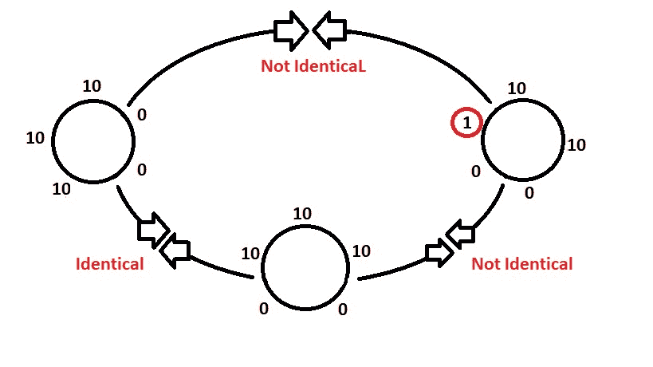

# Python |检查两个列表是否循环相同

> 原文:[https://www . geesforgeks . org/python-check-when-two-list-循环相同/](https://www.geeksforgeeks.org/python-check-whether-two-lists-circularly-identical/)

给定两个列表，循环检查它们是否相同。



**示例:**

```
Input : list1 = [10, 10, 0, 0, 10]
        list2 = [10, 10, 10, 0, 0]
Output : Yes
Explanation: yes they are circularly identical as when we write the list1
             last index to second last index, then we find it is circularly
             same with list1 
Input : list1 = [10, 10, 10, 0, 0]
        list2 = [1, 10, 10, 0, 0]
Output :No

```

**方法 1:使用列表遍历**

使用*遍历*，我们必须给定列表加倍。检查任意 x(0 < =n)到任意 x+n，并与列表 2 进行比较，查看列表 1 和列表 2 是否相同，如果两者相同，则列表 2 循环相同。使用两个循环，检查这个属性。第一个循环将从 0 运行到 len(list1)，然后检查索引(x 到 x+n)是否与 list2 相同，如果是，则返回 true，否则返回 false。

下面是上述方法的 Python 实现:

```
# python program to check if two 
# lists are circularly identical
# using traversal

# function to check circularly identical or not
def circularly_identical(list1, list2):

    # doubling list
    list3 = list1 * 2

    # traversal in twice of list1
    for x in range(0, len(list1)):
        z = 0 

        # check if list2 == list1 curcularly 
        for y in range(x, x + len(list1)):
            if list2[z]== list3[y]:
                z+= 1
            else:
                break

        # if all n elements are same circularly 
        if z == len(list1):
            return True 

    return False

# driver code
list1 = [10, 10, 0, 0, 10]
list2 = [10, 10, 10, 0, 0]
list3 = [1, 10, 10, 0, 0]

# check for list 1 and list 2 
if(circularly_identical(list1, list2)):
    print("Yes")
else:
    print("No")

# check for list 2 and list 3 
if(circularly_identical(list2, list3)):
    print ("Yes") 
else:
    print ("No") 
```

**Output:**

```
Yes
No

```

**方法二:使用列表切片**

```
# python program to check if two 
# lists are circularly identical
# using traversal

# function to check circularly identical or not
def circularly_identical(list1, list2):

  # doubling list
  list1.extend(list1)

  # traversal in twice of list1
  for i in range(len(list1)):

    # check if sliced list1 is equal to list2
    if list2 == list1[i: i + len(list2)]:

      return True
  return False

# driver code
list1 = [10, 10, 0, 0, 10]
list2 = [10, 10, 10, 0, 0]
list3 = [1, 10, 10, 0, 0]

# check for list 1 and list 2 
if(circularly_identical(list1, list2)):
    print("Yes")
else:
    print("No")

# check for list 2 and list 3 
if(circularly_identical(list2, list3)):
    print ("Yes") 
else:
    print ("No") 
```

**Output:**

```
Yes
No

```

**方法三:使用 map()功能**

*使用 Python 的内置函数* [map()](https://www.geeksforgeeks.org/python-lambda-anonymous-functions-filter-map-reduce/) 我们可以一步完成，在这里我们必须将 list2 映射到一个字符串中，然后查看它是否存在于 list1 (2*list1)在另一个字符串中的两次映射中。

下面是上述方法的 Python 实现:

```
# python program to check if two 
# lists are circularly identical
# using map function 

# function to check circularly identical or not
def circularly_identical(list1, list2):

    return(' '.join(map(str, list2)) in ' '.join(map(str, list1 * 2)))

# driver code
list1 = [10, 10, 0, 0, 10]
list2 = [10, 10, 10, 0, 0]
list3 = [1, 10, 10, 0, 0]

# check for list 1 and list 2 
if (circularly_identical(list1, list2)):
    print("Yes")
else:
    print("No")

# check for list 2 and list 3 
if(circularly_identical(list2, list3)):
    print ("Yes") 
else:
    print ("No") 
```

**Output:**

```
Yes
No

```