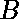
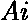
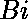
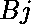

# Python |检查两个列表是否遵循相同的模式

> 原文:[https://www . geesforgeks . org/python-check-what-two-list-follow-same-pattern-or-not/](https://www.geeksforgeeks.org/python-check-whether-two-lists-follow-same-pattern-or-not/)

给定两个列表和，检查它们是否遵循相同的模式。
模式匹配条件:

1.   > ，再 > 
2.   = ，然后 = 
3.   < ，再<
    为全我，j。

**示例:**

> **输入:**
> 2 17 100
> 10 20 50
> 
> **输出:**
> 是
> 
> **输入:**
> 5 7 10 33
> 10 50 10 45
> 
> **输出:**
> 否

**方法:**
检查两个列表是否遵循上述模式。对两个列表进行排序，并在排序后的列表中找到上一个列表元素的索引。如果索引匹配，则模式匹配，否则没有模式匹配。

**代码:用于检查模式的 Python 程序。**

```py
# python program for above approach
a = [5, 7, 10, 33]
b = [10, 50, 10, 45]
aa = a.copy()
bb = b.copy()

# sorting the list
aa.sort()
bb.sort()

for i in range(len(a)-1):

    # checking the index are same or not
    if aa[i] < aa[i + 1] and bb[i] < bb[i + 1]:
        if a.index(aa[i])== b.index(bb[i]) and a.index(aa[i + 1]) == b.index(bb[i + 1]):
            flag ="YES"
        else:
            flag ="NO"
            break

    elif aa[i] == aa[i + 1] and bb[i] == bb[i + 1]:
        if a.index(aa[i]) == b.index(bb[i]) and a.index(aa[i + 1]) == b.index(bb[i + 1]):
            flag = "YES"
        else:
            flag = "NO"    
            break

    else:
        flag = "NO"
        break

print(flag)
```

**输出:**

```py
NO

```