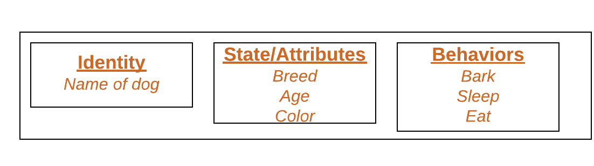
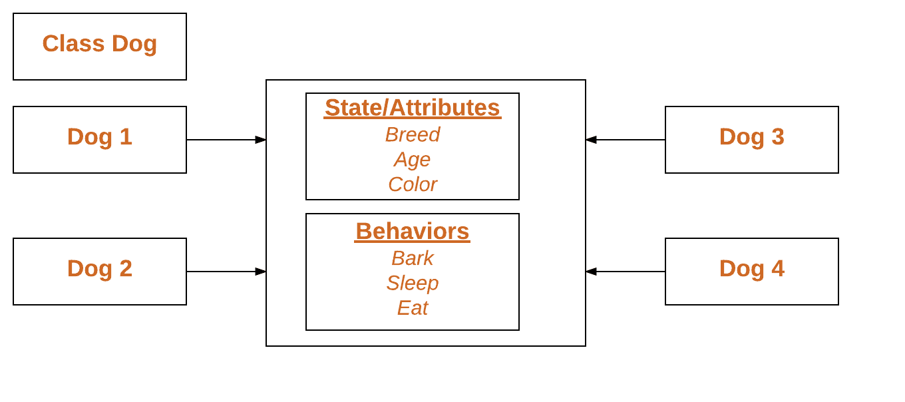

# Python 类和对象

> 原文:[https://www.geeksforgeeks.org/python-classes-and-objects/](https://www.geeksforgeeks.org/python-classes-and-objects/)

类是用户定义的蓝图或原型，从中创建对象。类提供了一种将数据和功能捆绑在一起的方法。创建一个新类会创建一个新类型的对象，从而允许创建该类型的新实例。每个类实例都可以附加属性来维护其状态。类实例也可以有方法(由它们的类定义)来修改它们的状态。

为了理解创建一个类的必要性，让我们考虑一个例子，假设您想要跟踪可能具有不同属性(如品种、年龄)的狗的数量。如果使用列表，第一个元素可能是狗的品种，而第二个元素可能代表它的年龄。假设有 100 只不同的狗，那么你怎么知道哪个元素应该是哪个呢？如果你想给这些狗增加其他属性呢？这缺乏组织性，也正是对课程的需求。

类创建用户定义的数据结构，该数据结构保存自己的数据成员和成员函数，可以通过创建该类的实例来访问和使用这些数据成员和成员函数。类就像一个对象的蓝图。

**Python 类上的几点:**

*   类是由关键字类创建的。
*   属性是属于一个类的变量。
*   属性始终是公共的，可以使用点(。)运算符。我的班级。我的属性

```py
Class Definition Syntax:

class ClassName:
    # Statement-1
    .
    .
    .
    # Statement-N
```

**定义类别–**

## 蟒蛇 3

```py
# Python3 program to
# demonstrate defining
# a class

class Dog:
    pass
```

在上面的示例中，class 关键字指示您正在创建一个类，后跟该类的名称(在本例中是 Dog)。

## 类对象

对象是类的一个实例。一个类就像一个蓝图，而一个实例是一个有*实际值*的类的副本。这不再是一个想法，它是一只真正的狗，就像一只七岁的哈巴狗。你可以让许多狗创建许多不同的实例，但是如果没有这个类作为向导，你会迷失方向，不知道需要什么信息。
物体包括:

*   **状态:**由物体的属性表示。它还反映了对象的属性。
*   **行为:**用一个对象的方法来表示。它还反映了一个对象对其他对象的响应。
*   **身份:**它为一个对象赋予唯一的名称，并使一个对象能够与其他对象交互。



#### 声明对象(也称为实例化类)

当一个类的对象被创建时，这个类被称为实例化。所有实例共享类的属性和行为。但是这些属性值，即状态对于每个对象都是唯一的。一个类可以有任意数量的实例。

示例:



**声明对象–**

## 蟒蛇 3

```py
# Python3 program to
# demonstrate instantiating
# a class

class Dog:

    # A simple class
    # attribute
    attr1 = "mammal"
    attr2 = "dog"

    # A sample method 
    def fun(self):
        print("I'm a", self.attr1)
        print("I'm a", self.attr2)

# Driver code
# Object instantiation
Rodger = Dog()

# Accessing class attributes
# and method through objects
print(Rodger.attr1)
Rodger.fun()
```

**输出:**

```py
mammal
I'm a mammal
I'm a dog
```

在上面的例子中，创建了一个对象，它基本上是一只名叫罗杰的狗。这个类只有两个类属性，告诉我们 Rodger 是狗，是哺乳动物。

## 自我

*   类方法在方法定义中必须有一个额外的第一个参数。当我们调用方法时，我们没有给出这个参数的值，Python 提供了它。
*   如果我们有一个不需要参数的方法，那么我们仍然需要一个参数。
*   这类似于 C++中的这个指针和 Java 中的这个引用。

当我们将这个对象的一个方法称为 myobject.method(arg1，arg2)时，这将被 Python 自动转换为 MyClass.method(myobject，arg1，arg 2)——这就是特殊自我的全部意义。

## __init__ 方法

__init__ 方法类似于 C++和 Java 中的构造函数。构造函数用于初始化对象的状态。与方法一样，构造函数也包含在对象创建时执行的语句(即指令)的集合。只要一个类的对象被实例化，它就会运行。该方法对于您想要对对象进行的任何初始化都很有用。

## 蟒蛇 3

```py
# A Sample class with init method
class Person:

    # init method or constructor 
    def __init__(self, name):
        self.name = name

    # Sample Method 
    def say_hi(self):
        print('Hello, my name is', self.name)

p = Person('Nikhil')
p.say_hi()
```

**输出:**

```py
Hello, my name is Nikhil
```

## 类和实例变量

实例变量用于数据，对每个实例都是唯一的，类变量用于类的所有实例共享的属性和方法。实例变量是其值在带有 self 的构造函数或方法中赋值的变量，而类变量是其值在类中赋值的变量。

使用构造函数定义实例变量。

## 蟒蛇 3

```py
# Python3 program to show that the variables with a value 
# assigned in the class declaration, are class variables and
# variables inside methods and constructors are instance
# variables.

# Class for Dog
class Dog:

    # Class Variable
    animal = 'dog'            

    # The init method or constructor
    def __init__(self, breed, color):

        # Instance Variable    
        self.breed = breed
        self.color = color       

# Objects of Dog class
Rodger = Dog("Pug", "brown")
Buzo = Dog("Bulldog", "black")

print('Rodger details:')  
print('Rodger is a', Rodger.animal)
print('Breed: ', Rodger.breed)
print('Color: ', Rodger.color)

print('\nBuzo details:')  
print('Buzo is a', Buzo.animal)
print('Breed: ', Buzo.breed)
print('Color: ', Buzo.color)

# Class variables can be accessed using class
# name also
print("\nAccessing class variable using class name")
print(Dog.animal)       
```

**输出:**

```py
Rodger details:
Rodger is a dog
Breed:  Pug
Color:  brown

Buzo details:
Buzo is a dog
Breed:  Bulldog
Color:  black

Accessing class variable using class name
dog
```

使用普通方法定义实例变量。

## 蟒蛇 3

```py
# Python3 program to show that we can create 
# instance variables inside methods

# Class for Dog
class Dog:

    # Class Variable
    animal = 'dog'     

    # The init method or constructor
    def __init__(self, breed):

        # Instance Variable
        self.breed = breed            

    # Adds an instance variable 
    def setColor(self, color):
        self.color = color

    # Retrieves instance variable    
    def getColor(self):    
        return self.color   

# Driver Code
Rodger = Dog("pug")
Rodger.setColor("brown")
print(Rodger.getColor()) 
```

**输出:**

```py
brown
```