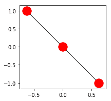
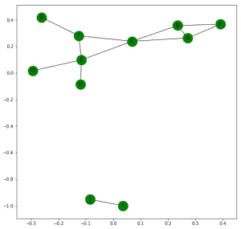
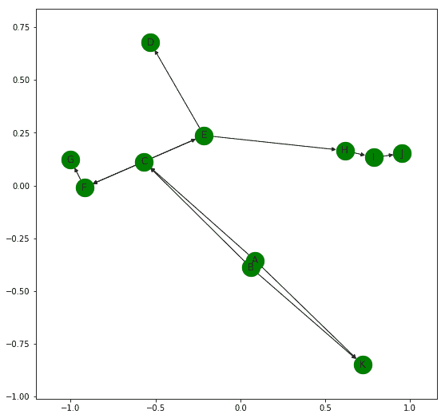
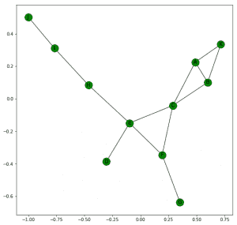

# Python |使用 Networkx 的聚类、连接和其他图形属性

> 原文:[https://www . geeksforgeeks . org/python-集群-连接-和其他-图形-属性-使用-networkx/](https://www.geeksforgeeks.org/python-clustering-connectivity-and-other-graph-properties-using-networkx/)

**图的三元闭包**是具有公共邻居的节点之间有边的趋势。如果在图形中添加了更多的边，这些边往往会形成。例如，在下图中:


接下来最有可能形成的边是(B，F)，(C，D)，(F，H)和(D，H)，因为这些对共享一个公共邻居。

**图中一个节点的局部聚类系数**是该节点相邻节点对的分数。例如，上图的节点 C 有四个相邻的节点，A、B、E 和 f

> 使用这 4 个节点可以形成的可能对的数量是 4*(4-1)/2 = **6** 。
> 彼此相邻的实际配对数量= **2** 。这些是(甲，乙)和(戊，己)。
> 因此给定图中节点 C 的局部聚类系数= 2/6 = **0.667**

Networkx 帮助我们轻松获得聚类值。

## 蟒蛇 3

```
import networkx as nx

G = nx.Graph()

G.add_edges_from([('A', 'B'), ('A', 'K'), ('B', 'K'), ('A', 'C'),
                  ('B', 'C'), ('C', 'F'), ('F', 'G'), ('C', 'E'),
                  ('E', 'F'), ('E', 'D'), ('E', 'H'), ('I', 'J')])

# returns a Dictionary with clustering value of each node
print(nx.clustering(G))

# This returns clustering value of specified node
print(nx.clustering(G, 'C'))
```

```
Output:
{'A': 0.6666666666666666,
 'B': 0.6666666666666666,
 'C': 0.3333333333333333,
 'D': 0,
 'E': 0.16666666666666666,
 'F': 0.3333333333333333,
 'G': 0,
 'H': 0,
 'I': 0,
 'J': 0,
 'K': 1.0}
0.3333333333333333
```

## 如何得到整个图的聚类值？

有两种不同的方法可以找到答案:

1.我们可以对所有单个节点的局部聚类系数进行平均，即所有节点的局部聚类系数之和除以节点总数。
nx.average_clustering(G)是找出答案的代码。在上面给出的图表中，这返回了一个值 0.287878787878785。

2.我们可以测量图的传递性。

> 图的传递性= 3 *图中三角形的数量/图中连通三元组的数量。

换句话说，它是封闭三元组数量与开放三元组数量之比的三倍。


这是一个封闭的三元组



这是一个开放的三和弦。
nx .传递性(G)是获取传递性的代码。在上面给出的图表中，它返回 0.40909090909090909091 的值。

现在，我们知道上面给出的图是不连通的。网络提供了许多内置功能来检查图形的各种连接特性。
它们在下面的代码中有更好的说明:

## 蟒蛇 3

```
import networkx as nx

G = nx.Graph()

G.add_edges_from([('A', 'B'), ('A', 'K'), ('B', 'K'), ('A', 'C'),
                  ('B', 'C'), ('C', 'F'), ('F', 'G'), ('C', 'E'),
                  ('E', 'F'), ('E', 'D'), ('E', 'H'), ('I', 'J')])

nx.draw_networkx(G, with_labels = True, node_color ='green')

# returns True or False whether Graph is connected
print(nx.is_connected(G))

# returns number of different connected components
print(nx.number_connected_components(G))

# returns list of nodes in different connected components
print(list(nx.connected_components(G)))

# returns list of nodes of component containing given node
print(nx.node_connected_component(G, 'I'))

# returns number of nodes to be removed
# so that Graph becomes disconnected
print(nx.node_connectivity(G))

# returns number of edges to be removed
# so that Graph becomes disconnected
print(nx.edge_connectivity(G))
```

**输出:**



```
False
2
[{'B', 'H', 'C', 'A', 'K', 'E', 'F', 'D', 'G'}, {'J', 'I'}]
{'J', 'I'}
0
0 
```

### 有向图的连通性–

有向图是 ***强连通的*** 如果每对节点 u 和 v 都有一条从 u 到 v 和 v 到 u 的有向路径
则是 ***弱连通的*** 如果用无向边替换有向图的所有边将产生一个无向连通图。它们可以通过以下代码进行检查:

```
nx.is_strongly_connected(G)
nx.is_weakly_connected(G)
```



给定的有向图是弱连通的，不是强连通的。

网络使我们能够在图形中轻松找到节点之间的路径。让我们仔细检查下面的图表:

## 蟒蛇 3

```
import networkx as nx
import matplotlib.pyplot as plt

G = nx.Graph()
G.add_edges_from([('A', 'B'), ('A', 'K'), ('B', 'K'), ('A', 'C'),
                  ('B', 'C'), ('C', 'F'), ('F', 'G'), ('C', 'E'),
                  ('E', 'F'), ('E', 'D'), ('E', 'H'), ('H', 'I'), ('I', 'J')])

plt.figure(figsize =(9, 9))
nx.draw_networkx(G, with_labels = True, node_color ='green')

print(nx.shortest_path(G, 'A'))
# returns dictionary of shortest paths from A to all other nodes

print(int(nx.shortest_path_length(G, 'A')))
# returns dictionary of shortest path length from A to all other nodes

print(nx.shortest_path(G, 'A', 'G'))
# returns a shortest path from node A to G

print(nx.shortest_path_length(G, 'A', 'G'))
# returns length of shortest path from node A to G

print(list(nx.all_simple_paths(G, 'A', 'J')))
# returns list of all paths from node A to J

print(nx.average_shortest_path_length(G))
# returns average of shortest paths between all possible pairs of nodes
```

**输出:**



> { ' a ']，
> b:【a】、【b】、
> c:【a】、【c】、
> 【d】、【a】、【c】、【e】、【d】、
> e:【a】、【c】、【e】、
> f:【a】、【c】、【f】、
> 【g:】
> 【I】:4，
> 【j】:5，
> 【k】:【1】
> 【a】、【c】、【f】、【g】、
> 
> 【a】、【a】、【c】、【f】、【e】、【h】、【I】、【j】、【a】、【a】、【k】、【b】、【c】、【f】、【f】、【I】、【I】、【I】、【I】、【a】、【a】、【b】、【c】、【f】、【f】

## 图表的几个重要特征–

*   **偏心率:**对于图 G 中的一个节点 n，n 的偏心率是 n 与所有其他节点之间最大可能的最短路径距离。
*   **直径:**图 G 中一对节点之间的最大最短距离就是它的直径。它是节点最大可能的偏心值。
*   **半径:**是节点的最小偏心值。
*   **外围:**是偏心率等于直径的节点集。
*   **中心:**图的中心是偏心率等于图的半径的一组节点。

Networkx 提供了计算所有这些属性的内置功能。

## 蟒蛇 3

```
import networkx as nx
import matplotlib.pyplot as plt

G = nx.Graph()
G.add_edges_from([('A', 'B'), ('A', 'K'), ('B', 'K'), ('A', 'C'),
                  ('B', 'C'), ('C', 'F'), ('F', 'G'), ('C', 'E'),
                  ('E', 'F'), ('E', 'D'), ('E', 'H'), ('H', 'I'), ('I', 'J')])

plt.figure(figsize =(9, 9))
nx.draw_networkx(G, with_labels = True, node_color ='green')

print("Eccentricity: ", nx.eccentricity(G))
print("Diameter: ", nx.diameter(G))
print("Radius: ", nx.radius(G))
print("Preiphery: ", list(nx.periphery(G)))
print("Center: ", list(nx.center(G)))
```

**输出:**


> 偏心率:{“A”:5，“K”:6，“B”:5，“H”:4，“J”:6，“E”:3，“C”:4，“I”:5，“F”:4，“D”:4，“G”:5 }
> 直径:6
> 半径:3
> 外围:【“K”，“J”】
> 中心:【“E”】

**参考:**[https://networkx.github.io/documentation](https://networkx.github.io/documentation/stable/index.html)。