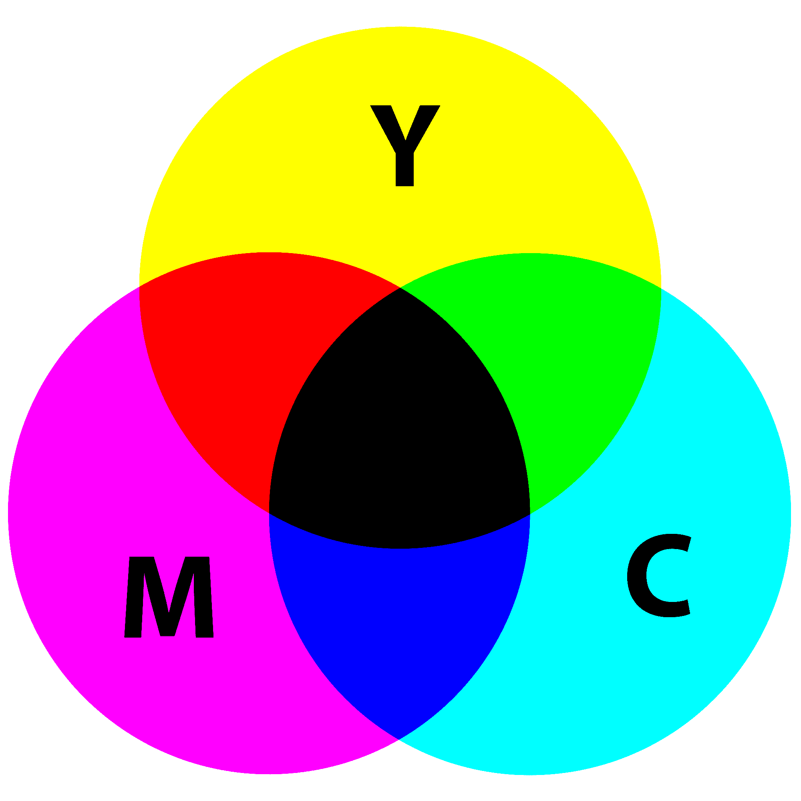

# Python | CMY 和 CMYK 颜色模型

> 原文:[https://www . geesforgeks . org/python-cmy-and-cmyk-color-models/](https://www.geeksforgeeks.org/python-cmy-and-cmyk-color-models/)

文章中讨论了两种常用的颜色模型 RGB 和 HSV:[RGB](https://www.geeksforgeeks.org/computer-graphics-the-rgb-color-model/)、 [HSV](https://www.geeksforgeeks.org/program-change-rgb-color-model-hsv-color-model/) 。在本文中，我们介绍了 CMY 和 CMYK 颜色模型。

**青色、品红、黄色**是光的副色，也是颜料的原色。这意味着，如果白光照射在涂有青色颜料的表面上，就不会反射红光。青色从白光中减去红光。与 RGB 颜色模型不同，CMY 是**减法**，这意味着较高的值与较暗的颜色而不是较亮的颜色相关联。



将颜料涂到彩纸或其他表面的设备使用 CMY 颜色模型，例如打印机和复印机。从 RGB 到 CKY 的转换是一个简单的操作，如下面的 Python 程序所示。重要的是，在转换之前，所有颜色值都要归一化为[0，1]。

```
C = 1 - R
M = 1 - G
Y = 1 - B

```

**下面是将 RGB 转换为 CMY 颜色模型的代码。**

```
# Formula to convert RGB to CMY.
def rgb_to_cmy(r, g, b):

    # RGB values are divided by 255 
    # to bring them between 0 to 1.
    c = 1 - r / 255
    m = 1 - g / 255
    y = 1 - b / 255
    return (c, m, y)

# Sample RGB values.
r = 0
g = 169
b = 86

# Print the result.
print(rgb_to_cmy(r, g, b))
```

**输出:**

```
(1.0, 0.33725490196078434, 0.6627450980392157)

```

根据上面显示的色轮，等量的青色、洋红色和黄色应该会产生黑色。然而，在现实生活中，结合这些颜料会产生一种浑浊的黑色。为了产生纯黑色，这在印刷时非常常用，我们在颜料混合物中加入第四种颜色——黑色。这叫**四色打印**。在这个模型中加入黑色导致它被称为 **CMYK** 颜色模型。