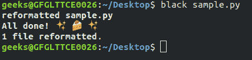
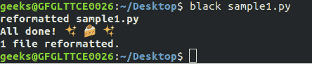

# Python 代码格式化使用黑色

> 原文:[https://www . geesforgeks . org/python-代码-格式化-使用-黑色/](https://www.geeksforgeeks.org/python-code-formatting-using-black/)

编写格式良好的代码非常重要，小程序很容易理解，但是随着程序变得复杂，它们变得越来越难理解。在某些时候，你甚至不能理解你写的代码。为了避免这种情况，需要以可读的格式编写代码。在这里，黑色发挥作用，黑色确保代码质量。

#### 什么是黑色？

pycodestyle 或 flake8 等 Linters 显示您的代码是否符合 PEP8 格式，这是官方的 Python 风格指南。但问题是，修复这种格式样式会给开发人员带来负担。在这里，Black 开始发挥作用，它不仅报告格式错误，而且修复它们。


引用项目自述:

> 黑色是不妥协的 Python 代码格式化程序。通过使用它，你同意放弃对手工格式化细节的控制。作为回报，Black 给了你速度、决定论和摆脱 pycodestyle 关于格式的唠叨的自由。你会为更重要的事情节省时间和精力。

**注意:** Black 可以很容易地与 Vim、Emacs、VSCode、Atom 等很多编辑器或者 GIT 这样的版本控制系统集成。

#### 安装和使用黑色:

黑色要求安装了 pip 的**Python 3 . 6 . 0+【T1:** 

```
$ pip install black
```

使用黑色非常简单。在终端中运行以下命令。

```
$ black [file or directory]
```

这将使用黑色代码样式重新格式化您的代码。
**示例 1:** 让我们创建一个未格式化的文件名“sample.py”，我们希望使用黑色格式化它。下面是实现。

## 蟒蛇 3

```
def is_unique(
               s
               ):
    s = list(s
                )
    s.sort()

    for i in range(len(s) - 1):
        if s[i] == s[i + 1]:
            return 0
    else:
        return 1

if __name__ == "__main__":
    print(
          is_unique(input())
         )
```

创建此文件后，运行以下命令。



**输出文件:**

## 蟒蛇 3

```
def is_unique(s):
    s = list(s)
    s.sort()

    for i in range(len(s) - 1):
        if s[i] == s[i + 1]:
            return 0
    else:
        return 1

if __name__ == "__main__":
    print(is_unique(input()))
```

在上面的例子中，两者都是相同的代码，但是在使用黑色后，它被格式化，因此很容易理解。
**示例 2:** 让我们创建另一个包含以下代码的文件“sample1.py”。

## 蟒蛇 3

```
def function(name, default=None, *args, variable="1123", a, b, c, employee, office, d, e, f, **kwargs):
    """This is function is created to demonstrate black"""

string = 'GeeksforGeeks'

j = [1,
 2,
 3]
```

在终端中再次写入上述命令后。



**输出文件:**

## 蟒蛇 3

```
def function(
    name,
    default=None,
    *args,
    variable="1123",
    a,
    b,
    c,
    employee,
    office,
    d,
    e,
    f,
    **kwargs
):
    """This is function is created to demonstrate black"""

string = "GeeksforGeeks"

j = [1, 2, 3]
```