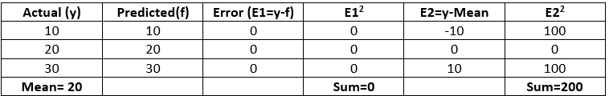
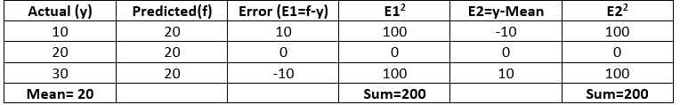
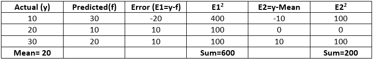

# Python-决定系数-R2 评分

> 原文:[https://www . geesforgeks . org/python-决定系数-r2-score/](https://www.geeksforgeeks.org/python-coefficient-of-determination-r2-score/)

决定系数也称为 R <sup>2</sup> 分数，用于评估线性回归模型的性能。它是输出相关属性的变化量，可从输入独立变量中预测。它用于检查模型重现观测结果的程度，具体取决于模型描述的结果总偏差的比率。

****数学公式:****

```py
**R<sup>2</sup>= 1- SS<sub>res</sub> / SS<sub>tot</sub>**
```

其中，
SS <sub>res</sub> 是残差平方和。
SS <sub>tot</sub> 是误差的总和。

**解读 R <sup>2</sup> 评分:**
假设 R <sup>2</sup> = 0.68
可以参考的是，依赖输出属性的可变性有 68%可以用模型来解释，而剩下的 32 %的可变性仍然无法解释。
R <sup>2</sup> 表示位于回归方程创建的直线内的数据点的比例。更高的 R 值 <sup>2</sup> 是可取的，因为它表明更好的结果。

**例**
**例 1 模型给出准确结果**


```py
 ** R<sup>2</sup> = 1- 0/200 = 1**
```

**案例 2 模型总是给出相同的结果**



```py
 **R<sup>2</sup> = 1- 200/200 = 0**
```

**案例 3 模型给出不明确的结果**



```py
 **R<sup>2</sup> = 1- 600/200 = -2**
```

我们可以从 Python 中的 sklearn.metrics 导入 r2_score 来计算 R <sup>2</sup> 分数。

**Python 实现:**
**代码 1:从 sklearn.metrics** 导入 r2_score

```py
from sklearn.metrics import r2_score
```

**代码 2:计算以上所有情况的 R <sup>2</sup> 评分。**

```py
### Assume y is the actual value and f is the predicted values
y =[10, 20, 30]
f =[10, 20, 30]
r2 = r2_score(y, f)
print('r2 score for perfect model is', r2)
```

**输出:**

```py
r2 score for perfect model is 1.0
```

```py
### Assume y is the actual value and f is the predicted values
y =[10, 20, 30]
f =[20, 20, 20]
r2 = r2_score(y, f)
print('r2 score for a model which predicts mean value always is', r2)

```

**输出:**

```py
r2 score for a model which predicts mean value always is 0.0
```

**代码 3:**

```py
### Assume y is the actual value and f is the predicted values
y = [10, 20, 30]
f = [30, 10, 20]
r2 = r2_score(y, f)
print('r2 score for a worse model is', r2)
```

**输出:**

```py
r2 score for a worse model is -2.0
```

**结论:**

*   最佳可能得分是 1，当预测值与实际值相同时获得。
*   R <sup>2</sup> 基线模型得分为 0。
*   在更糟的情况下，**R<sup>2</sup>T3】评分甚至可以是负数。**