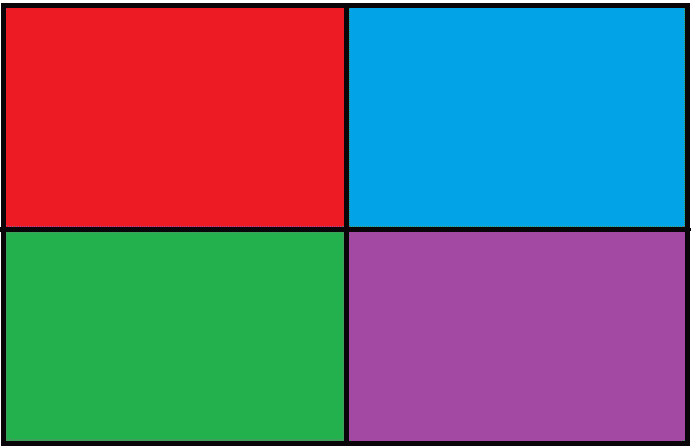
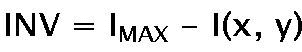

# Python–使用枕头进行颜色反转

> 原文:[https://www . geeksforgeeks . org/python-color-inversion-use-wheel/](https://www.geeksforgeeks.org/python-color-inversion-using-pillow/)

颜色反转(图像负片)是反转图像像素值的方法。图像反转不依赖于图像的颜色模式，即反转工作在通道级别。当在多色图像(RGB、CMYK 等)上使用反转时，每个通道被单独处理，最终结果通过调用所有通道的结果形成。
我们将使用枕头(PIL)库来获取图像的底片。要安装库，请在命令行中执行以下命令:-

```py
pip install pillow
```

**注意:**一些 Linux 发行版倾向于预装 Python 和 PIL。
在这篇文章中，已经描述了 2 种方法来反转图像的颜色空间。第一个是使用 ImageChops.invert()函数的内置方法。在第二个例子中，我们将通过像素值的元素减法来反转图像。
**样图–**



**方法#1:**
使用内置方法 ImageChops.invert()来否定颜色。

## 蟒蛇 3

```py
# Importing imagechops for using the invert() method
from PIL import Image, ImageChops

# Opening the test image, and saving it's object
img = Image.open('test.jpg')

# Passing the image object to invert() 
inv_img = ImageChops.invert(img)

# Displaying the output image
inv_img.show()
```

**输出:**


**说明:**
首先我们导入 ImageChops 模块，用于使用 invert()方法。然后我们打开测试图像(test.jpg)，并保存它的图像对象。现在，我们将该图像对象传递给 ImageDraw.invert()，该对象返回反转的图像。最后，我们显示了彩色反转图像。
使用 ImageChops.invert()时需要牢记的事项:

*   输入图像不应包含阿尔法通道

*   输入图像不应该是彩色模式。

**方法#2:**
获取图像逆的方法是用当前像素的值减去像素的最大值/强度。结果值由公式–
指导



其中 INV 是合成的反转像素，I^MAX 是给定颜色模式下的最大强度水平，I(x，y)是特定坐标对下图像/颜色通道的强度(像素值)。

## 蟒蛇 3

```py
from PIL import Image

# numpy for performing batch processing and elementwise
# matrix operations efficiently
import numpy as np

# Opening an image, and saving open image object
img = Image.open(r"sample.jpg")

# Creating an numpy array out of the image object
img_arry = np.array(img)

# Maximum intensity value of the color mode
I_max = 255

# Substracting 255 (max value possible in a given image
# channel) from each pixel values and storing the result
img_arry = I_max - img_arry

# Creating an image object from the resultant numpy array
inverted_img = Image.fromarray(img_arry)

# Saving the image under the name Image_negative.jpg
inverted_img.save(r"Image_negative.jpg")
```

**输出:**


**解释:**
首先我们将 numpy 导入到我们的代码中，因为 numpy 允许对矩阵进行快速的元素操作，并提供了对数组的几种算术操作。然后我们使用 Image.open()打开测试图像，并将返回的图像对象存储在变量 img 中。然后我们从打开的图像对象(img)获得的像素值创建一个数组(img_arry)。这样做是为了允许 numpy 库提供的元素减法操作。现在我们从每个通道/像素值减去 255，这导致所有像素值被反转。现在，我们使用这个结果矩阵来创建一个新的图像(inverted_img)。最后我们保存了图片，名字是 Image_negative.jpg.

### 需要记住的一些事情–

*   应该确保输入图像不包含 alpha 通道。这是因为当行 img _ arry = 255–img _ arry 将对包含 alpha 通道的图像执行时，它也会反转 alpha 通道值。这将导致输出图像的不一致性，因为我们可能会得到完全透明的图像(这不是颜色反转的一部分)。允许处理 RGBA 图像的一种方法是首先使用图像转换(“RGB”)将它们转换为 RGB 颜色模式。或者，我们可以使用 Image.getdata(band=3)提取 alpha 通道，然后将其合并到最终图像中，以获得原始 RGBA 图像。
    该输入图像 sample.jpg 是有意选择的格式。jpg 作为 **JPG/JPEG** 图像格式不支持透明度或 alpha 通道。

*   输入图像不应是 P(淡色)模式。因为淡色图像不包含坐标处的像素值，而是属于(不同大小的)颜色映射的像素值的索引。因此，图像反演会导致不一致的结果。

*   假设在特定图像模式下可实现的最大强度为 255，则赋值 I_max = 255。该值不是硬编码的。该值取决于颜色模式，因此可能小于 255(例如。1)或大于 255(例如。16 位无符号灰度模式下为 32536)。