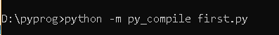
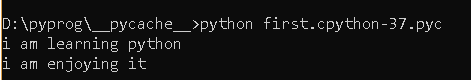

# Python |编译还是解释？

> 原文:[https://www . geesforgeks . org/python-编译或解释/](https://www.geeksforgeeks.org/python-compiled-or-interpreted/)

在 python 编程的各种书籍中，都提到了 python 语言的解释。但这是对的，python 程序首先被编译，然后被解释。编译部分对程序员是隐藏的，因此，许多程序员认为它是一种解释语言。编译部分首先在我们执行代码时完成，这将生成字节码，在内部，这个字节码由 python 虚拟机(p.v.m)根据底层平台(机器+操作系统)进行转换。
现在的问题是——是否有证据证明 python 首先在内部编译程序，然后通过解释器运行代码？
答案是肯定的！请注意，这个编译过的部分被 python 删除了(只要您执行代码),只是它不想让程序员陷入复杂性。

**代码:Python 示例代码**

```py
print("i am learning python")
print("i am enjoying it")
```

现在，如果您使用命令提示符运行此代码，只需将上面的代码保存在记事本中，并用扩展名保存即可”。py"
**语法:**python(program . py 的名称)并按 enter。
**注意:**如果你正在记事本中写代码，只需保存扩展名为“py”的代码入口假设你已经在 d drive 中创建了一个名为 python_prog 的文件夹。



当您按 enter 键时，将生成字节码。创建了一个文件夹，其中包含程序的字节码。该文件夹位于 python_prog 文件夹中，您可以在其中保存 python 代码。


现在要运行编译好的字节码只需在命令提示符下键入以下命令:-

扩展名。pyc 是 python 编译器..

由此证明，python 程序既可以编译，也可以解释！！但是编译部分对程序员来说是隐藏的。