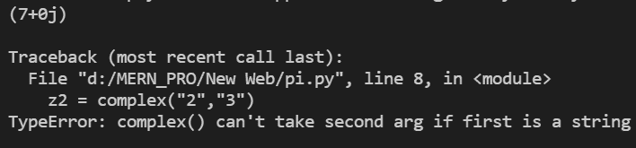
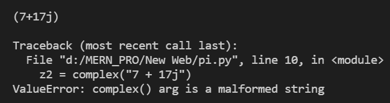

# Python 复杂()函数

> 原文:[https://www.geeksforgeeks.org/python-complex-function/](https://www.geeksforgeeks.org/python-complex-function/)

**Python complex()函数**是 Python 中的内置函数。此方法在传递实数和虚数时返回一个[复数](https://www.geeksforgeeks.org/complex-numbers/)(实数+虚数)示例(5+2j)，或者它还将字符串转换为复数。

**语法:**

> 复数([实数[，虚数]])

**参数:**

*   实数:数字类型(包括复数)。默认为零。
*   虚数:数字类型(包括复数)。默认为零。

**返回:**

*   (实数+虚数)形式的复数示例(5+2j)
*   类型:复杂

**注意:**如果传递的第一个参数是字符串，那么第二个参数就不应该传递，否则会引发类型错误。字符串不得在+或–运算符周围包含空格，否则将引发 ValueError。

**例 1:**

## 蟒蛇 3

```
# numeric type
# nothing is passed
z = complex()
print("Nothing is passed", z)

# integer type
# passing first parameter only
complex_num1 = complex(5)
print("Int: first parameter only", complex_num1)

# passing both parameters
complex_num2 = complex(7, 2)
print("Int: both parameters", complex_num2)

# float type
# passing first parameter only
complex_num3 = complex(3.6)
print("Float: first parameter only", complex_num3)

# passing both parameters
complex_num4 = complex(3.6, 8.1)
print("Float: both parameters", complex_num4)
print()

# type
print(type(complex_num1))
```

**Output**

```
Nothing is passed 0j
Int: first paramter only (5+0j)
Int: both paramters (7+2j)
Float: first paramter only (3.6+0j)
Float: both paramters (3.6+8.1j)

<class 'complex'>
```

**例 2:**

## 蟒蛇 3

```
# string
# only first parameter is to be passed
z1 = complex("7")
print(z1)

print()
z2 = complex("2", "3")

# This will raise TypeError"
print(z2)
```

**输出:**



**例 3:**

## 蟒蛇 3

```
# string
# only first parameter is passed
z1 = complex("7+17j")
print(z1)

print()
z2 = complex("7 + 17j")

# This will raise Valueerror
print(z2)
```

**输出:**

