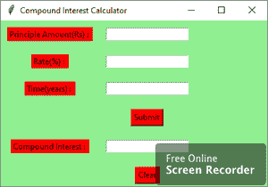

# Python–使用 Tkinter 的复利 GUI 计算器

> 原文:[https://www . geesforgeks . org/python-复利-GUI-计算器-使用-tkinter/](https://www.geeksforgeeks.org/python-compound-interest-gui-calculator-using-tkinter/)

**先决条件:**[tkinter 简介](https://www.geeksforgeeks.org/python-gui-tkinter/) | [计算复利的程序](https://www.geeksforgeeks.org/program-find-compound-interest/)

Python 为开发图形用户界面提供了多种选择。在所有的 GUI 方法中，Tkinter 是最常用的方法。在本文中，我们将学习如何使用 Tkinter 创建复利图形用户界面计算器应用程序，并提供一步一步的指南。

要创建 Tkinter:

*   导入模块–tkinter
*   创建主窗口(容器)
*   向主窗口添加任意数量的小部件。
*   在小部件上应用事件触发器。

以下是图形用户界面的外观:



让我们创建一个基于图形用户界面的复利计算器应用程序。

**下面是实现:**

## 蟒蛇 3

```
# import all classes / functions from the tkinter
from tkinter import *

# Function for clearing the 
# contents of all entry boxes  
def clear_all() :

    # whole content of entry boxes is deleted
    principle_field.delete(0, END)  
    rate_field.delete(0, END)
    time_field.delete(0, END)
    compound_field.delete(0, END)

    # set focus on the principle_field entry box 
    principle_field.focus_set()

# Function to find compound interest 
def calculate_ci():

    # get a content from entry box
    principle = int(principle_field.get())

    rate = float(rate_field.get())

    time = int(time_field.get())

    # Calculates compound interest 
    CI = principle * (pow((1 + rate / 100), time))

    # insert method inserting the 
    # value in the text entry box.
    compound_field.insert(10, CI)

# Driver code
if __name__ == "__main__" :

    # Create a GUI window
    root = Tk()

    # Set the background colour of GUI window
    root.configure(background = 'light green')

    # Set the configuration of GUI window
    root.geometry("400x250")

    # set the name of tkinter GUI window
    root.title("Compound Interest Calculator") 

    # Create a Principle Amount : label
    label1 = Label(root, text = "Principle Amount(Rs) : ",
                   fg = 'black', bg = 'red')

    # Create a Rate : label
    label2 = Label(root, text = "Rate(%) : ",
                   fg = 'black', bg = 'red')

    # Create a Time : label
    label3 = Label(root, text = "Time(years) : ",
                   fg = 'black', bg = 'red')

    # Create a Compound Interest : label
    label4 = Label(root, text = "Compound Interest : ",
                   fg = 'black', bg = 'red')

    # grid method is used for placing 
    # the widgets at respective positions 
    # in table like structure .

    # padx keyword argument used to set padding along x-axis .
    # pady keyword argument used to set padding along y-axis .
    label1.grid(row = 1, column = 0, padx = 10, pady = 10) 
    label2.grid(row = 2, column = 0, padx = 10, pady = 10) 
    label3.grid(row = 3, column = 0, padx = 10, pady = 10)
    label4.grid(row = 5, column = 0, padx = 10, pady = 10)

    # Create a entry box 
    # for filling or typing the information.
    principle_field = Entry(root) 
    rate_field = Entry(root) 
    time_field = Entry(root)
    compound_field = Entry(root)

    # grid method is used for placing 
    # the widgets at respective positions 
    # in table like structure .

    # padx keyword argument used to set padding along x-axis .
    # pady keyword argument used to set padding along y-axis .
    principle_field.grid(row = 1, column = 1, padx = 10, pady = 10) 
    rate_field.grid(row = 2, column = 1, padx = 10, pady = 10) 
    time_field.grid(row = 3, column = 1, padx = 10, pady = 10)
    compound_field.grid(row = 5, column = 1, padx = 10, pady = 10)

    # Create a Submit Button and attached 
    # to calculate_ci function 
    button1 = Button(root, text = "Submit", bg = "red", 
                     fg = "black", command = calculate_ci)

    # Create a Clear Button and attached 
    # to clear_all function 
    button2 = Button(root, text = "Clear", bg = "red", 
                     fg = "black", command = clear_all)

    button1.grid(row = 4, column = 1, pady = 10)
    button2.grid(row = 6, column = 1, pady = 10)

    # Start the GUI 
    root.mainloop()

```

**输出:**

<video class="wp-video-shortcode" id="video-439179-1" width="640" height="360" preload="metadata" controls=""><source type="video/mp4" src="https://media.geeksforgeeks.org/wp-content/uploads/20210114113324/FreeOnlineScreenRecorderProject3.mp4?_=1">[https://media.geeksforgeeks.org/wp-content/uploads/20210114113324/FreeOnlineScreenRecorderProject3.mp4](https://media.geeksforgeeks.org/wp-content/uploads/20210114113324/FreeOnlineScreenRecorderProject3.mp4)</video>