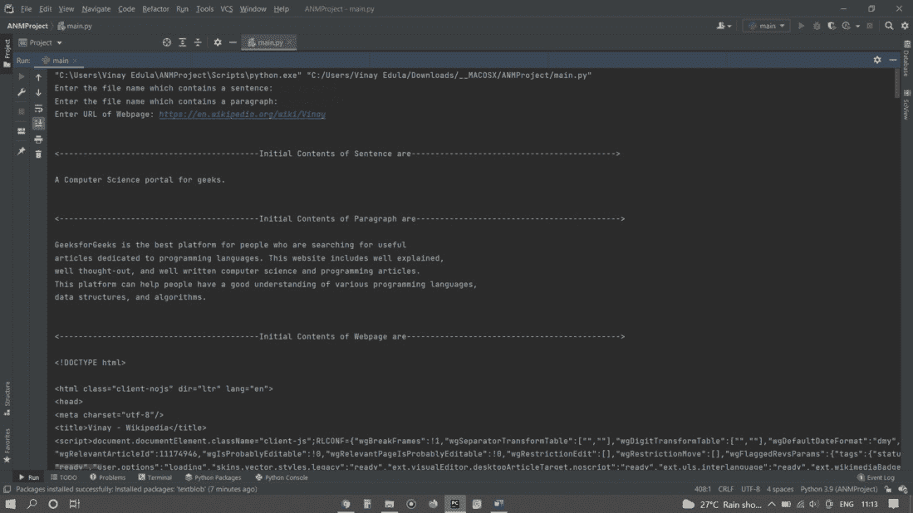
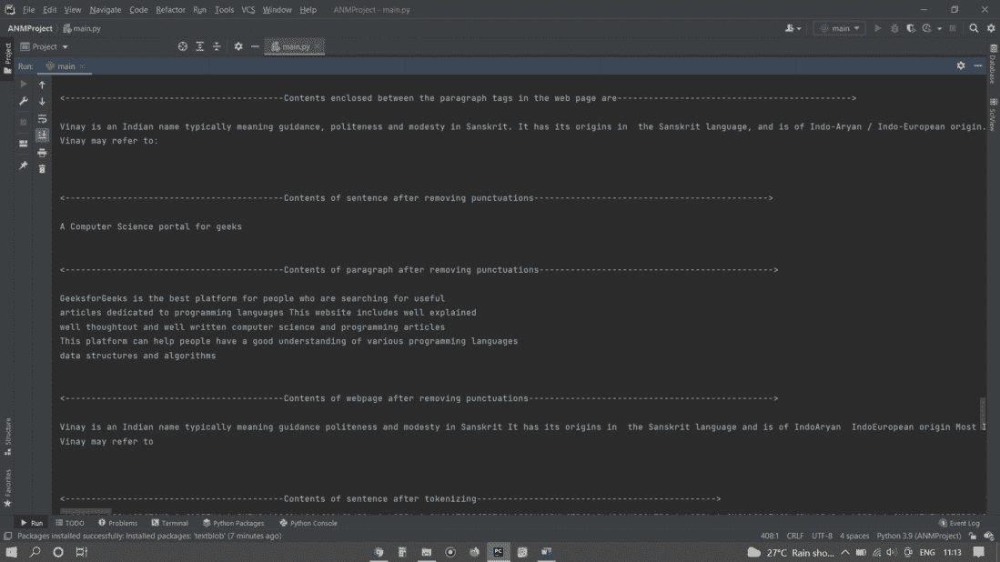
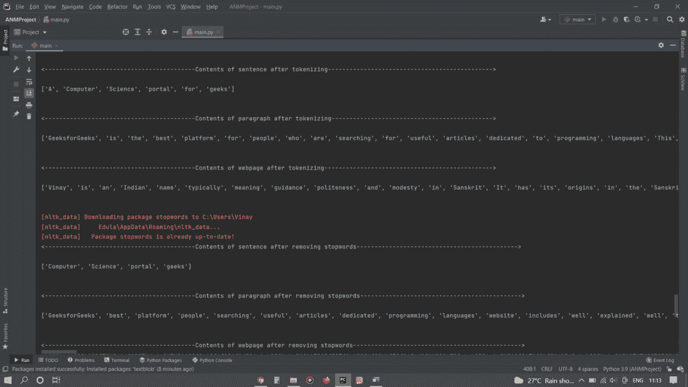
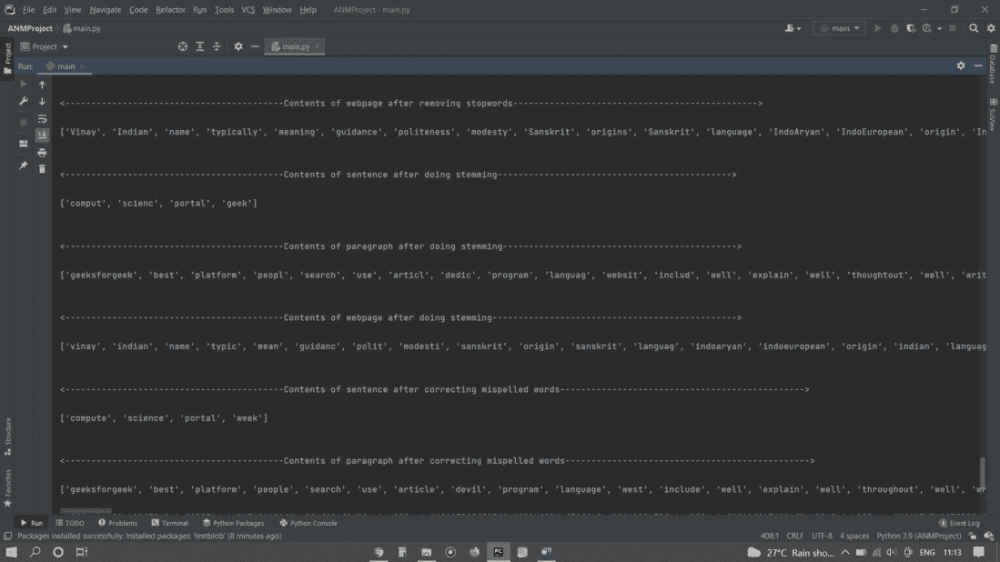
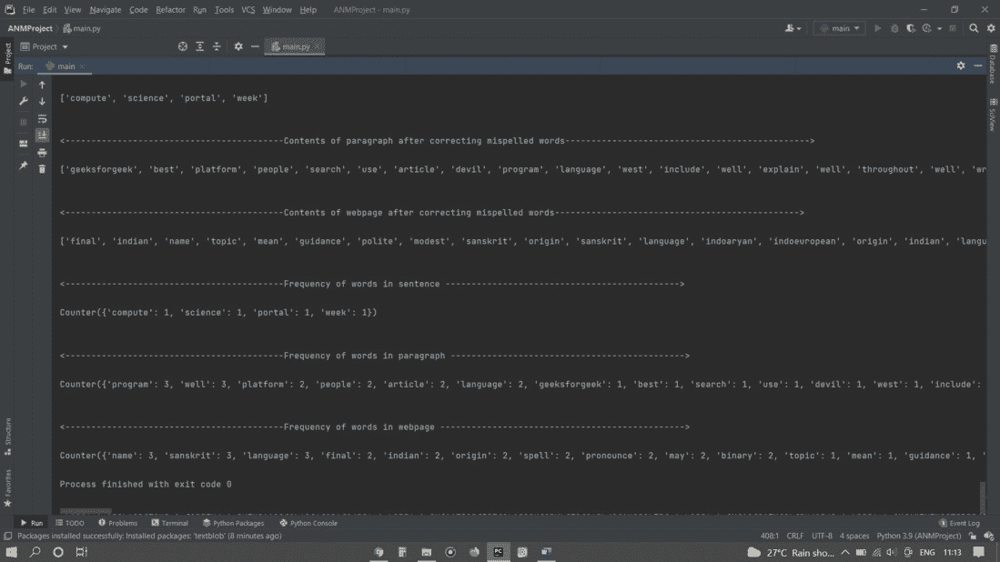

# Python–计算去除停止词和词干后的词频

> 原文:[https://www . geeksforgeeks . org/python-计算移除停止词和词干后的词频/](https://www.geeksforgeeks.org/python-compute-the-frequency-of-words-after-removing-stop-words-and-stemming/)

在本文中，我们将在 python 环境中使用 NLTK 工具包标记句子、段落、网页内容，然后我们将删除停止词并在句子、段落、网页的内容上应用词干。最后，我们将计算去除停止词和词干后的词频。

### 需要的模块

**bs4:** 美人汤(bs4)是一个从 HTML 和 XML 文件中提取数据的 Python 库。要安装此库，请在 IDE/终端中键入以下命令。

```
pip install bs4
```

**urlib:**urlib 包是 python 的统一资源定位器处理库。它用于获取网址。要安装此库，请在 IDE/终端中键入以下命令。

```
pip install urllib
```

**NLTK:**NLTK 库是 python 中用于自然语言处理的海量工具包，这个模块通过提供整个 NLP 方法论来帮助我们。要安装此库，请在 IDE/终端中键入以下命令。

```
pip install nltk
```

### 分步实施 **:**

**第一步:**

*   将文件句子. txt、段落. txt 保存在当前目录中。
*   使用 Open 方法打开文件，并将它们存储在名为 file1、file2 的文件操作符中。
*   使用 *read()* 方法读取文件内容，并将整个文件内容存储到一个字符串中。
*   显示文件内容。
*   关闭文件操作符。

## 计算机编程语言

```
import nltk
s = input('Enter the file name which contains a sentence: ')
file1 = open(s)
sentence = file1.read()
file1.close()
p = input('Enter the file name which contains a paragraph: ')
file2 = open(p)
paragraph = file2.read()
file2.close()
```

**第二步:**

*   导入 *urllib.request* 打开并读取网页内容。
*   从 *bs4* 导入*美化程序*，允许我们从 HTML 文档中拉出数据。
*   使用 *<u>urllib.request</u>* 向该特定的 url 服务器发出请求。
*   服务器将响应并返回 Html 文档。
*   使用 *read()* 方法阅读网页内容。
*   将网页数据传递到美观的网页中，通过修复不良的 HTML，帮助我们组织和格式化杂乱的网页数据，并以易于浏览的结构呈现给我们。

## 计算机编程语言

```
import urllib.request
from bs4 import BeautifulSoup
url = input('Enter URL of Webpage: ')
print('\n')
url_request = urllib.request.Request(url)
url_response = urllib.request.urlopen(url)
webpage_data = url_response.read()
soup = BeautifulSoup(webpage_data, 'html.parser')
```

**第三步:**

*   为了简化标记化的任务，我们将只提取 HTML 页面的一部分。
*   使用*美化组*操作符提取 HTML 文档中存在的所有段落标签。
*   shoot(' p ')返回包含网页上所有段落标记的项目列表。
*   创建名为 web_page_data 的空字符串。
*   对于列表中的每个标签，将标签之间的文本连接到空字符串。

## 计算机编程语言

```
web_page_paragraph_contents = soup('p')
web_page_data = ''
for para in web_page_paragraph_contents:
    web_page_data = web_page_data + str(para.text)
```

**第四步:**

*   使用*re sub()*将非字母字符替换为空字符串。
*   *re.sub()* 将正则表达式、新字符串和输入字符串作为参数，并返回修改后的字符串(用新字符串替换输入字符串中的指定字符)。
*   ^——意味着它将与写在它右边的图案相匹配。
*   \ w –#在每个非字母顺序的字符处返回一个匹配项(字符不在 a 和 z 之间。如"！", "?"空格、数字，包括下划线等。)和\ s–匹配空格。

## 计算机编程语言

```
from nltk.tokenize import word_tokenize
import re
sentence_without_punctuations = re.sub(r'[^\w\s]', '', sentence)
paragraph_without_punctuations = re.sub(r'[^\w\s]', '', paragraph)
web_page_paragraphs_without_punctuations = re.sub(r'[^\w\s]', '', web_page_data)
```

**第五步:**

*   在删除标点符号和不必要的字符后，将句子、段落和网页内容传递到 word_tokenize()中，word _ token ize()将返回标记化的文本、段落和网页字符串。
*   显示标记化句子、标记化段落和标记化网页字符串的内容。

## 计算机编程语言

```
sentence_after_tokenizing = word_tokenize(sentence_without_punctuations)
paragraph_after_tokenizing = word_tokenize(paragraph_without_punctuations)
webpage_after_tokenizing = word_tokenize(web_page_paragraphs_without_punctuations)
```

**步骤 6:**

*   从 nltk .语料库导入 stopwords。
*   使用*nltk . download(' stopwords ')*下载 stop words。
*   将英文停止词存储在*nltk _ stop _ word*中。
*   将标记化句子、标记化段落和标记化 web 字符串中的每个单词与 nltk_stop_words 中的单词进行比较如果数据中的任何单词出现在 nltk stop words 中，我们将忽略这些单词。

## 计算机编程语言

```
from nltk.corpus import stopwords
nltk.download('stopwords')
nltk_stop_words = stopwords.words('english')
sentence_without_stopwords = [i for i in sentence_after_tokenizing if not i.lower() in nltk_stop_words]
paragraph_without_stopwords = [j for j in paragraph_after_tokenizing if not j.lower() in nltk_stop_words]
webpage_without_stopwords = [k for k in webpage_after_tokenizing if not k.lower() in nltk_stop_words]
```

**步骤 7:**

*   来自 nltk . stem . porter import porterstemer。
*   使用 nltk 做词干:去掉后缀，考虑词根。
*   创建三个空列表，用于存储句子、段落和网页的词干。
*   使用 stemmer.stem()对上一个列表中的每个单词进行词干处理，并将其存储在新创建的列表中。

## 计算机编程语言

```
from nltk.stem.porter import PorterStemmer
stemmer = PorterStemmer()
sentence_after_stemming= []
paragraph_after_stemming =[]
webpage_after_stemming = []  #creating empty lists for storing stemmed words
for word in sentence_without_stopwords:
    sentence_after_stemming.append(stemmer.stem(word))
for word in paragraph_without_stopwords:
    paragraph_after_stemming.append(stemmer.stem(word))
for word in webpage_without_stopwords:
    webpage_after_stemming.append(stemmer.stem(word))
```

**第八步:**

*   有时在进行词干后，可能会导致拼错单词，因为这是一个实现问题。
*   使用 TextBlob 模块，我们可以为特定的拼写错误的单词找到相关的正确单词。
*   对于句子词干后、段落词干后、网页词干后中的每个单词，使用正确()方法找到该单词的实际正确位置。
*   检查停止词中是否有正确的词。如果停止词中没有这个词，用拼错的词替换正确的词。

## 计算机编程语言

```
from textblob import TextBlob
final_words_sentence=[]
final_words_paragraph=[]
final_words_webpage=[]

for i in range(len(sentence_after_stemming)):
    final_words_sentence.append(0)
    present_word=sentence_after_stemming[i]
    b=TextBlob(sentence_after_stemming[i])
    if str(b.correct()).lower() in nltk_stop_words:
        final_words_sentence[i]=present_word
    else:
        final_words_sentence[i]=str(b.correct())
print(final_words_sentence)
print('\n')

for i in range(len(paragraph_after_stemming)):
    final_words_paragraph.append(0)
    present_word = paragraph_after_stemming[i]
    b = TextBlob(paragraph_after_stemming[i])
    if str(b.correct()).lower() in nltk_stop_words:
        final_words_paragraph[i] = present_word
    else:
        final_words_paragraph[i] = str(b.correct())

print(final_words_paragraph)
print('\n')

for i in range(len(webpage_after_stemming)):
    final_words_webpage.append(0)
    present_word = webpage_after_stemming[i]
    b = TextBlob(webpage_after_stemming[i])
    if str(b.correct()).lower() in nltk_stop_words:
        final_words_webpage[i] = present_word
    else:
        final_words_webpage[i] = str(b.correct())
print(final_words_webpage)
print('\n')
```

**步骤 9:**

*   使用集合模块中的计数器方法查找句子、段落、网页中单词的频率。Python Counter 是一个容器，它将保存容器中每个元素的计数。
*   Counter 方法返回键值对为{'word '，word_count}的字典。

## 计算机编程语言

```
from collections import Counter
sentence_count = Counter(final_words_sentence)
paragraph_count = Counter(final_words_paragraph)
webpage_count = Counter(final_words_webpage)
```

### 下面是完整实现:

## 计算机编程语言

```
import nltk
s = input('Enter the file name which contains a sentence: ')
file1 = open(s)
sentence = file1.read()
file1.close()
p = input('Enter the file name which contains a paragraph: ')
file2 = open(p)
paragraph = file2.read()
file2.close()

import urllib.request
from bs4 import BeautifulSoup
url = input('Enter URL of Webpage: ')
print( '\n' )
url_request = urllib.request.Request(url)
url_response = urllib.request.urlopen(url)
webpage_data = url_response.read()
soup = BeautifulSoup(webpage_data, 'html.parser')

print('<------------------------------------------Initial Contents of Sentence are-------------------------------------------> \n')
print(sentence)
print( '\n' )

print('<------------------------------------------Initial Contents of Paragraph are-------------------------------------------> \n')
print(paragraph)
print( '\n' )

print('<------------------------------------------Initial Contents of Webpage are---------------------------------------------> \n')
print(soup)
print( '\n' )

web_page_paragraph_contents=soup('p')
web_page_data = ''
for para in web_page_paragraph_contents:
     web_page_data = web_page_data + str(para.text)

print('<------------------------------------------Contents enclosed between the paragraph tags in the web page are---------------------------------------------> \n')
print(web_page_data)
print('\n')

from nltk.tokenize import word_tokenize
import re
sentence_without_punctuations = re.sub(r'[^\w\s]', '', sentence)
paragraph_without_punctuations = re.sub(r'[^\w\s]', '', paragraph)
web_page_paragraphs_without_punctuations = re.sub(r'[^\w\s]', '', web_page_data)
print('<------------------------------------------Contents of sentence after removing punctuations---------------------------------------------> \n')
print(sentence_without_punctuations)
print('\n')
print('<------------------------------------------Contents of paragraph after removing punctuations---------------------------------------------> \n')
print(paragraph_without_punctuations)
print('\n')
print('<------------------------------------------Contents of webpage after removing punctuations-----------------------------------------------> \n')
print(web_page_paragraphs_without_punctuations)
print('\n')

sentence_after_tokenizing = word_tokenize(sentence_without_punctuations)
paragraph_after_tokenizing = word_tokenize(paragraph_without_punctuations)
webpage_after_tokenizing = word_tokenize(web_page_paragraphs_without_punctuations)
print('<------------------------------------------Contents of sentence after tokenizing----------------------------------------------> \n')
print(sentence_after_tokenizing)
print( '\n' )
print('<------------------ ------------------------Contents of paragraph after tokenizing---------------------------------------------> \n')
print(paragraph_after_tokenizing)
print( '\n' )
print('<------------------------------------------Contents of webpage after tokenizing-----------------------------------------------> \n')
print(webpage_after_tokenizing)
print( '\n' )

from nltk.corpus import stopwords
nltk.download('stopwords')
nltk_stop_words = stopwords.words('english')
sentence_without_stopwords = [i for i in sentence_after_tokenizing if not i.lower() in nltk_stop_words]
paragraph_without_stopwords = [j for j in paragraph_after_tokenizing if not j.lower() in nltk_stop_words]
webpage_without_stopwords = [k for k in webpage_after_tokenizing if not k.lower() in nltk_stop_words]
print('<------------------------------------------Contents of sentence after removing stopwords---------------------------------------------> \n')
print(sentence_without_stopwords)
print( '\n' )
print('<------------------------------------------Contents of paragraph after removing stopwords---------------------------------------------> \n')
print(paragraph_without_stopwords)
print( '\n' )
print('<------------------------------------------Contents of webpage after removing stopwords-----------------------------------------------> \n')
print(webpage_without_stopwords)
print( '\n' )

from nltk.stem.porter import PorterStemmer
stemmer = PorterStemmer()
sentence_after_stemming = []
paragraph_after_stemming = []
webpage_after_stemming = []  #creating empty lists for storing stemmed words
for word in sentence_without_stopwords:
    sentence_after_stemming.append(stemmer.stem(word))
for word in paragraph_without_stopwords:
    paragraph_after_stemming.append(stemmer.stem(word))
for word in webpage_without_stopwords:
    webpage_after_stemming.append(stemmer.stem(word))
print('<------------------------------------------Contents of sentence after doing stemming---------------------------------------------> \n')
print(sentence_after_stemming)
print( '\n' )
print('<------------------------------------------Contents of paragraph after doing stemming---------------------------------------------> \n')
print(paragraph_after_stemming)
print( '\n' )
print('<------------------------------------------Contents of webpage after doing stemming-----------------------------------------------> \n')
print(webpage_after_stemming)
print( '\n' )

from textblob import TextBlob
final_words_sentence=[]
final_words_paragraph=[]
final_words_webpage=[]

for i in range(len(sentence_after_stemming)):
    final_words_sentence.append(0)
    present_word=sentence_after_stemming[i]
    b=TextBlob(sentence_after_stemming[i])
    if str(b.correct()).lower() in nltk_stop_words:
        final_words_sentence[i]=present_word
    else:
        final_words_sentence[i]=str(b.correct())
print('<------------------------------------------Contents of sentence after correcting mispelled words-----------------------------------------------> \n')
print(final_words_sentence)
print('\n')

for i in range(len(paragraph_after_stemming)):
    final_words_paragraph.append(0)
    present_word = paragraph_after_stemming[i]
    b = TextBlob(paragraph_after_stemming[i])
    if str(b.correct()).lower() in nltk_stop_words:
        final_words_paragraph[i] = present_word
    else:
        final_words_paragraph[i] = str(b.correct())
print('<------------------------------------------Contents of paragraph after correcting mispelled words-----------------------------------------------> \n')
print(final_words_paragraph)
print('\n')

for i in range(len(webpage_after_stemming)):
    final_words_webpage.append(0)
    present_word = webpage_after_stemming[i]
    b = TextBlob(webpage_after_stemming[i])
    if str(b.correct()).lower() in nltk_stop_words:
        final_words_webpage[i] = present_word
    else:
        final_words_webpage[i] = str(b.correct())
print('<------------------------------------------Contents of webpage after correcting mispelled words-----------------------------------------------> \n')
print(final_words_webpage)
print('\n')

from collections import Counter
sentence_count = Counter(final_words_sentence)
paragraph_count = Counter(final_words_paragraph)
webpage_count = Counter(final_words_webpage)
print('<------------------------------------------Frequency of words in sentence ---------------------------------------------> \n')
print(sentence_count)
print( '\n' )
print('<------------------------------------------Frequency of words in paragraph ---------------------------------------------> \n')
print(paragraph_count)
print( '\n' )
print('<------------------------------------------Frequency of words in webpage -----------------------------------------------> \n')
print(webpage_count)
```

### **输出:**

    