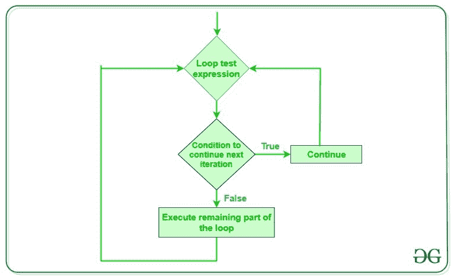

# Python 继续语句

> 原文:[https://www.geeksforgeeks.org/python-continue-statement/](https://www.geeksforgeeks.org/python-continue-statement/)

在本文中，我们将讨论 Python 中用于改变循环流的 **continue 语句**。

## 继续语句的用法

Python 中的[循环](https://www.geeksforgeeks.org/loops-in-python/)以高效的方式自动化并重复任务。但是有时，可能会出现这样一种情况，您想要完全退出循环，跳过一次迭代或者忽略该情况。这些可以通过[循环控制语句](https://www.geeksforgeeks.org/break-continue-and-pass-in-python/)来完成。Continue 是一种可以改变循环流的循环控制语句。

## 连续语句

**continue 语句**是一个循环控制语句，强制执行循环的下一次迭代，同时仅针对当前迭代跳过循环内部的其余代码，即当 Continue 语句在循环中执行时，Continue 语句之后的循环内部代码将针对当前迭代被跳过，循环的下一次迭代将开始。

**语法:**

```py
continue
```

## 继续语句流程图



### **示例:**Python 中的 Continue 语句

考虑一下当你需要写一个程序来打印从 1 到 10 而不是 6 的数字时的情况。指定您必须使用循环来执行此操作，并且只允许使用一个循环。下面是 continue 语句的用法。我们在这里可以做的是，我们可以运行一个从 1 到 10 的循环，每次我们都必须将迭代器的值与 6 进行比较。如果它等于 6，我们将使用 continue 语句继续下一次迭代，而不打印任何内容，否则我们将打印该值。

下面是上述想法的实现:

## 蟒蛇 3

```py
# Python program to
# demonstrate continue
# statement

# loop from 1 to 10
for i in range(1, 11):

    # If i is equals to 6,
    # continue to next iteration
    # without printing
    if i == 6:
        continue
    else:
        # otherwise print the value
        # of i
        print(i, end=" ")
```

**输出:**

```py
1 2 3 4 5 7 8 9 10 
```

**注意:**continue 语句也可以用于任何其他循环，如 [while loop](https://www.geeksforgeeks.org/python-while-loop/) ，其方式与上面的循环中的[相似。](https://www.geeksforgeeks.org/python-for-loops/)

**练习题:**

给定数字 n，打印三角形图案。我们只能使用一个循环。

```py
Input: 7
Output:
*
* * 
* * *
* * * *
* * * * *
* * * * * *
* * * * * * *
```

解决方案:[使用一个循环打印图案|设置 2(使用继续语句)](https://www.geeksforgeeks.org/print-pattern-using-one-loop-continue-statement/)