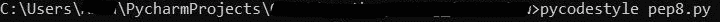
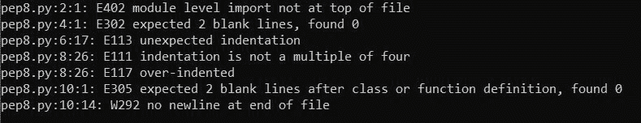
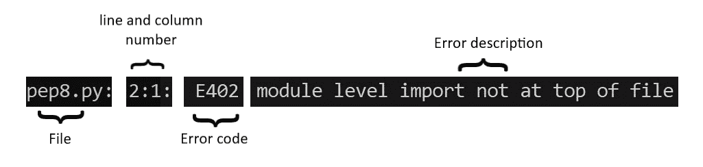

# Python–约定和 PEP8

> 原文:[https://www.geeksforgeeks.org/python-conventions-and-pep8/](https://www.geeksforgeeks.org/python-conventions-and-pep8/)

**约定**是指在一个社区内为了确保秩序而采取的某种做事方式。类似地，编码约定也是一组指南，但是对于推荐编程风格、实践和方法的编程语言来说。这包括命名约定、缩进、注释、语句、编程实践等规则。

遵循这些规则确保了代码的可读性和易于维护。由于代码并不总是由开发人员维护，因此下一个人必须准确地理解您的代码，因为“**代码被读取的次数比被写入的次数**要多得多”。

### PEP-8

PEP-8 是 Python 增强协议 8 的首字母缩略词，该协议是为 Python 编程语言发布的一组指南。PEP-8 的指导方针看似迂腐，但遵循它们可以改进你的代码，尤其是当涉及到分享你的代码时，无论是你的潜在雇主还是开源贡献，或者是在团队项目期间。编写清晰可读的代码也是专业的标志，表明你知道如何组织代码。

让我们看看为什么约定在使用代码示例进行编码时很重要:

**违反 PEP-8**

```py
L = [1, 2, 3, 4, 2, 4, 1, 2]
from collections import defaultdict
# Helper Function
def ltd(l):
    """Convert list to DefaultDict"""
                d = defaultdict(int)
                for i in l:
                         d[i] += 1
                return d
print(ltd(L))
```

**Output:**

```py
defaultdict(, {1: 2, 2: 3, 3: 1, 4: 2})

```

上面是违反 PEP-8 最佳实践的代码，简单地说，这里的代码很难阅读。几乎没有问题，导入模块语句不在文件的顶部，空格和缩进不一致，缺少换行符使得很难理解函数何时结束，下一行代码何时开始。即使不知道 PEP-8 的规则，你也可能知道这不是最可读的代码块。让我们看看用 PEP-8 规则重写后的这段代码。

**跟随 PEP-8**

```py
# Import needed package
from collections import defaultdict

# Define our data
list_data = [1, 2, 3, 4, 2, 4, 1, 2]

# Helper Function
def list_to_dict(input_list):
    """Convert list to DefaultDict"""
    d = defaultdict(int)
    for i in input_list:
        d[i] += 1
    return d

# Output
print(ltd(list_data))
```

**Output:**

```py
defaultdict(, {1: 2, 2: 3, 3: 1, 4: 2})

```

正如您在上面注意到的，同一段代码现在描述了空白、缩进和换行符的适当使用，这使得代码看起来比以前干净多了。现在在注释的帮助下，代码比以前更容易理解了。

### PEP-8 工具

如果您是 Python 新手，那么在编写程序几天或几周之后，可能会有点难以记住某段代码是做什么的。如果您遵循 PEP 8，您可以确保您已经很好地命名了您的变量，并添加了足够的空白，这样就更容易遵循代码中的逻辑步骤。您也可以很好地注释您的代码。所有这些都意味着您的代码更易读、更容易理解。作为初学者，遵循 PEP 8 的规则可能很困难，但是您可以使用各种工具来确保您的代码遵循规则，例如:

*   **IDE** like *PyCharm*, which flags violation as soon as you write a bad line of code.

    

*   Using ***pycodestyle*** package, it can check code in multiple files at once, and it outputs descriptions of the violations along with the information of where you need to go to fix the issue.
    **Step 1:** Install *pycodestyle* using pip install, type the below command in the terminal.

    ```py
    pip install pycodestyle
    ```

    **第二步:**使用如下所示的命令，用 pycodestyle 检查 python 文件。( *pycodestyle **filename**。py* )
    
    **输出:**
    
    