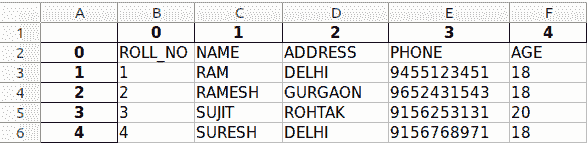

# Python |将 HTML 表格转换成 excel

> 原文:[https://www . geesforgeks . org/python-convert-an-html-table-to-excel/](https://www.geeksforgeeks.org/python-convert-an-html-table-into-excel/)

微软 Excel 是处理大量表格数据的强大工具。它对于排序、分析、执行复杂计算和可视化数据特别有用。在本文中，我们将讨论如何从网页中提取表格，并将其存储为 Excel 格式。

**步骤#1:转换为熊猫数据框**
熊猫是一个用于管理表格的 Python 库。我们的第一步是将网页中的表格存储到熊猫数据框中。函数`read_html()`返回数据帧列表，每个元素代表网页中的一个表格。这里我们假设网页包含一个表格。

```py
# Importing pandas
import pandas as pd

# The webpage URL whose table we want to extract
url = "https://www.geeksforgeeks.org/extended-operators-in-relational-algebra/"

# Assign the table data to a Pandas dataframe
table = pd.read_html(url)[0]

# Print the dataframe
print(table)
```

**输出**

```py
         0       1        2           3    4
0  ROLL_NO    NAME  ADDRESS       PHONE  AGE
1        1     RAM    DELHI  9455123451   18
2        2  RAMESH  GURGAON  9652431543   18
3        3   SUJIT   ROHTAK  9156253131   20
4        4  SURESH    DELHI  9156768971   18

```

**第二步:将熊猫数据帧存储在 excel 文件**
中，为此，我们使用熊猫的 *to_excel()* 函数，将文件名作为参数传递。

```py
# Importing pandas
import pandas as pd

# The webpage URL whose table we want to extract
url = "https://www.geeksforgeeks.org/extended-operators-in-relational-algebra/"

# Assign the table data to a Pandas dataframe
table = pd.read_html(url)[0]

# Store the dataframe in Excel file
table.to_excel("data.xlsx")
```

**输出:**


如果网页上有多个表格，我们可以将索引号从 0 更改为所需表格的索引号。