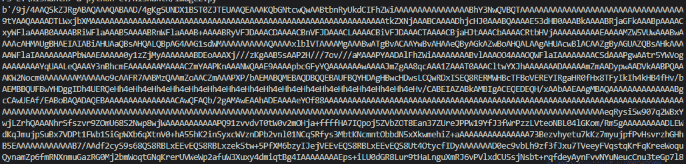
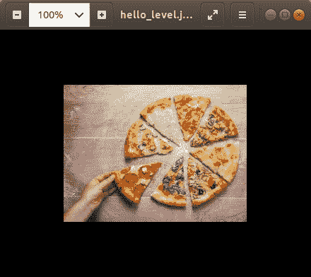

# Python–将图像转换为字符串，反之亦然

> 原文:[https://www . geesforgeks . org/python-convert-image-to-string-反之亦然/](https://www.geeksforgeeks.org/python-convert-image-to-string-and-vice-versa/)

为了将图像存储或传送给某些人，我们需要将它转换成字符串，这样字符串就可以描述我们作为输入给出的图像。所以在 Python 中做这个操作，是一个简单的任务，并不复杂，因为我们在 Python 中有很多可用的功能。

## **将图像转换为字符串**

*   首先我们导入**[**Base64**](https://www.geeksforgeeks.org/how-base64-encoding-and-decoding-is-done-in-node-js/)**方法对给定图像进行编码****
*   ****接下来，我们在以二进制模式读取的 **rb** 模式下打开图像文件。****
*   ****我们用 **image2.read()** 读取图像并使用 b64encode()进行编码这是用于将数据编码为 Base64 的方法****
*   ****最后，我们打印我们的编码字符串****

******使用的图像:******

********

## ****蟒蛇 3****

```
**import base64

with open("food.jpeg", "rb") as image2string:
    converted_string = base64.b64encode(image2string.read())
print(converted_string)

with open('encode.bin', "wb") as file:
    file.write(converted_string)**
```

******输出:******

****

这是使用 Base64 转换为字符串的图像输出**** 

****这里我们得到了输出，但是如果你注意到在字符串的开始，我们得到这个**b’**这个我们可以说是一对单引号中的 Base64 编码字符串。因此，如果我们想删除它，我们可以通过用**Print(my _ string . decode(' utf-8 ')**替换 Print 语句来执行以下操作****

## ******将字符串转换为图像******

****这里从字符串转换它实际上是一个反向过程，也是一个直接的方法****

*   ****首先我们导入 **Base64。然后**我们打开我们的二进制文件，在那里我们丢弃了我们的字符串。然后打开文件 **rb** 模式，即 **R** 在 **B** 二进制模式下打开。****
*   ****将从文件中读取的数据存储到变量中。然后关闭文件****
*   ****然后只需给出任何图像文件名(**例如:“my Image . png”**)并在 **wb** 模式 **W** 仪式中 **B** 二次打开它****
*   ****用 b64 解码二进制文件，然后用**关闭文件。close()******

******注意:**我们将使用上面创建的字符串将其转换回图像****

## ****蟒蛇 3****

```
**import base64

file = open('encode.bin', 'rb')
byte = file.read()
file.close()

decodeit = open('hello_level.jpeg', 'wb')
decodeit.write(base64.b64decode((byte)))
decodeit.close()**
```

******输出:******

********