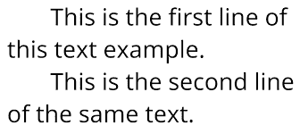

# Python |先将图像转换为文本，再转换为语音

> 原文:[https://www . geesforgeks . org/python-convert-image-to-text-然后转到语音/](https://www.geeksforgeeks.org/python-convert-image-to-text-and-then-to-speech/)

我们的目标是将给定的文本图像转换成文本字符串，将其保存到文件中，并通过音频听到图像中写的内容。

为此，我们需要导入一些库

1.  **pytesserract(Python-tesserract):**是谷歌赞助的一款针对 Python 的光学字符识别(OCR)工具。
2.  **pyttsx3 :** 它是一个离线的跨平台文本到语音库
3.  **Python 图像库(PIL) :** 它为您的 Python 解释器增加了图像处理功能
4.  **Googletrans :** 它是一个免费的 python 库，实现了 Google Translate API。

**示例:**



```

Input : We Have an image with some text 

Output: THE TEXT FROM THE IMAGE IS EXTRACTED AND A VOICE WILL SPEAK THE TEXT

          This is the first line of
           this text example.

          This is the second line
           of the same text.

       Translated(src=en, dest=de, text=Dies ist die erste Zeile von

           Dieses Textbeispiel.

            Dies ist die zweite Zeile
            desselben Textes., pronunciation=None, extra_data="{'translat..."

```

**代码:将文字转换为语音的 Python 代码**

```
# import the following libraries
# will convert the image to text string
import pytesseract      

# adds image processing capabilities
from PIL import Image    

 # converts the text to speech  
import pyttsx3           

#translates into the mentioned language
from googletrans import Translator      

 # opening an image from the source path
img = Image.open('text1.png')     

# describes image format in the output
print(img)                          
# path where the tesseract module is installed
pytesseract.pytesseract.tesseract_cmd ='C:/Program Files (x86)/Tesseract-OCR/tesseract.exe'   
# converts the image to result and saves it into result variable
result = pytesseract.image_to_string(img)   
# write text in a text file and save it to source path   
with open('abc.txt',mode ='w') as file:     

                 file.write(result)
                 print(result)

p = Translator()                      
# translates the text into german language
k = p.translate(result,dest='german')      
print(k)
engine = pyttsx3.init()

# an audio will be played which speaks the test if pyttsx3 recognizes it
engine.say(k)                             
engine.runAndWait()
```

**注意:**我们可以将文本转换成任何想要的语言。例如日语、俄语、印地语。但唯一的条件是谷歌翻译应该识别目的地语言。此外，pyttsx3 将只说它能识别的语言。