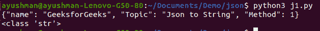
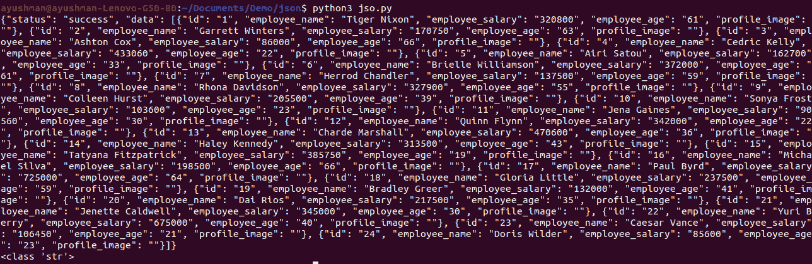

# Python–将 JSON 转换为字符串

> 原文:[https://www . geesforgeks . org/python-convert-JSON-to-string/](https://www.geeksforgeeks.org/python-convert-json-to-string/)

使用 API 调用跨平台传输数据。数据大多以 JSON 格式检索。为了便于存储和使用，我们可以将获得的 JSON 数据转换为字符串数据。

让我们看看如何将 JSON 转换为 String。

**方法#1:** 使用“json.dumps”将 Json 转换为虚拟数据字符串

## 蟒蛇 3

```py
import json

# create a sample json

a = {"name" : "GeeksforGeeks", "Topic" : "Json to String", "Method": 1}

# Convert JSON to String

y = json.dumps(a)

print(y)
print(type(y))
```

**输出:**



**方法 2:** 使用使用请求和“json.dumps”的 API 将 Json 转换为 String

## 蟒蛇 3

```py
import json
import requests

# Get dummy data using an API
res = requests.get("http://dummy.restapiexample.com/api/v1/employees")

# Convert data to dict
data = json.loads(res.text)

# Convert dict to string
data = json.dumps(data)

print(data)
print(type(data))
```

**输出:**

