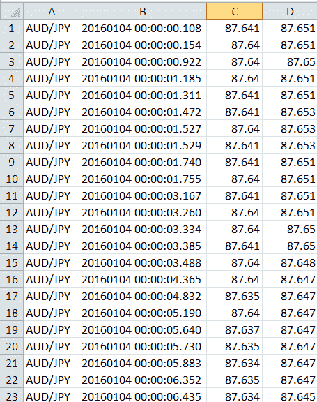
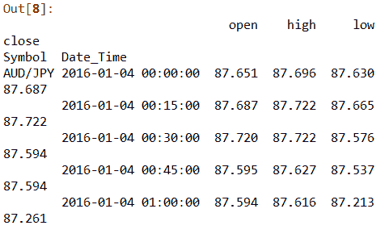
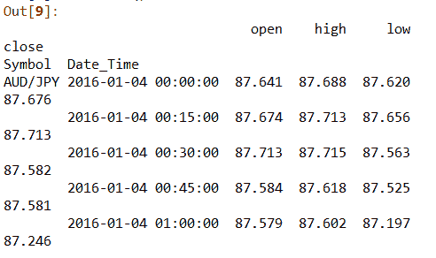

# Python–将逐笔成交数据转换为 OHLC(开盘-高点-低点-收盘)数据

> 原文:[https://www . geesforgeks . org/python-convert-tick-by-tick-data-in-ohlc-open-high-low-close-data/](https://www.geeksforgeeks.org/python-convert-tick-by-tick-data-into-ohlc-open-high-low-close-data/)

在这篇文章中，我们将探索 Python 熊猫包的特性。我们经常会发现关于将逐笔交易数据转换为 OHLC(开盘价、最高价、最低价和收盘价)的查询。使用熊猫工具包，这可以用最少的努力完成。OHLC 数据在一个时间单位(1 天、1 小时等)内使用。)对价格走势进行技术分析。

**第一步:**
第一步涉及样本数据的采集。让我们逐个输入刻度样本刻度数据。在本教程中，我们将使用从佩珀斯通(外部来源)下载的澳元/日元(澳元/日元)对的 1 月份数据。

<center></center>

Pepperstone offers free historical tick data for specific pairs of currencies. The.csv file contains top of the book, tick-by-tick market data, with millisecond details of fractional pip spreads. For our study, the data is more than adequate.
**Steps in Python:**
As you can see there is no header to the data. We’ll include the header and programmatically accomplish the necessary mission.**Code: Importing pandas package.**

```py
# importing libraries
import pandas as pd
```

**代码:加载数据。**

```py
data_frame = pd.read_csv(
    'AUDJPY-2016-01.csv', names=['Symbol', 'Date_Time', 'Bid', 'Ask'],
                                       index_col=1, parse_dates=True)
data_frame.head()
```

数据以' AUDJPY-2016-01.csv '的名称存储在工作目录中。正如我们前面看到的，数据没有头。然后，我们将在导入数据时为其添加一个标题。因此，导入和添加标题发生在同一行代码中。
使用熊猫数据帧的重采样属性。重采样功能允许重新检查标准时间序列数据。在 15 分钟内，我们必须对数据进行重新采样，并将其划分为 OHLC 格式。如果要对更小的时间帧(毫秒/微秒/秒)重新采样，则使用 L 表示毫秒，U 表示微秒，S 表示秒，等等。

```py
data_ask = data_frame['Ask'].resample('15Min').ohlc()
data_bid = data_frame['Bid'].resample('15Min').ohlc()
```

**代码:“询问”数据框**

```py
data_ask.head()
```

<center></center>

**Code: ‘Bid’ Dataframe**

```py
data_bid.head()
```

<center></center>

**代码:合并“要价”和“出价”数据框**

```py
data_ask_bid = pd.concat(
    [data_ask, data_bid], axis=1, 
    keys=['Ask', 'Bid'])
```

**结论:**
这是一种利用 TBT 数据计算 OHLC 的快速方法。这可以应用于所有资产，并且基于 OHLC 数据，可以设计各种策略。我们还可以绘制基于 OHLC 的地图，并产生贸易信号。另一种使用数据的方法是用 python 构建技术指标，或者计算风险调整后的回报。