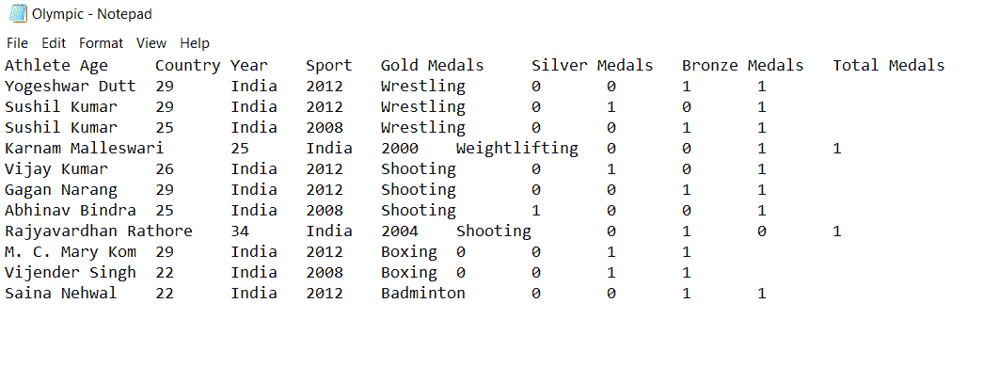
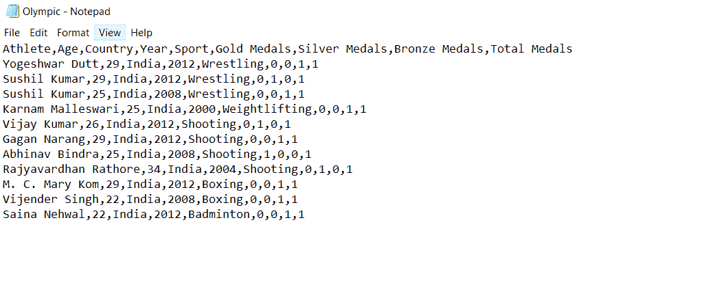
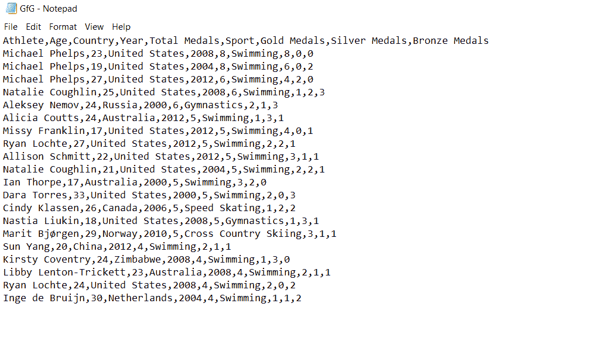

# Python–将 TSV 转换为 CSV 文件

> 原文:[https://www . geesforgeks . org/python-convert-tsv-to-CSV-file/](https://www.geeksforgeeks.org/python-convert-tsv-to-csv-file/)

在本文中，我们将看到如何使用 Python 将 TSV 文件转换为 CSV。

## 方法一:使用[正则表达式](https://www.geeksforgeeks.org/regular-expression-python-examples-set-1/)

通过从 TSV 一次读取一行数据，使用 re 库将制表符替换为逗号，并写入 CSV 文件，可以将 TSV 文件转换为 CSV 文件。我们首先打开从中读取数据的 TSV 文件，然后打开其中写入数据的 CSV 文件。我们一行行地读取数据。在每一行中，我们用逗号(“，”)替换制表符(“\t”)，因为 CSV 文件中的数据是以逗号分隔的。

**示例:**

**输入文件:**



## 蟒蛇 3

```py
# Python program to convert .tsv file to .csv file
# importing re library
import re

# reading given tsv file
with open("Olympic.tsv", 'r') as myfile:  
  with open("Olympic.csv", 'w') as csv_file:
    for line in myfile:

      # Replace every tab with comma
      fileContent = re.sub("\t", ",", line)

      # Writing into csv file
      csv_file.write(fileContent)

# output
print("Successfully made csv file")
```

**输出:**

```py
Successfully made csv file
```



## **方法二:使用** [**熊猫**](https://www.geeksforgeeks.org/introduction-to-pandas-in-python/)

熊猫模块提供的方法使读取各种暴饮暴食中存储的数据变得非常容易。下面是将 TSV 文件转换为 CSV 文件的代码片段。我们首先使用 [read_table()](https://www.geeksforgeeks.org/pandas-read_table-function/) 从 TSV 文件中读取数据。现在我们使用[到 _csv()](https://www.geeksforgeeks.org/python-pandas-series-to_csv/) 将这些数据写入 CSV 文件。这里我们写 index=False，因为默认情况下，当用 read_table()函数读取数据时，它会创建一个从 0 开始的新的索引列。但是我们不会使用 index=False 将其写入 CSV 文件。

**示例:**

**输入文件:**


## 蟒蛇 3

```py
# Python program to convert .tsv file to .csv file
# importing pandas library
import pandas as pd 

tsv_file='GfG.tsv'

# readinag given tsv file
csv_table=pd.read_table(tsv_file,sep='\t')

# converting tsv file into csv
csv_table.to_csv('GfG.csv',index=False)

# output
print("Successfully made csv file")
```

**输出:**

```py
Successfully made csv file
```

**输出文件:**

