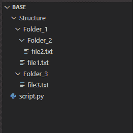
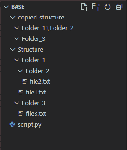

# Python–复制没有文件的目录结构

> 原文:[https://www . geesforgeks . org/python-copy-directory-structure-不带文件/](https://www.geeksforgeeks.org/python-copy-directory-structure-without-files/)

在本文中，我们将讨论如何使用 Python 用文件复制目录结构。例如，考虑这个目录树:



我们有一个名为“基础”的文件夹，里面有一个名为“结构”的文件夹。“结构”有一些文件夹，里面也包含一些文件。现在我们必须将“结构”的所有文件夹复制到一个名为“copy _ Structure”的文件夹中，这样文件就不会被复制。

在本文中，我们将讨论各种方法来做到这一点。

*   **使用 shutil.copytree()**
*   **使用 os.walk()**

### 方法 1:使用 shutil.copytree()

使用 [shutil](https://www.geeksforgeeks.org/shutil-module-in-python/) 库的 [shutil.copytree()](https://www.geeksforgeeks.org/python-shutil-copytree-method/) 方法我们可以实现这个任务。shutil.copytree()方法递归地将一个以源(src)为根的整个目录树复制到目标目录。由(dst)命名的目标目录必须不存在。它将在复制过程中创建。它需要一个可选的参数，即“忽略”。如果给出“忽略”，它必须是一个可调用的，它将接收 *copytree* ()正在访问的目录作为参数，以及由 [os.listdir()](https://www.geeksforgeeks.org/python-os-listdir-method/) 返回的目录列表。为了更好地理解，让我们通过编写代码来实现这个方法。
只复制“结构”的目录结构而不复制文件到“复制的 _ 结构”的代码是:

## 计算机编程语言

```
# importing the shutil module
import shutil

# importing the os module
import os

# defining the function to ignore the files
# if present in any folder
def ignore_files(dir, files):
    return [f for f in files if os.path.isfile(os.path.join(dir, f))]

# calling the shutil.copytree() method and
# passing the src,dst,and ignore parameter
shutil.copytree('D:/projects/base/Structure',
                'D:/projects/base/copied_structure',
                ignore=ignore_files)
```

运行上述代码后，我们会发现创建了一个名为“copy _ structure”的新文件夹，它包含与“structure”文件夹相同的文件夹结构，但在“Structure”文件夹中没有任何文件。



### 方法 2:使用 os.walk()

我们也可以使用 [os 模块](https://www.geeksforgeeks.org/os-module-python-examples/)的 [os.walk()](https://www.geeksforgeeks.org/os-walk-python/) 方法来完成上述任务。为此，我们将遍历源目录的每个目录，从源目录中获取文件夹名称及其相对路径，然后通过这个相对路径，我们将使用 [os.mkdir()](https://www.geeksforgeeks.org/python-os-mkdir-method/) 在目标目录中复制它们。这个实现的代码是:

## 计算机编程语言

```
# importing the os module
import os

# defining a function for the task
def create_dirtree_without_files(src, dst):

      # getting the absolute path of the source
    # direcrory
    src = os.path.abspath(src)

    # making a variable having the index till which
    # src string has directory and a path separator
    src_prefix = len(src) + len(os.path.sep)

    # making the destination directory
    os.makedirs(dst)

    # doing os walk in source directory
    for root, dirs, files in os.walk(src):
        for dirname in dirs:

            # here dst has destination directory,
            # root[src_prefix:] gives us relative
            # path from source directory
            # and dirname has folder names
            dirpath = os.path.join(dst, root[src_prefix:], dirname)

            # making the path which we made by
            # joining all of the above three
            os.mkdir(dirpath)

# calling the above function
create_dirtree_without_files('D:/projects/base/Structure',
                             'D:/projects/base/copied_structure')
```

运行这段代码后，我们会发现创建了一个名为“copy _ structure”的文件夹，该文件夹的目录结构与“Structure”相同，但其中没有文件。

