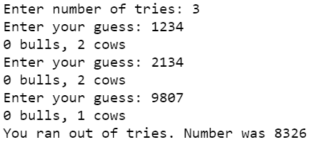

# 蟒蛇–牛和公牛游戏

> 原文:[https://www.geeksforgeeks.org/python-cows-and-bulls-game/](https://www.geeksforgeeks.org/python-cows-and-bulls-game/)

牛和公牛是一种笔和纸密码破解游戏，通常在两个玩家之间进行。在这种情况下，玩家试图猜测第二个玩家选择的密码。规则如下:

*   玩家会创建一个密码，通常是 4 位数。这个号码不能有重复的数字。
*   另一个玩家猜测(4 位数)破解秘密号码。猜一猜，会给出 2 个提示——牛和公牛。
*   公牛表示正确位置的正确位数，母牛表示错误位置的正确位数。例如，如果密码是 1234，猜测的数字是 1246，那么我们有 2 个公牛(数字 1 和 2 的精确匹配)和 1 个母牛(数字 4 的错误匹配)
*   玩家继续猜测，直到密码被破解。猜中最少尝试次数的玩家获胜。

**说明:**

为了更好地理解，让我们看一个示例运行。

```
Secret Code: 3768

Guess: 1234
Response: 0 bulls, 1 cow
Guess: 5678
Response: 1 bull, 2 cows
Guess: 1678
Response: 1 bull, 2 cows
Guess: 3678
Response: 2 bulls, 2 cows
Guess: 3148
Response: 2 bulls, 0 cows
Guess: 3768
You guessed right!
```

**进场:**

要用 Python 创建这个游戏，计算机会生成一个秘密代码，用户必须猜测代码。把它分成这些块:

*   生成密码-生成一个随机的 4 位数字，并检查它没有任何重复的数字。
*   生成提示或响应-获取生成的 4 位密码和猜测的数字(输入)。找出完全匹配的常用数字(公牛)和位置错误的常用数字(母牛)。重复每一个猜测，直到你有 4 头公牛(完全匹配)或你用尽了尝试。

约束:密码和猜测的代码应该是 4 位数(在 1000 和 9999 之间)，并且没有重复的数字。

**程序:**

## 计算机编程语言

```
# Import required module
import random 

# Returns list of digits 
# of a number
def getDigits(num):
    return [int(i) for i in str(num)]

# Returns True if number has 
# no duplicate digits 
# otherwise False      
def noDuplicates(num):
    num_li = getDigits(num)
    if len(num_li) == len(set(num_li)):
        return True
    else:
        return False

# Generates a 4 digit number 
# with no repeated digits    
def generateNum():
    while True:
        num = random.randint(1000,9999)
        if noDuplicates(num):
            return num

# Returns common digits with exact 
# matches (bulls) and the common 
# digits in wrong position (cows)
def numOfBullsCows(num,guess):
    bull_cow = [0,0]
    num_li = getDigits(num)
    guess_li = getDigits(guess)

    for i,j in zip(num_li,guess_li):

        # common digit present
        if j in num_li:

            # common digit exact match
            if j == i:
                bull_cow[0] += 1

            # common digit match but in wrong position
            else:
                bull_cow[1] += 1

    return bull_cow

# Secret Code
num = generateNum()
tries =int(input('Enter number of tries: '))

# Play game until correct guess 
# or till no tries left
while tries > 0:
    guess = int(input("Enter your guess: "))

    if not noDuplicates(guess):
        print("Number should not have repeated digits. Try again.")
        continue
    if guess < 1000 or guess > 9999:
        print("Enter 4 digit number only. Try again.")
        continue

    bull_cow = numOfBullsCows(num,guess)
    print(f"{bull_cow[0]} bulls, {bull_cow[1]} cows")
    tries -=1

    if bull_cow[0] == 4:
        print("You guessed right!")
        break
else:
    print(f"You ran out of tries. Number was {num}")
```

**输出:**

