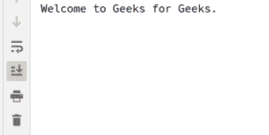

# Python–在 GTK+ 3 中创建一个盒子

> 原文:[https://www.geeksforgeeks.org/python-create-a-box-in-gtk-3/](https://www.geeksforgeeks.org/python-create-a-box-in-gtk-3/)

**先决条件–**[Python–创建窗口，GTK+ 3 中的按钮](https://www.geeksforgeeks.org/python-create-window-button-in-gtk-3/)

在 GTK+中，您可以将小部件排列成行、列和/或表，而不是指定窗口中每个小部件的位置和大小。窗口的大小是根据它包含的小部件的大小自动确定的。小部件的大小反过来又取决于它们包含的文本量。完善布局可以通过指定小部件的填充距离和居中值来完成。

GTK+使用容器分层排列小部件。有两种类型的容器独子容器和多子容器。最常用的是垂直或水平框`(Gtk.Box)`和网格`(Gtk.Grid)`。

**遵循以下步骤:**

1.  导入 GTK+ 3 模块。
2.  创建主窗口。
3.  创建盒子。
4.  创建按钮。

**注意:**在像 Pycharm 这样的 IDE 中，为了使用 GTK+ 3，我们可以安装一个名为 PyGObject 的包。

盒子是不可见的容器，我们可以把小部件装进里面。将小部件打包到水平盒中时，对象水平插入`Gtk.Box.pack_start()`(从左到右)或`Gtk.Box.pack_end()`(从右到左)。在一个垂直的盒子里，小部件从上到下打包，反之亦然。

**Example :** Creating a box with button.

```py
import gi
# Since a system can have multiple versions
# of GTK + installed, we want to make 
# sure that we are importing GTK + 3.
gi.require_version("Gtk", "3.0")
from gi.repository import Gtk

class MyWindow(Gtk.Window):
    def __init__(self):
        Gtk.Window.__init__(self, title ="GfG")

        # Create a horizontally orientated box container 
        # having spacing 6 pixels 
        self.box = Gtk.Box(spacing = 6)
        self.add(self.box)

        # Add a button to box container.
        # Gtk.Box.pack_start() widgets are positioned from left to right
        self.button1 = Gtk.Button(label ="Click Here")
        self.button1.connect("clicked", self.on_button1_clicked)
        self.box.pack_start(self.button1, True, True, 0)

    def on_button1_clicked(self, widget):
        print("Welcome to Geeks for Geeks.")

win = MyWindow()
win.connect("destroy", Gtk.main_quit)
win.show_all()
Gtk.main()
```

**输出:**

点击此处即可获得。

