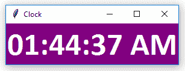

# Python |使用 Tkinter

创建数字时钟

> 原文:[https://www . geesforgeks . org/python-create-a-digital-clock-use-tkinter/](https://www.geeksforgeeks.org/python-create-a-digital-clock-using-tkinter/)

众所周知，Tkinter 用于创建各种图形用户界面(GUI)应用程序。在本文中，我们将学习如何使用 [Tkinter](https://www.geeksforgeeks.org/python-gui-tkinter/) 创建数字时钟。

> **先决条件:**
> - > Python 函数
> - > Tkinter 基础(标签小部件)
> - >时间模块

**使用来自 Tkinter 的 Label widget 和时间模块:**
在下面的应用程序中，我们将使用 ***Label widget*** 并且还将使用 ***时间模块*** 来检索系统的时间。
下面是实现:

## 蟒蛇 3

```
# importing whole module
from tkinter import *
from tkinter.ttk import *

# importing strftime function to
# retrieve system's time
from time import strftime

# creating tkinter window
root = Tk()
root.title('Clock')

# This function is used to
# display time on the label
def time():
    string = strftime('%H:%M:%S %p')
    lbl.config(text = string)
    lbl.after(1000, time)

# Styling the label widget so that clock
# will look more attractive
lbl = Label(root, font = ('calibri', 40, 'bold'),
            background = 'purple',
            foreground = 'white')

# Placing clock at the centre
# of the tkinter window
lbl.pack(anchor = 'centre')
time()

mainloop()
```

**输出:**



<video class="wp-video-shortcode" id="video-292586-1" width="640" height="360" preload="metadata" controls=""><source type="video/mp4" src="https://media.geeksforgeeks.org/wp-content/uploads/20190411013837/clock.mp4?_=1">[https://media.geeksforgeeks.org/wp-content/uploads/20190411013837/clock.mp4](https://media.geeksforgeeks.org/wp-content/uploads/20190411013837/clock.mp4)</video>