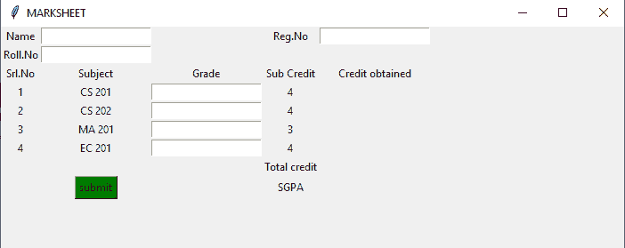

# Python |使用 Tkinter 创建图形用户界面标记表

> 原文:[https://www . geesforgeks . org/python-create-a-GUI-marksheet-using-tkinter/](https://www.geeksforgeeks.org/python-create-a-gui-marksheet-using-tkinter/)

创建一个 python 图形用户界面标记表。在给出各科学分的地方，输入各科成绩，点击提交。每个科目的学分、总学分以及 SGPA 在自动计算后显示。使用 Tkit 创建图形用户界面。

> 参考下面的文章，了解 tkinter 和 Python 的基础知识。
> 
> *   tkinter introduction
> *   [Python 基础知识](https://www.geeksforgeeks.org/python-programming-language/)

Python 为开发图形用户界面提供了多种选择。在所有的 GUI 方法中，Tkinter 是最常用的方法。它是 Python 附带的 Tk 图形用户界面工具包的标准 Python 接口。Python 搭配 Tkinter 输出了创建 GUI 应用程序最快最简单的方法。使用 Tkinter 创建图形用户界面是一项简单的任务。

**要创建 Tkinter:**

*   导入模块–Tkit
*   创建主窗口(容器)
*   向主窗口添加任意数量的小部件
*   在小部件上应用事件触发器。

图形用户界面是这样的:



让我们使用 Python Tkinter 模块创建一个基于图形用户界面的简单标记表，它可以根据每个主题输入的标记创建标记表。

**下面是实现:**

## 蟒蛇 3

```py
# Python program to create a
# GUI mark sheet using tkinter

# Import tkinter as tk
import tkinter as tk

# creating a new tkinter window
master = tk.Tk()

# assigning a title
master.title("MARKSHEET")

# specifying geometry for window size
master.geometry("700x250")

# declaring objects for entering data
e1 = tk.Entry(master)
e2 = tk.Entry(master)
e3 = tk.Entry(master)
e4 = tk.Entry(master)
e5 = tk.Entry(master)
e6 = tk.Entry(master)
e7 = tk.Entry(master)

# function to display the total subject
# credits total credits and SGPA according
# to grades entered
def display():

    # Variable to store total marks
    tot=0

    # 10*number of subject credits
    # give total credits for grade A
    if e4.get() == "A":

        # grid method is used for placing
        # the widgets at respective positions
        # in table like structure .
        tk.Label(master, text ="40").grid(row=3, column=4)
        tot += 40

    # 9*number of subject credits give
    # total credits for grade B
    if e4.get() == "B":
        tk.Label(master, text ="36").grid(row=3, column=4)
        tot += 36

    # 8*number of subject credits give
    # total credits for grade C
    if e4.get() == "C":
        tk.Label(master, text ="32").grid(row=3, column=4)
        tot += 32

    # 7*number of subject credits
    # give total credits for grade D   
    if e4.get() == "D":
        tk.Label(master, text ="28").grid(row=3, column=4)
        tot += 28

    # 6*number of subject credits give
    # total credits for grade P   
    if e4.get() == "P":
        tk.Label(master, text ="24").grid(row=3, column=4)
        tot += 24

    # 0*number of subject credits give
    # total credits for grade F   
    if e4.get() == "F":
        tk.Label(master, text ="0").grid(row=3, column=4)
        tot += 0

    # Similarly doing with other objects
    if e5.get() == "A":
        tk.Label(master, text ="40").grid(row=4, column=4)
        tot += 40
    if e5.get() == "B":
        tk.Label(master, text ="36").grid(row=4, column=4)
        tot += 36
    if e5.get() == "C":
        tk.Label(master, text ="32").grid(row=4, column=4)
        tot += 32
    if e5.get() == "D":
        tk.Label(master, text ="28").grid(row=4, column=4)
        tot += 28
    if e5.get() == "P":
        tk.Label(master, text ="28").grid(row=4, column=4)
        tot += 24
    if e5.get() == "F":
        tk.Label(master, text ="0").grid(row=4, column=4)
        tot += 0

    if e6.get() == "A":
        tk.Label(master, text ="30").grid(row=5, column=4)
        tot += 30
    if e6.get() == "B":
        tk.Label(master, text ="27").grid(row=5, column=4)
        tot += 27
    if e6.get() == "C":
        tk.Label(master, text ="24").grid(row=5, column=4)
        tot += 24
    if e6.get() == "D":
        tk.Label(master, text ="21").grid(row=5, column=4)
        tot += 21
    if e6.get() == "P":
        tk.Label(master, text ="28").grid(row=5, column=4)
        tot += 24
    if e6.get() == "F":
        tk.Label(master, text ="0").grid(row=5, column=4)
        tot += 0

    if e7.get() == "A":
        tk.Label(master, text ="40").grid(row=6, column=4)
        tot += 40
    if e7.get() == "B":
        tk.Label(master, text ="36").grid(row=6, column=4)
        tot += 36
    if e7.get() == "C":
        tk.Label(master, text ="32").grid(row=6, column=4)
        tot += 32
    if e7.get() == "D":
        tk.Label(master, text ="28").grid(row=6, column=4)
        tot += 28
    if e7.get() == "P":
        tk.Label(master, text ="28").grid(row=6, column=4)
        tot += 24
    if e7.get() == "F":
        tk.Label(master, text ="0").grid(row=6, column=4)
        tot += 0

    # to display total credits
    tk.Label(master, text=str(tot)).grid(row=7, column=4)

    # to display SGPA
    tk.Label(master, text=str(tot/15)).grid(row=8, column=4)

# end of display function

# label to enter name
tk.Label(master, text="Name").grid(row=0, column=0)

# label for registration number
tk.Label(master, text="Reg.No").grid(row=0, column=3)

# label for roll Number
tk.Label(master, text="Roll.No").grid(row=1, column=0)

# labels for serial numbers
tk.Label(master, text="Srl.No").grid(row=2, column=0)
tk.Label(master, text="1").grid(row=3, column=0)
tk.Label(master, text="2").grid(row=4, column=0)
tk.Label(master, text="3").grid(row=5, column=0)
tk.Label(master, text="4").grid(row=6, column=0)

# labels for subject codes
tk.Label(master, text="Subject").grid(row=2, column=1)
tk.Label(master, text="CS 201").grid(row=3, column=1)
tk.Label(master, text="CS 202").grid(row=4, column=1)
tk.Label(master, text="MA 201").grid(row=5, column=1)
tk.Label(master, text="EC 201").grid(row=6, column=1)

# label for grades
tk.Label(master, text="Grade").grid(row=2, column=2)
e4.grid(row=3, column=2)
e5.grid(row=4, column=2)
e6.grid(row=5, column=2)
e7.grid(row=6, column=2)

# labels for subject credits
tk.Label(master, text="Sub Credit").grid(row=2, column=3)
tk.Label(master, text="4").grid(row=3, column=3)
tk.Label(master, text="4").grid(row=4, column=3)
tk.Label(master, text="3").grid(row=5, column=3)
tk.Label(master, text="4").grid(row=6, column=3)

tk.Label(master, text="Credit obtained").grid(row=2, column=4)

# taking entries of name, reg, roll number respectively
e1=tk.Entry(master)
e2=tk.Entry(master)
e3=tk.Entry(master)

# organizing them in th e grid
e1.grid(row=0, column=1)
e2.grid(row=0, column=4)
e3.grid(row=1, column=1)

# button to display all the calculated credit scores and sgpa
button1=tk.Button(master, text="submit", bg="green", command=display)
button1.grid(row=8, column=1)

tk.Label(master, text="Total credit").grid(row=7, column=3)
tk.Label(master, text="SGPA").grid(row=8, column=3)

master.mainloop()

#This Marksheet can be snapshotted and printed out
# as a report card for the semester

#This code has been contributed by Soumi Bardhan
```

**输出:**

<video class="wp-video-shortcode" id="video-365868-1" width="640" height="360" preload="metadata" controls=""><source type="video/mp4" src="https://media.geeksforgeeks.org/wp-content/uploads/20210118170957/FreeOnlineScreenRecorderProject4.mp4?_=1">[https://media.geeksforgeeks.org/wp-content/uploads/20210118170957/FreeOnlineScreenRecorderProject4.mp4](https://media.geeksforgeeks.org/wp-content/uploads/20210118170957/FreeOnlineScreenRecorderProject4.mp4)</video>