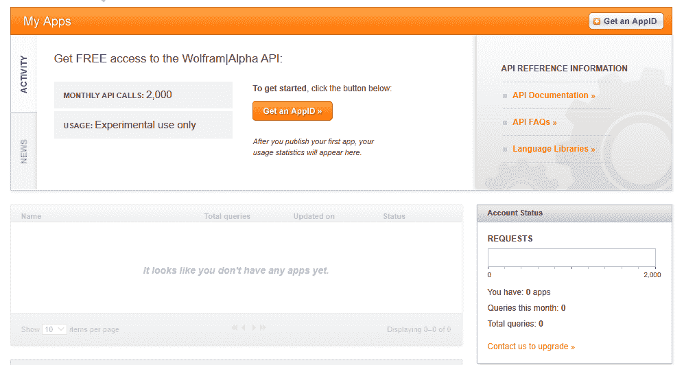
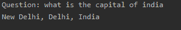

# Python |使用 Wolfram Alpha API 创建一个简单的助手。

> 原文:[https://www . geesforgeks . org/python-create-a-simple-assistant-use-wolfram-alpha-API/](https://www.geeksforgeeks.org/python-create-a-simple-assistant-using-wolfram-alpha-api/)

`Wolfram|Alpha Webservice API`提供了一个基于网络的应用编程接口，允许 Wolfram|Alpha 的计算和呈现能力集成到网络、移动、桌面和企业应用程序中。`Wolfram Alpha`是一个可以使用 Wolfram 的算法、知识库和 AI 技术计算专家级答案的 API。沃尔夫拉姆语使之成为可能。本文讲述了如何用 Python 创建一个简单的助手应用程序，它可以回答下面列出的简单问题。

```
Input : What is the capital of India? 
Output : New Delhi

Input : What is sin(30)?
Output : 0.5

```

**先决条件:**基本了解 [python](https://www.geeksforgeeks.org/python-programming-language/) 的语法和功能。

**获取 API Id**

1.  在 Wolfram alpha 创建一个帐户。账号可以在[官网创建。](https://account.wolfram.com/auth/create)
2.  After signing up, sign in using your Wolfram ID.

    

3.  现在你会看到网站的主页。前往右上角您看到电子邮件的部分。在下拉菜单中，选择我的应用程序选项。
    
4.  单击获取应用程序标识按钮获取标识。
    
5.  在下一个对话框中，给应用程序一个合适的名称和描述。
6.  记下出现在下一个对话框中的 APPID。此应用程序 id 将特定于应用程序。

**实施**

确保预先安装了`wolframalpha` python 包。可以通过在终端或 cmd 中运行以下命令来完成

```
pip install wolframalpha

```

下面是实现

```
# Python program to 
# demonstrate creation of an
# assistant using wolf ram API

import wolframalpha

# Taking input from user
question = input('Question: ')

# App id obtained by the above steps
app_id = ‘Your app_id’

# Instance of wolf ram alpha 
# client class
client = wolframalpha.Client(app_id)

# Stores the response from 
# wolf ram alpha
res = client.query(question)

# Includes only text from the response
answer = next(res.results).text

print(answer)
```

**输出:**

