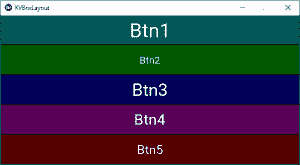
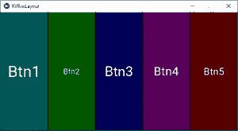

# Python |使用创建盒子布局小部件。kv 文件

> 原文:[https://www . geesforgeks . org/python-create-box-layout-widget-using-kv-file/](https://www.geeksforgeeks.org/python-create-box-layout-widget-using-kv-file/)

Kivy 是 Python 中独立于平台的 GUI 工具。因为它可以在安卓、IOS、linux 和 Windows 等平台上运行。Kivy 为您提供了一次性编写代码并在不同平台上运行的功能。它基本上是用来开发安卓应用程序的，但并不意味着它不能在桌面应用程序上使用。

现在在本文中，我们将学习使用 `.kv` 文件在 kivy 中使用 Box 布局小部件，以及如何向其中添加一些功能，如颜色、大小等。

> 👉🏽 [Kivy 教程–通过示例学习 Kivy](https://www.geeksforgeeks.org/kivy-tutorial/)。

**BoxLayout:**
Kivy 提供了几种布局来将小部件保持在应用程序的期望位置。BoxLayout 是一种简单而强大的布局，通常以嵌套方式或简单的普通方式使用。BoxLayout 以一个在另一个之上的垂直方式或一个接一个的水平方式排列小部件。当您不提供任何大小提示时，子小部件会平均或相应地划分其父小部件的大小。

> **创建按钮时要遵循的基本方法:**
> 1)导入 kivy
> 2)导入 kivyApp
> 3)导入 BoxLayout
> 4)设置最低版本(可选)
> 5)扩展类
> 6)设置。kv 文件(名称与 Appclass 相同)
> 7)返回布局
> 8)运行类的实例

**`main.py` file of BoxLayout –**

```
# base Class of your App inherits from the App class. 
# app:always refers to the instance of your application 
from kivy.app import App 

# BoxLayout arranges children in a vertical or horizontal box.
# or help to put the childrens at the desired location.
from kivy.uix.boxlayout import BoxLayout

###############################################

# creating the root widget used in .kv file
class KVBL(BoxLayout):
    '''
        no need to do anything here as
        we are building things in .kv file
    '''
    pass

#################################################  
# class in which name .kv file must be named KVBoxLayout.kv. 
class KVBoxLayoutApp(App):  

    def build(self):
        # returning the instance of KVBL class
        return KVBL()

##################################################

# creating the object root for BoxLayoutApp() class  
root = KVBoxLayoutApp() 

# run function runs the whole program 
# i.e run() method which calls the 
# target function passed to the constructor. 
root.run() 
```

**文件的`main.py`文件的**

```
<KVBL>:
# you can change it to BoxLayout but have
# to change everywhere including .py

########################################################

    # To position widgets next to each other,
    # use a horizontal BoxLayout.
    # To position widgets above/below each other,
    # use a vertical BoxLayout.

    # orientation: 'horizontal'

    orientation: 'vertical'

#########################################################

    # defining the buttons in the box layout format
    # and adding colour, size etc to it.
    # you can use accordingly
    Button:
        text: "Btn1"
        background_color: 0, 1, 1, 1
        font_size: 40

    Button:
        text: "Btn2"
        background_color: 0, 1, 0, 1
        font_size: 20

    Button:
        text: "Btn3"
        background_color: 0, 0, 1, 1
        font_size: 35

    Button:
        text: "Btn4"
        background_color: 1, 0, 1, 1
        font_size: 30

    Button:
        text: "Btn5"
        background_color: 1, 0, 0, 1
        font_size: 25
```

**输出:**

**1)当方向设置为垂直时**


**2)当方向设置为水平时**


**参考:**
[https://kivy . org/doc/stability/API-kivy . uix . box layout . html](https://kivy.org/doc/stable/api-kivy.uix.boxlayout.html#kivy.uix.boxlayout.BoxLayout)