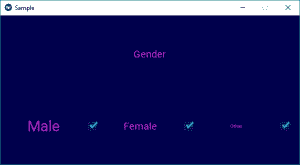

# Python |使用复选框创建。kv 文件

> 原文:[https://www . geesforgeks . org/python-create-checkbox-using-kv-file/](https://www.geeksforgeeks.org/python-create-checkbox-using-kv-file/)

Kivy 是 Python 中独立于平台的 GUI 工具。因为它可以在安卓、IOS、Linux 和 Windows 等平台上运行。它基本上是用来开发安卓应用程序的，但并不意味着它不能在桌面应用程序上使用。

> [Kivy 教程–通过示例学习 Kivy](https://www.geeksforgeeks.org/kivy-tutorial/)。

**Checkbox 小部件:**
CheckBox 是一个特定的双态按钮，可以选中也可以不选中。
要使用复选框，首先必须从包含复选框所有功能的模块中导入复选框，即

```
from kivy.uix.checkbox import CheckBox 
```

```
Basic Approach to follow while creating Checkbox using .kv file :
1) import kivy
2) import kivyApp
3) import BoxLayout
4) import Checkbox
5) set minimum version(optional)
6) Extend the container class
7) set up .kv file :
9) Return layout
10) Run an instance of the class
```

**现在程序的如何创建复选框在基维使用。kv 文件:**

## 蟒蛇 3

```
# main.py file
# program for creating checkbox using .kv in kivy.

# import kivy module
import kivy

# set require version
kivy.require("1.9.0")

# base Class of your App inherits from the App class. 
# app:always refers to the instance of your application 
from kivy.app import App

from kivy.uix.boxlayout import BoxLayout

## not necessary while using .kv file
from kivy.uix.checkbox import CheckBox

# To do some manipulation on window import window
from kivy.core.window import Window

# Container class for the app's widgets
class SampBoxLayout(BoxLayout):

    # Callback for the checkbox
    def checkbox_click(self, instance, value):
        if value is True:
            print("Checkbox Checked")
        else:
            print("Checkbox Unchecked")

# App derived from App class
class SampleApp(App):
    # build is a method of Kivy's App class used
    # to place widgets onto the GUI.
    def build(self):
        # setting up window background color
        Window.clearcolor = (0, 0, .30, .60)
        return SampBoxLayout()

# Run the app
root = SampleApp()
root.run()
```

**示例. kv 文件的代码。**

## 蟒蛇 3

```
#.kv file of main.py file

#: import CheckBox kivy.uix.checkbox

# giving colour to label
<CustLabel@Label>:
    color: .761, .190, .810, 1

<SampBoxLayout>:
    orientation: "vertical"
    padding: 10
    spacing: 10

    CustLabel:
        text: "Gender"
        size_hint_x: 1
        font_size:20

    # creating box layout
    BoxLayout:
        # assigning orientation
        orientation: "horizontal"
        height: 20

        BoxLayout:
            orientation: "horizontal"
            size_hint_x: .22

            # label creation
            CustLabel:
                text: "Male"
                size_hint_x: .80
                font_size:30
            CheckBox:
                color:.294, .761, .623
                on_active: root.checkbox_click(self, self.active)
                size_hint_x: .20

            CustLabel:
                text: "Female"
                size_hint_x: .80
                font_size:20
            CheckBox:
                on_active: root.checkbox_click(self, self.active)
                size_hint_x: .20

            CustLabel:
                text: "Other"
                size_hint_x: .80
                font_size:10
            CheckBox:
                on_active: root.checkbox_click(self, self.active)
                size_hint_x: .20
```

**输出:**



**视频输出:**

<video class="wp-video-shortcode" id="video-303198-1" width="640" height="360" preload="metadata" controls=""><source type="video/webm" src="https://media.geeksforgeeks.org/wp-content/uploads/20190511113424/chekboxkv.webm?_=1">[https://media.geeksforgeeks.org/wp-content/uploads/20190511113424/chekboxkv.webm](https://media.geeksforgeeks.org/wp-content/uploads/20190511113424/chekboxkv.webm)</video>